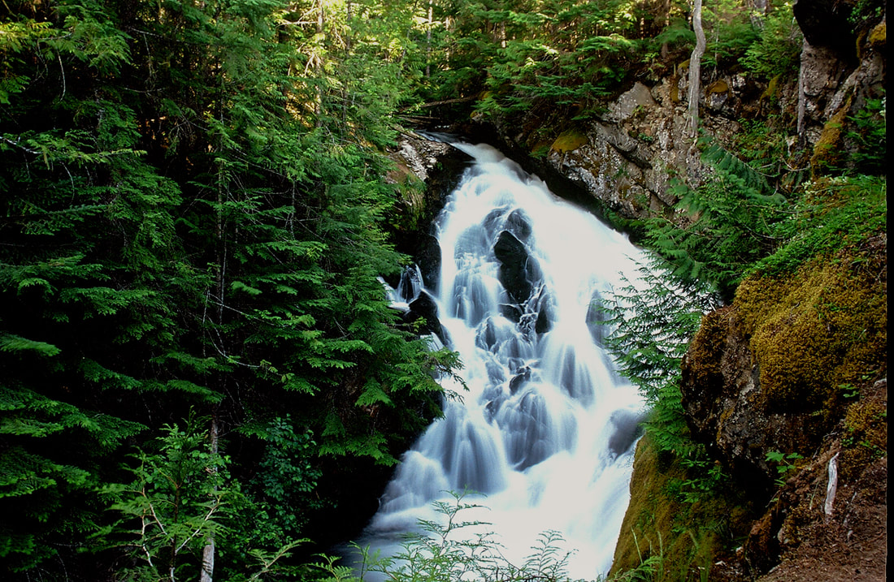

---
tags:
  - Waterfalls
stats:
  - label: Waterfall
    icon: waterfall
    value: Hunt Creek Falls
  - label: Drop
    icon: arrow-collapse-down
    value: About 60'
  - label: Waterfall Type
    icon: waterfall
    value: Segmented or Braided
  - label: Distance Car to Falls
    icon: map-marker-distance
    value: .3 miles
  - label: Maps
    icon: map
    value: I.P.N.F., Bonners Ferry Ranger District 208.267.5561 Priest Lake SE topo
  - label: GPS
    icon: crosshairs-gps
    value: 48°56′62″ N 116°82′00″ W
---

# Hunt Creek Falls

## Description

Hunt Creek Falls is a hidden gem along Priest Lake's E. Shore Drive north of Coolin. At about 3.4 miles
north of Cavanaugh Bay Airport, look for an up hill road on your right (E). As you drive up this short dirt
road, notice a sign in the trees announcing that this area is managed by the Idaho Dept. of Lands. At the
junction, bear left and drive as far as you can, and park. Walk the same road to the falls in about .1
miles. Please be very careful around the view points of this falls.

## Directions

From Priest River, drive north on Hwy 57 past the Priest Lake Visitors Center (Restroom here) for about .4
miles to the Dickensheet Hwy turn off. Turn right (E) continue past Coolin. Just after the airstrip on your
left, drive 3.4 miles onto the Idaho Dept of Lands road. If you cross a creek, you've gone too far.

## Cool Things Close By

Lookout Mountain, Caribou Falls, Priest Lake, Priest Lake State Park, Mount Roothaan & Chimney Rock, Hunt
Lake & Gunsight Peak, and the Wigwams.

## Hazards

All waterfalls are a hazard, due to their slippery nature. Always be extra careful near any waterfall.

## Restaurants & Pubs

Ardy's Cafe and Moose Knuckle Burgers and Brew.

## Plan Your Trip

Click for Current NOAA Weather Conditions

## Photo Gallery

_Hunt Creek Falls in the spring._
