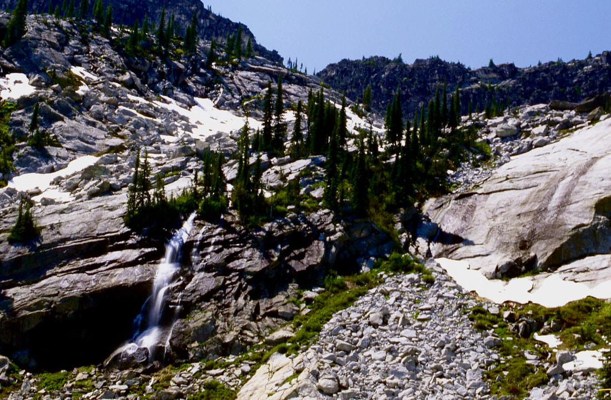
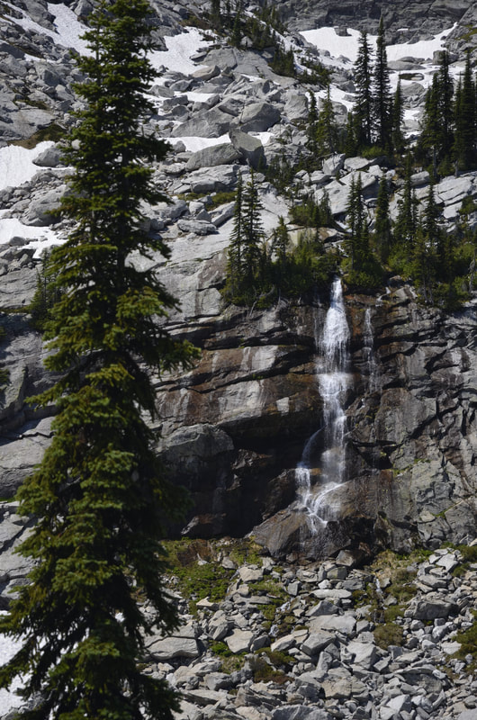

---
tags:
  - Lakes
  - Waterfalls
stats:
  - label: Waterfall
    icon: waterfall
    value: Little Harrison Lake Falls
  - label: Drop
    icon: arrow-collapse-down
    value: 40'
  - label: Waterfall Type
    icon: hiking
    value: Cascading tiered falls
  - label: Distance Car to Falls
    icon: map-marker-distance
    value: 4.6 miles one way
  - label: Maps
    icon: map
    value: IPNF-Kaniksu N.F., The Wigwams
  - label: GPS
    icon: crosshairs-gps
    value: 48°39′41″ N 116°39′18″ W
---

# Little Harrison Lake Falls

_Little Harrison Lake Falls_

## Description

To get to Little Harrison Lake, you must first hike to Beehive Lake on Trail #279 for 3.8 miles.

Take a moment to enjoy Beehive Lake before climbing the ridge to the north. There is a faint trail on the NE
end of the lake that heads north up and over the ridge. Carefully descend the ridge to the right (east) end
of Little Harrison Lake. There is a trail around the lake to the flat granite slabs. Above the lake is a
nice waterfall that feeds the lake and offers great sound effects. Above the falls is the location of a
plane crash that 4 people walked away from. The background to the west is the famous American Selkirk Crest
and most of the Seven Sisters, including the Twins. To the north is a high meadow that leads to Harrison
Lake and Peak. Retrace your steps back up the ridge and over to Beehive Lake. This waterfall is very
intermittent, so if you want to visit it, do it in the early spring.

## Directions

From Sandpoint, drive north on Hwy 95 to Samuels. Turn left (west) onto the Pack River Road #231 for 19
miles to the Beehive Lake trailhead, or 20 miles to the Harrison Lake trailhead.

## Cool Things Close By

Fault Lake, the Kootenai National Wildlife Refuge, the Purcell Trench, Sandpoint, and Lake Pend Oreille.

## Hazards

*South Route*: From Beehive Lake, the scrambling is serious but doable.

## R & P

Jalapeños, Mr. Sub, and Eichardt’s in Sandpoint.

## Photo Gallery

_Little Harrison Lake Falls._
