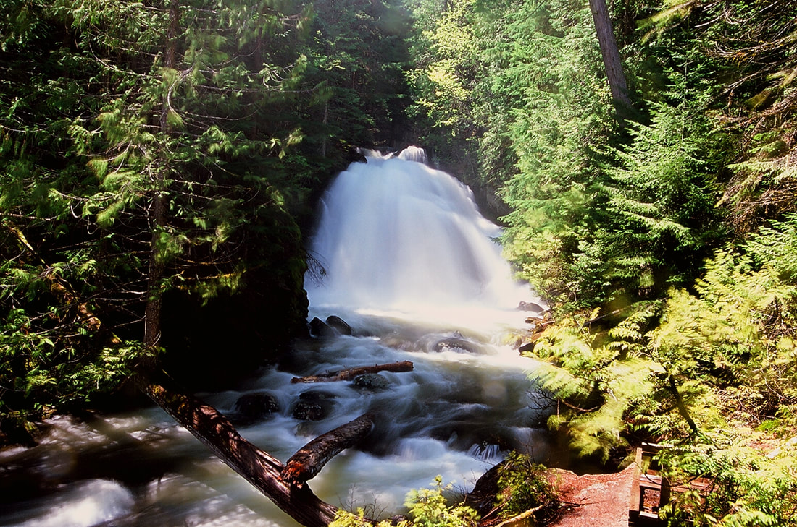
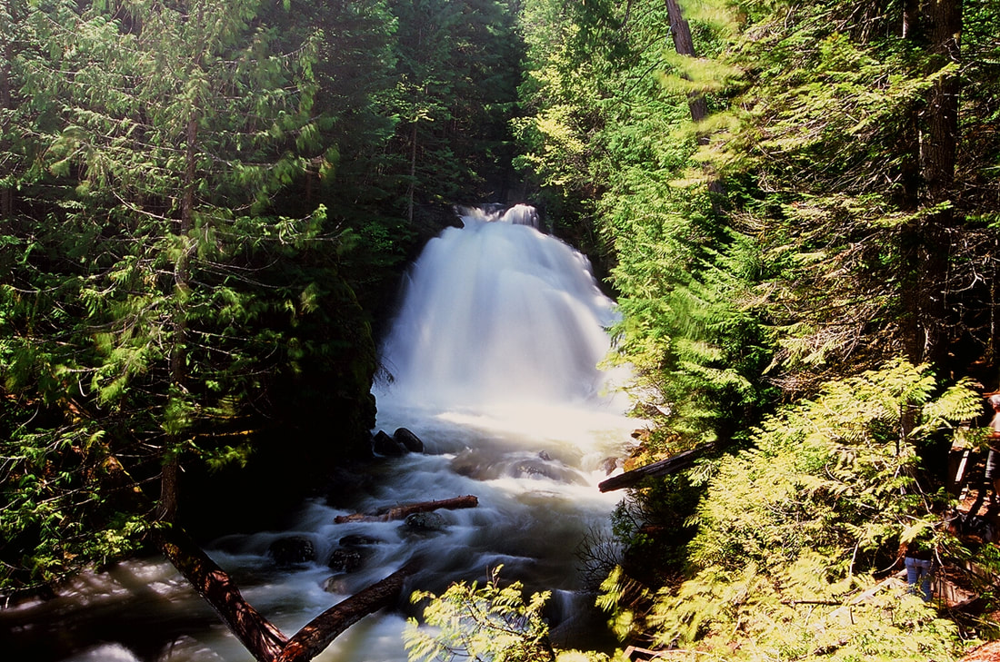
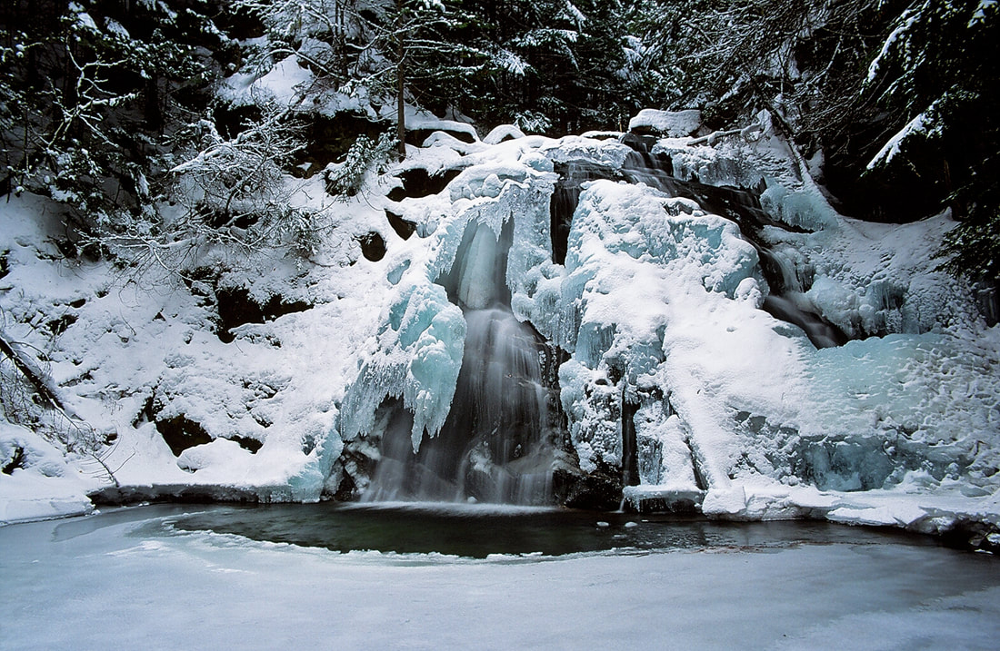
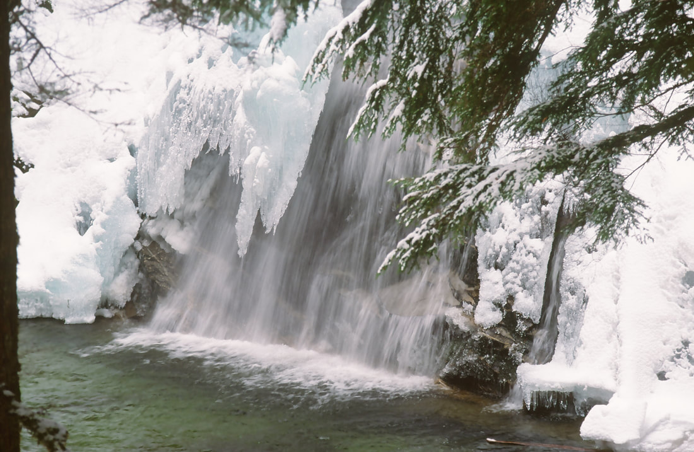

---
tags:
- Waterfalls
- Skiing & Snowshoeing
stats:
- label: Waterfall
  icon: waterfall
  value: L. & U. Snow Creek Falls
- label: Drop
  icon: arrow-collapse-down
  value: Lower Falls about 20', Upper Falls about 30'
- label: Waterfall Type
  icon: ski
  value: Lower is Chute, Upper is Fan
- label: Distance Car to Falls
  icon: map-marker-distance
  value: To visit both falls it's about 1 mile
- label: Maps
  icon: map
  value: I.P.N.F. Bonners Ferry Ranger District 208.267.5561, Roman Nose topo
- label: GPS
  icon: crosshairs-gps
  value: Trailhead 48°40′12″ N 116°25′37″ W, Falls 48°40′02″ N 116°25′45″ W
---

# Upper & Lower Snow Creek Falls

_Upper & Lower Snow Creek Falls_

## Description

The best of the best waterfalls in our area. There are few falls in our area that match the quality and
beauty of Snow Creek Falls. Because it's such a short walk, you should not miss it when you are in the area.

Years ago, I had to bushwhack through the woods just to get to the falls. The USFS Bonners Ferry Ranger
District constructed a new trail to the falls, with observation decks at both. The Upper Falls is larger and
fans out wide as it drops about 30'. The Lower Falls is a bit smaller, but has the same volume of water, so
it gushes in a spectacular display.

On the trail in, you will walk to a split in the trail. There is a bench here to sit and listen to Quiet
Creek. If you go right at the "Y", you will walk a short distance to the Upper Falls. If you go left at the
"Y", you will drop slightly to some stairs that lead to the Lower Falls.

These falls are excellent to photograph in any season. So if you are in the area during winter, do not miss
them. However, in the spring and early summer, the creek gushes over their drops and mist is an issue. This
also makes the area around the falls very slippery. Do not change your DSLR lenses anywhere near the falls.
Please stay on the decks; the area around both falls is muddy and very slippery.

## Directions

The easiest way to get to the trailhead is to drive through Bonners Ferry on Hwy 95. Just before you cross
the Kootenai River, turn left (W) onto Riverside Street. PLEASE obey the speed limits here. Continue on
Riverside Street which skirts the Kootenai River until it crosses Deep Creek (there is a restroom here).
Stay on Riverside Street until it joins up with F.R. #18 (was #418 on older maps).

Take a sharp left (S) onto #18, also known as the West Side Road. Drive 2.8 miles to another very sharp
right turn onto the Snow Creek Road. The Snow Creek Falls parking area is a wide spot along this road, and
is well signed.

## Cool Things Close By

Roman Nose Lakes & Peak, Bottleneck Lakes & Peak, Snow Lake, Myrtle Lake & Peak, Myrtle Falls & the Kootenai
National Wildlife Refuge, Burton Peak, Pyramid-Ball Lakes, Fisher Peak, Smith Falls, Long Mountain Lake, and
Parker Peak.

## Hazards

All waterfalls are a hazard due to their slippery nature. Always be extra careful near any waterfall.

Stepping off the observation decks can be very dangerous. Please stay on the decks and use extra caution in
wet conditions.

## Restaurants & Pubs

Oriental Gardens, Chic-N-Chops, Pizza Factory, and Burger Express.

## Plan Your Trip

Click for Current NOAA Weather Conditions

## Photo Gallery

_Lower Snow Creek Falls in spring._

_Upper Snow Creek Falls in the dead of winter._

_What a beautiful winter sight._
