---
tags:
  - Waterfalls
stats:
  - label: Waterfall
    icon: waterfall
    value: Willow Creek Falls East
  - label: Drop
    icon: arrow-collapse-down
    value: Several drops
  - label: Waterfall Type
    icon: waterfall
    value: Several types
  - label: Distance Car to Falls
    icon: map-marker-distance
    value: Lower falls are below the trailhead, about .5 miles; Upper falls are about 2.25 miles
  - label: Maps
    icon: map
    value: I.P.N.F., CDA River Ranger District 208.769.3000 & 208.752.1221
  - label: GPS
    icon: crosshairs-gps
    value: Stevens Lakes & Lone Lake trailhead 47°26′16″ N 115°45′57″ W
---

# Willow Creek Falls East

## Description

The description of these waterfalls is very complicated, but I'll do my best. In the gallery below, the
falls will match the number in the description here. Starting at the trailhead and heading upstream towards
L. & U. Stevens Lakes:

- **1st falls**: About 40' off the trail, a 3' Block type falls.
- **2nd falls**: A ways past the first and only 40' off the trail.
- **3rd falls**: The best of the lower falls.
- **4th falls**: Up in the clearing below the headwall, dropping about 20' in a Plunge type. On your hike to
  the lakes, you have to cross the falls to continue.
- **5th falls**: Up past the first large switchback. It is actually two falls that descend through a split
  in a huge rock. Both are Plunge types.
- **6th & 7th falls**: Real close to each other and can be seen by dropping down to the 4th falls. Both are
  Plunge type falls.

!!! warning "Use Caution"

    Please be very careful here.

Below the trailhead are 3 more falls, but the area around them is too overgrown to get good images of.

## Directions

Drive east on I-90 to Exit #69. At the stop sign, turn left (N) over the freeway to the next stop sign, and
turn right (E) onto Friday Ave. Continue past the Lucky Friday mine site to a "Y", and bear right. In a
short distance, you will cross back over the freeway where you will be on Willow Creek Road. In a little
over a mile, the trailhead will be on your left. There is a pit toilet and picnic bench at the trailhead.
The Stevens Lakes Trail #165 is on the left (E) side of the creek.

## Cool Things Close By

Lower & Upper Stevens Lakes, Stevens Peak 6838', Lone Lake & the Upper Sanctuary, St. Regis Lakes, Lookout
Pass Ski Area, Route of the Hiawatha, Trail of the CDA, and the Shoshone County Park.

## Hazards

All waterfalls are a hazard due to their slippery nature. Always be extra careful near any waterfall.

## Restaurants & Pubs

Muchackos Tacos Pizza Factory in Wallace. Radio Brewery in Kellogg.

## Plan Your Trip

Click for Current NOAA Weather Conditions

## Photo Gallery

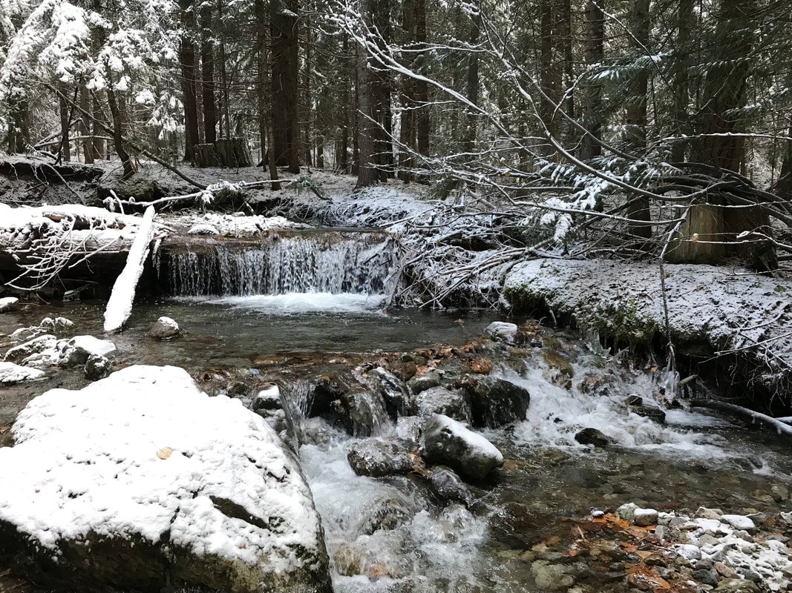
_The 1st waterfall along the trail._

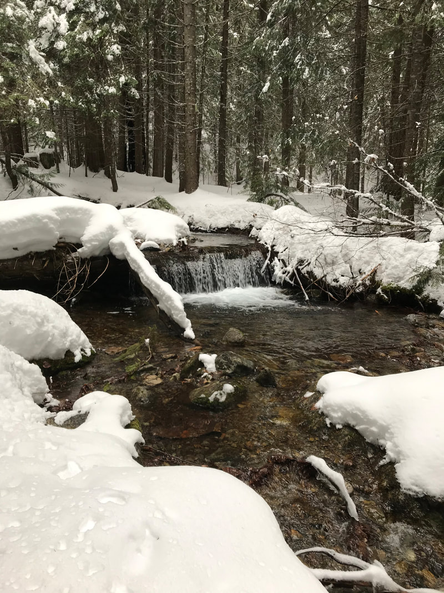
_The 1st waterfall along the trail, another view._

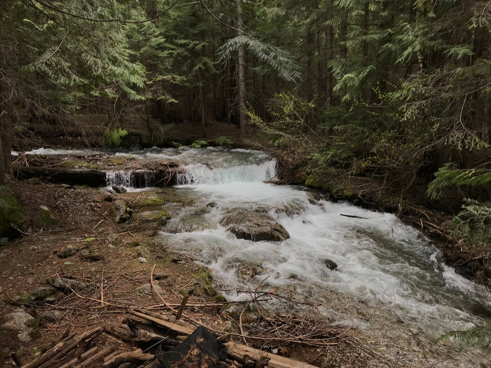
_The same waterfall as above, but in heavy runoff on 5/31/22._

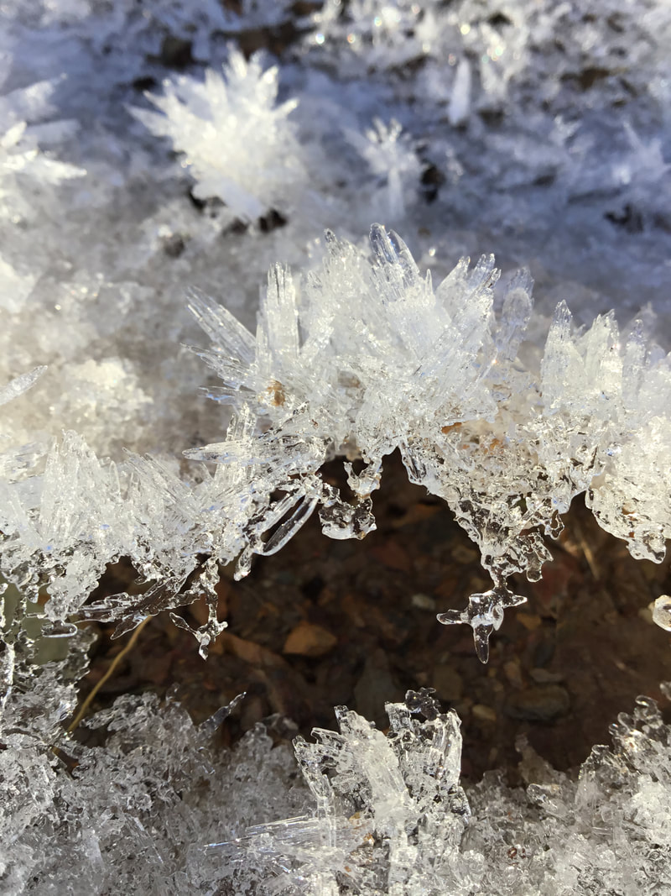
_Falls #1: hoar frost popping up through the dirt on the trail._

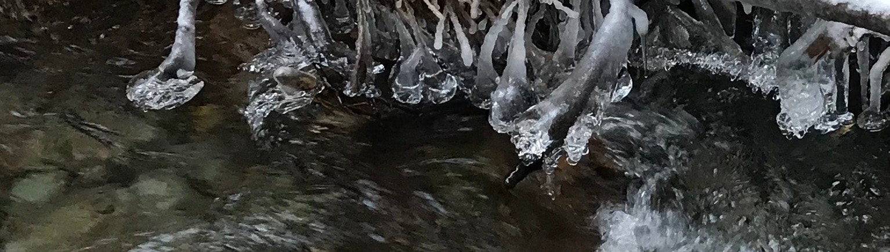
_Falls #1: ice balls form when the flow is high._

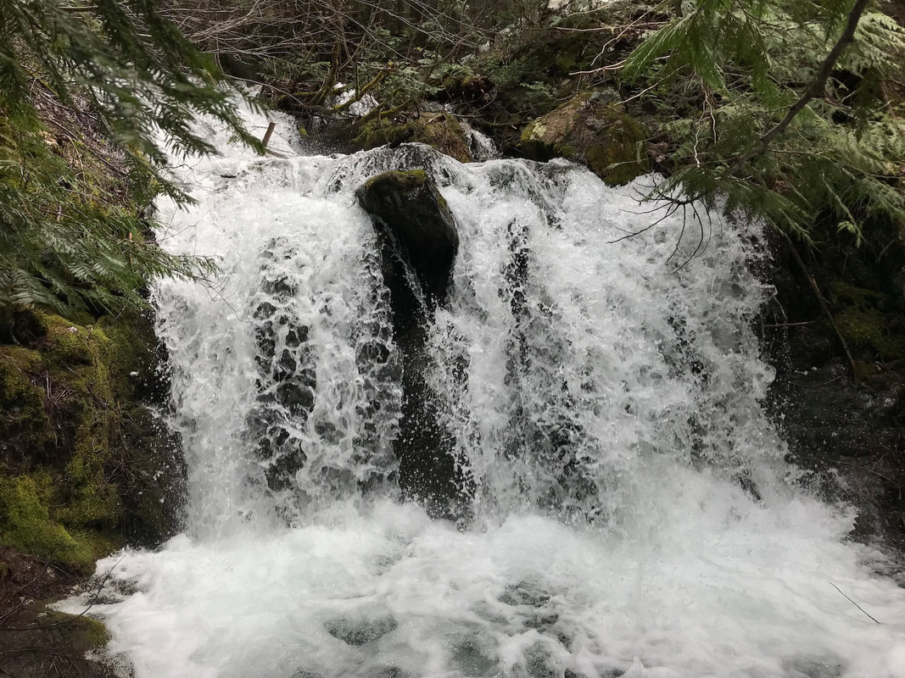
_Falls #2: this waterfall is noisy and about .4 mile upstream._

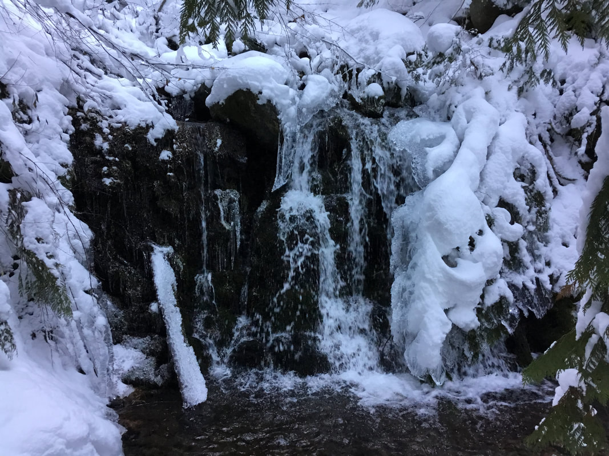
_Falls #2: the same waterfall, but in lower flow._

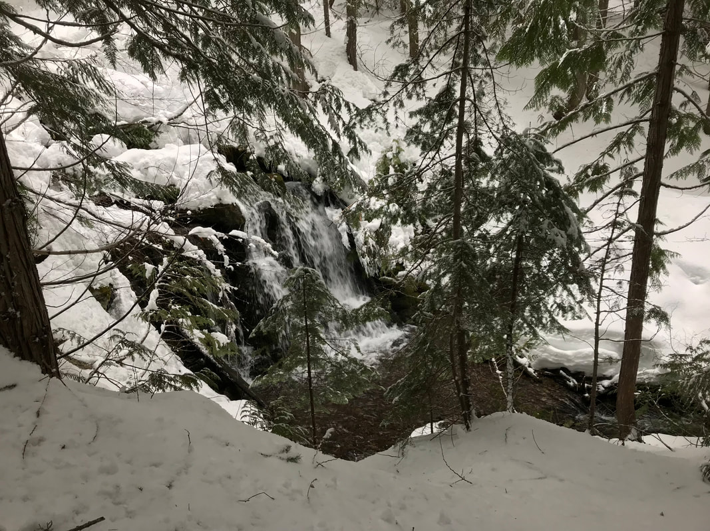
_Falls #3: the biggest of the lower falls._

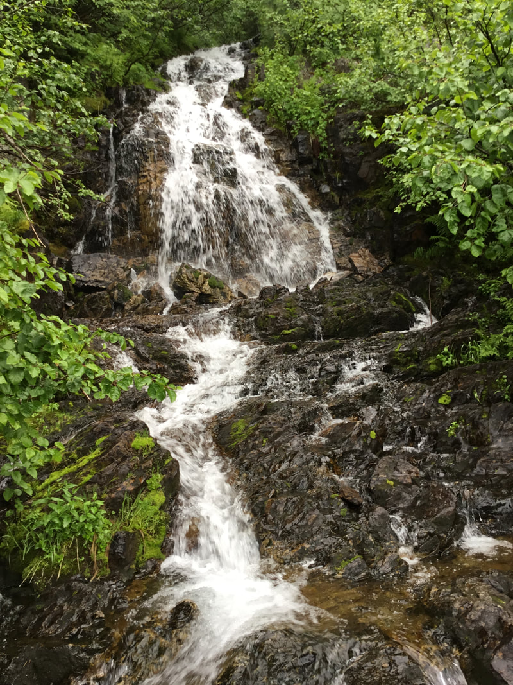
_Falls #4: at the bottom of the headwall you must cross._

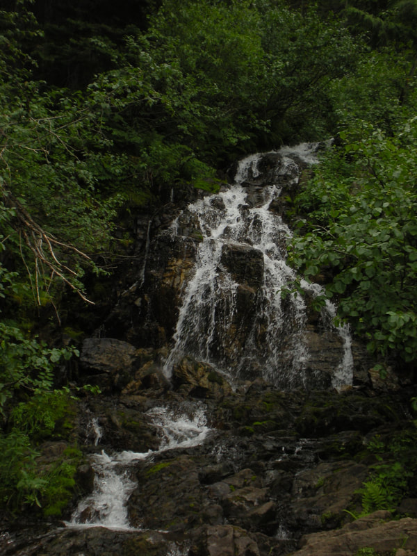
_Falls #4: at the bottom of the headwall you must cross, another view._

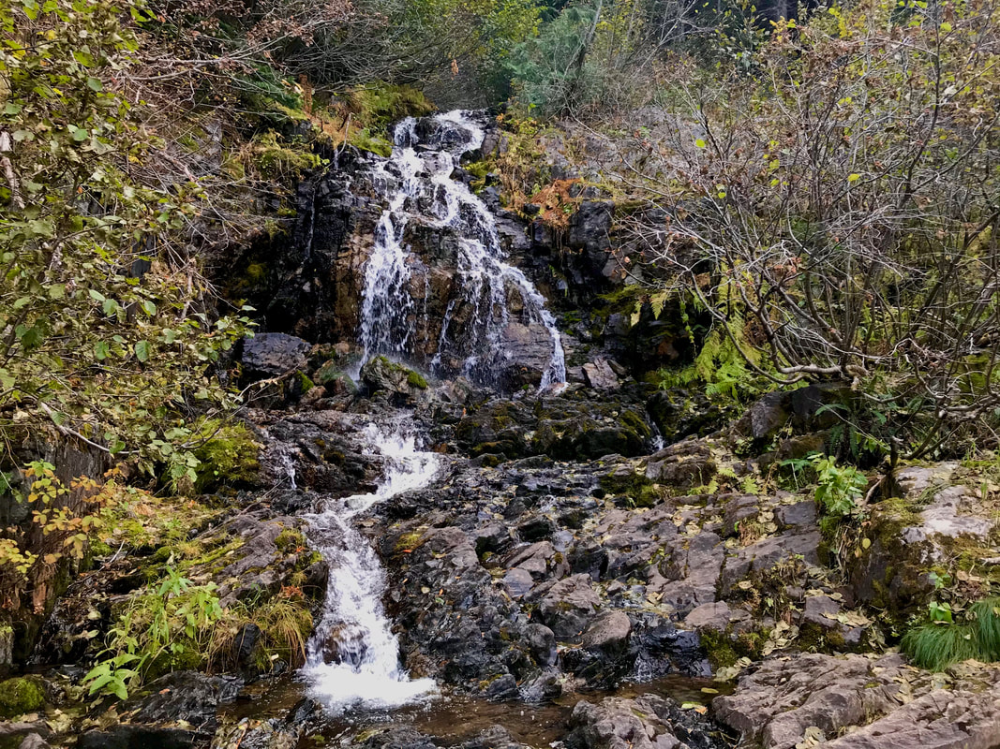
_Falls #4: headwall falls taken from the log crossing._

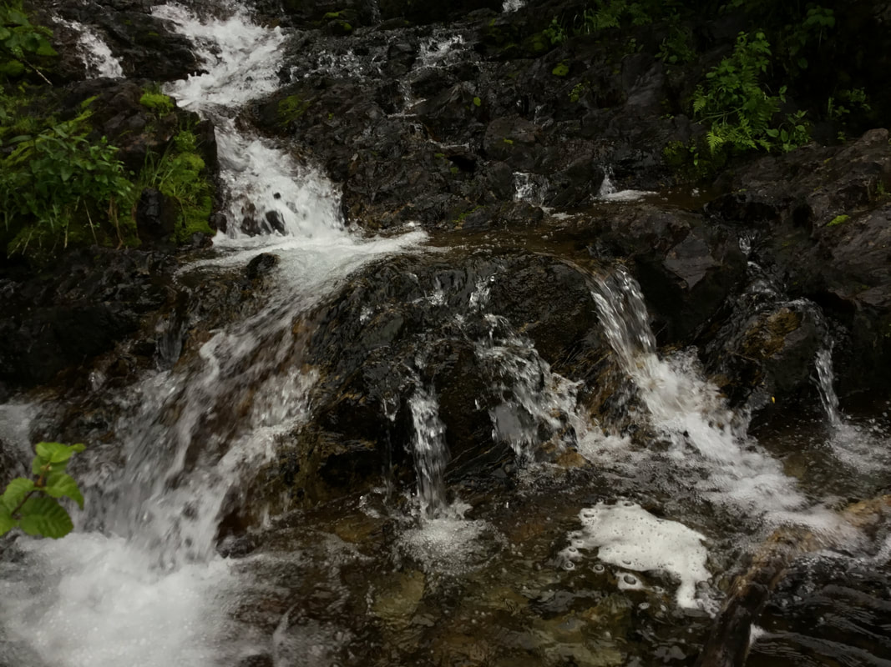
_Falls #4: headwall falls._

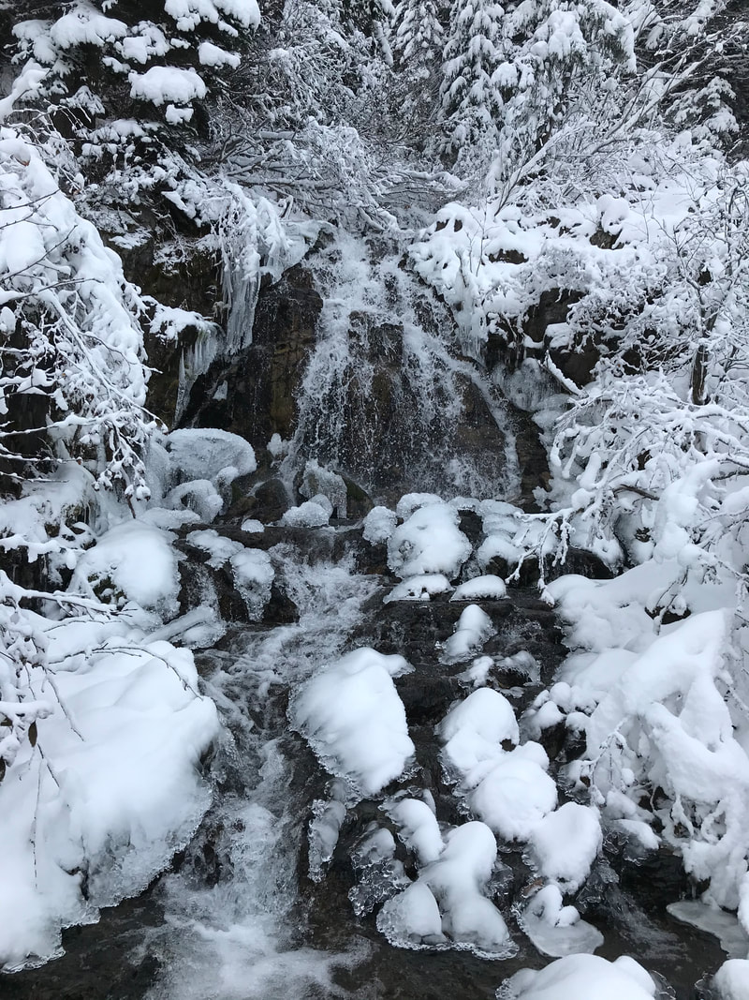
_Falls #4: the start of winter at the headwall falls._

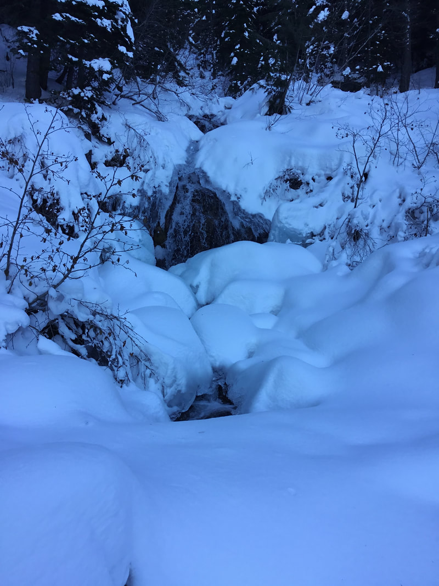
_Falls #4: the headwall falls in the dead of winter._

_Falls #4: the headwall falls._

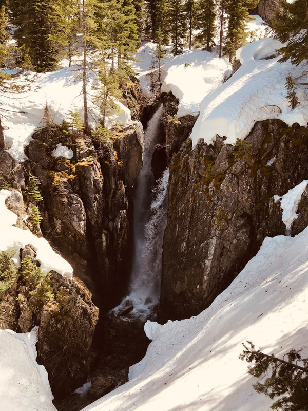
_Falls #5: these waterfalls are halfway up the headwall, dropping through a crack in the rocks._

_Falls #5: in early spring._
