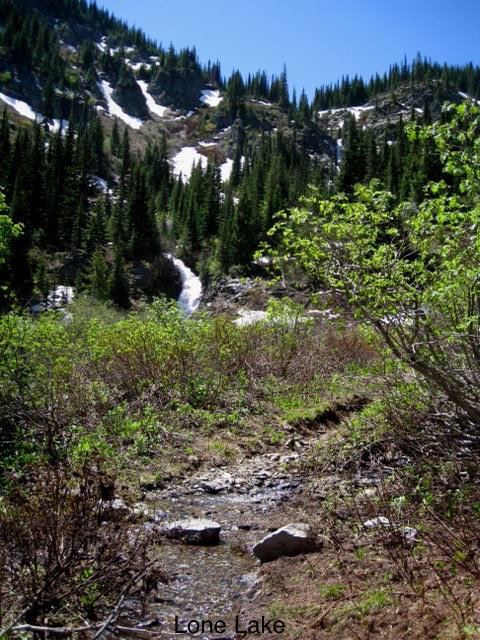
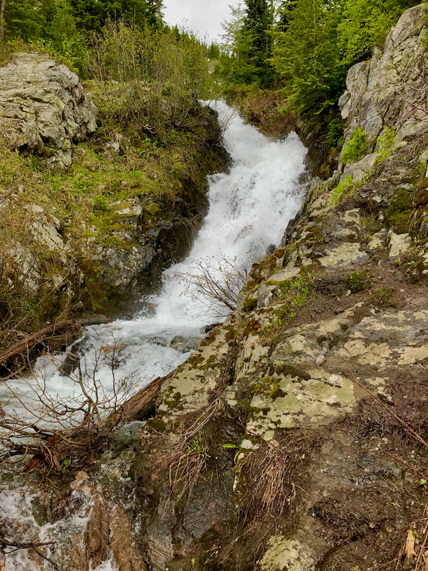
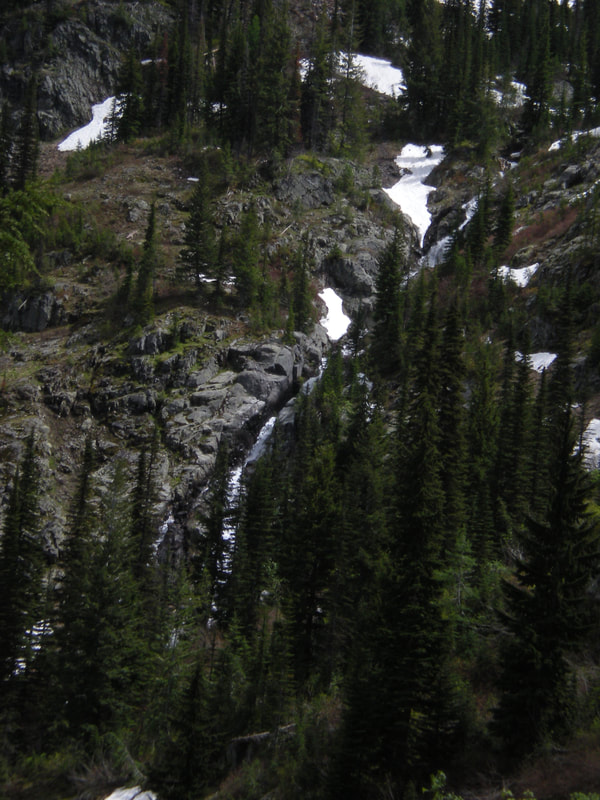
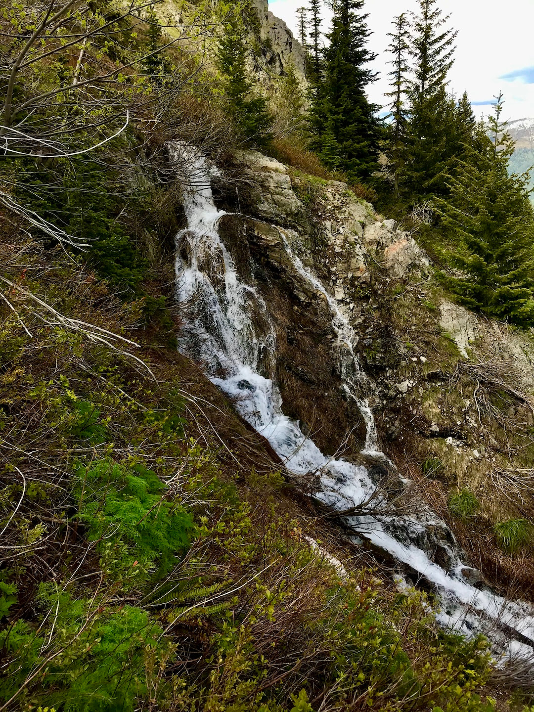
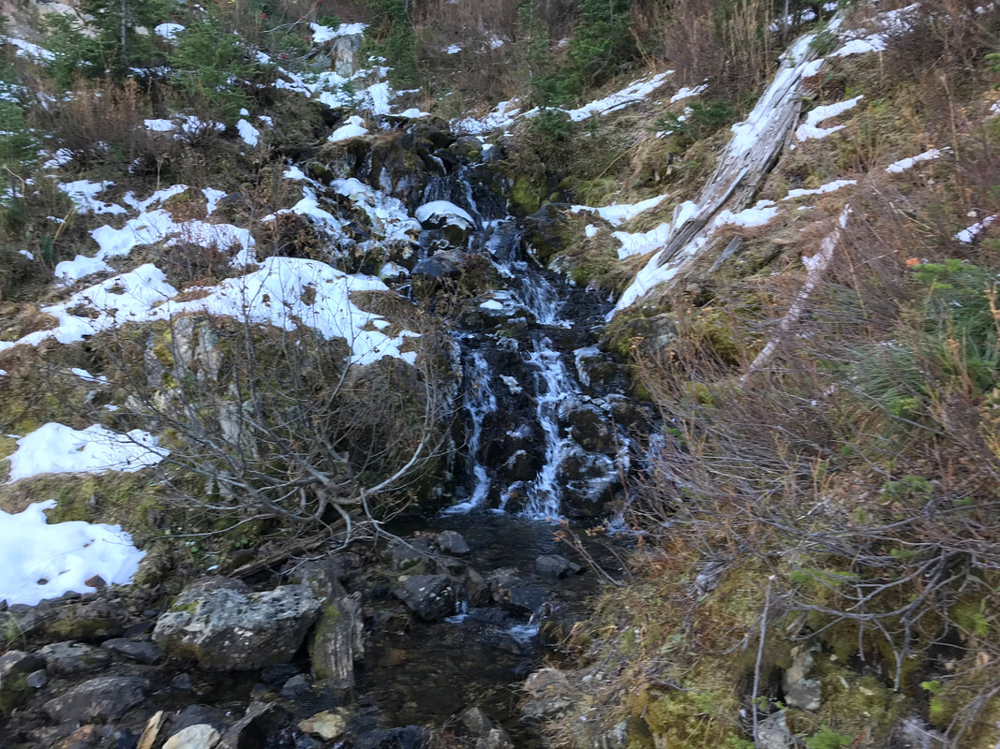
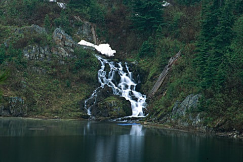
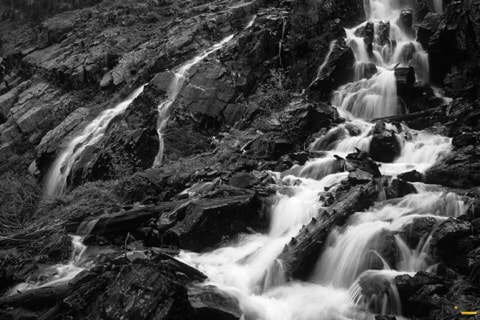
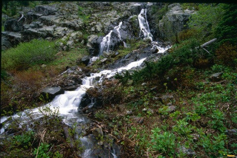
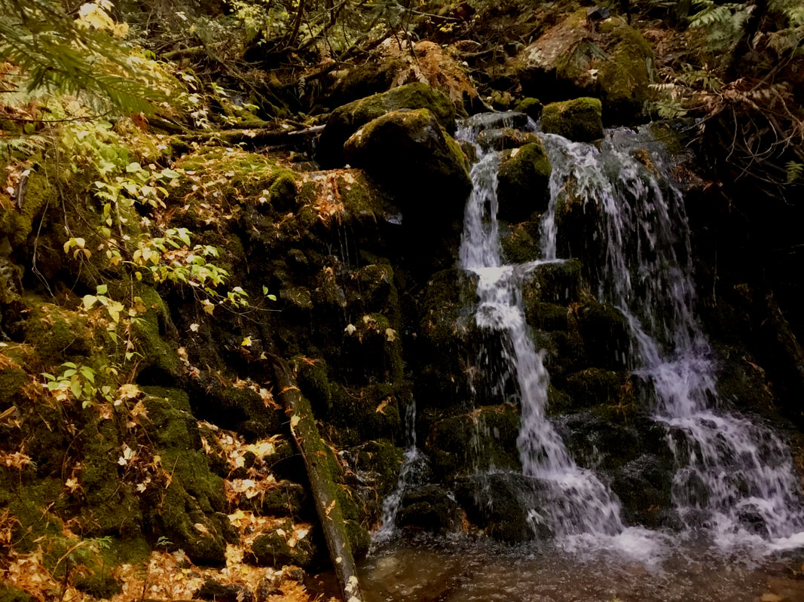
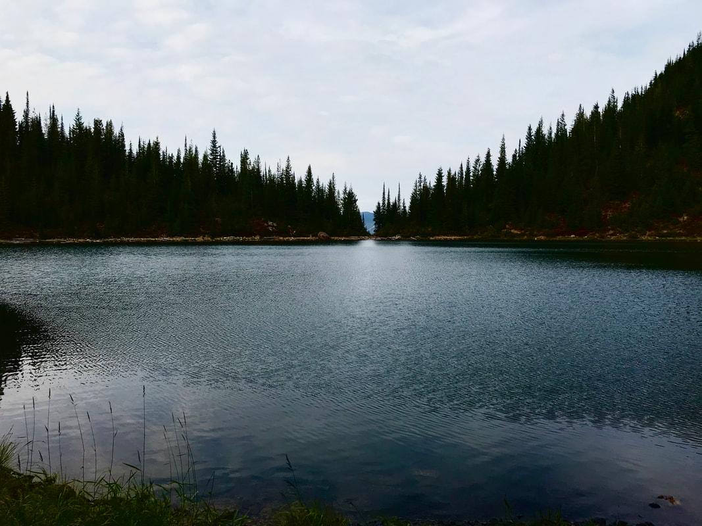

---
tags:
- Trails & Scrambles stats:
- label: Waterfall icon: waterfall value: west willow creek falls
- label: Drop icon: arrow-collapse-down value: several falls, and 500’ steep cascades
- label: Waterfall Type icon: hiking value: nearly every type
- label: Distance Car to Falls icon: map-marker-distance value: headwall falls .9 miles. many more above &
  below
- label: Maps icon: map value: ipnf, mullan topo
- label: GPS icon: crosshairs-gps
## value: 47°26’17" n 115°46’26" w
## Willow Creek West Cascades
## Description: caution statement
From Lone Lake to the junction with East Willow Creek, is only about 2 miles. In that distance, the creek
falls about 500 feet down the Headwall. At Lone Lake, there is a nice waterfall opposite from the inlet
stream. By walking the right side (west) around the lake, the small falls is just below what I call the
Upper Sanctuary. Along the upper part of Trail #138 as the trail switchbacks out onto a rock rib, there are
three cascade drops to cross. Fortunately they are safe to cross. But extra care between the lake and the
headwall falls is a must. Rocks are slippery. As the trail switchbacks on an exposed rib, observe the
headwall cascades/falls across the valley to the SE.
When you get to the headwall falls, above is the 500 ‘ of cascades. Be aware: any of the falls below the
lake are very dangerous to access. use a long telephoto and tripod to capture them. About .5 miles up Trail
## 138 is a lot of waterfall noise, but few phot opts, due to brush
See stevens lakes for east willow creek, and willow creek from the junction to mullan.
## Option #1
Headwall falls on west willow creek: About two miles up thru the forest as the canopy opens up, is the
headwall falls. As the trail turns SW and skirts the north facing slopes, its a short walk to the falls.
## Option #2
Trail #138 falls:
At about a mile from the trailhead as you step up from the de-commissioned road, there is an attractive
noise to your left. There is no trail, and having been there once, once was enough. However, in the winter
the falls are more exposed. They are about .1 of a mile, and 50 vert below the trail , but in the summer.
## Option #3
There are other cascades on the West Willow Creek, so search and see what you find. Most have no photo ops.
---

# Willow Creek West Cascades

## Directions

Drive east on I-90 to Exit #69 East Mullan. Exit and turn left at the stop sign. Crossing over the freeway,
turn right (East) past the Lucky Friday mine, to a "Y", and bear right, eventually crossing back over the
freeway. Continue south for about a mile to the joint Stevens Lakes & Lone Lake trailhead, with outhouse.

If you have a high clearance vehicle, you can head west across Willow Creek to a road heading south between
the creek and a gigantic Boulder. It’s about .3 of a mile to the upper parking. Please do not block the main
road that switchbacks near parking area.

## Cool things close by

Lower & Upper Stevens Lakes, Stevens Peak, the Idaho Centennial Trail, Upper & Lower St. Regis Lakes, the
Trail of the CDA’s, the Hiawatha Trail, and Montana

## Hazards

Any time you go waterfalling, you are putting yourself in danger. do not take dogs or children on serious
photo ops. Please always err on the side of caution. no waterfall, or image is worth your life. In developed
areas, mind the rules, or pay the price.

All waterfalls are a hazard, due to their slippery nature. always be extra careful near any waterfall

## R & P

Muchacho’s tacos, pizza factory, in wallace. radio brewery in kellogg.

---

Click for Current NOAA Weather Conditions

## Photo gallery

---

## As you break out of the woods, the lower falls comes into view

## The above falls in the summer

## This is the 500' cascading waterfall below lone lake

## Small intermittent falls half way up the headwall trail

## The falls at the back of the lake, on the way to the upper sanctuary

## Spring time at the lakes waterfall

The next three images are from the 500' cascading waterfall. The original trail climbed up next to the
cascades, but it is way too steep. I used technical climbing gear to get these images

##

## The lakes falls in the fall

Lone lake from near the lakes waterfall, looking north. the split in the trees is the trail down

---

---

---

---

---

---
