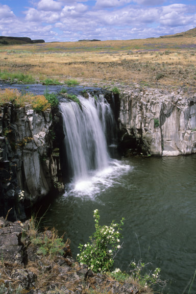
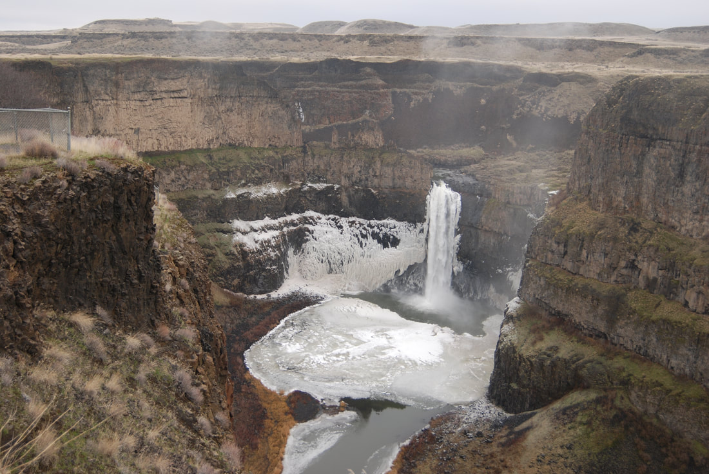
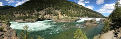
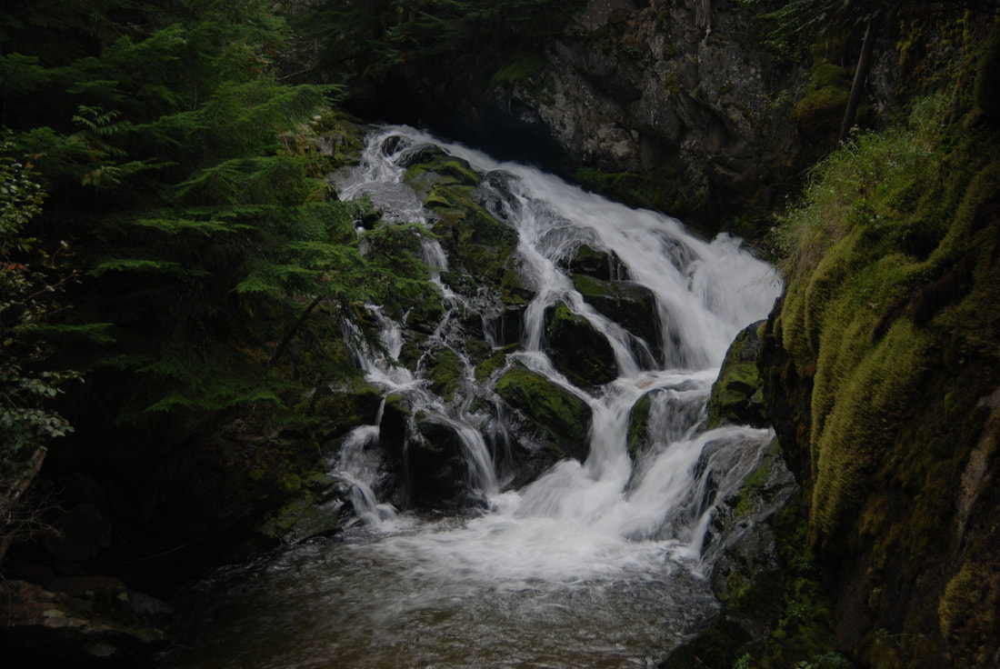
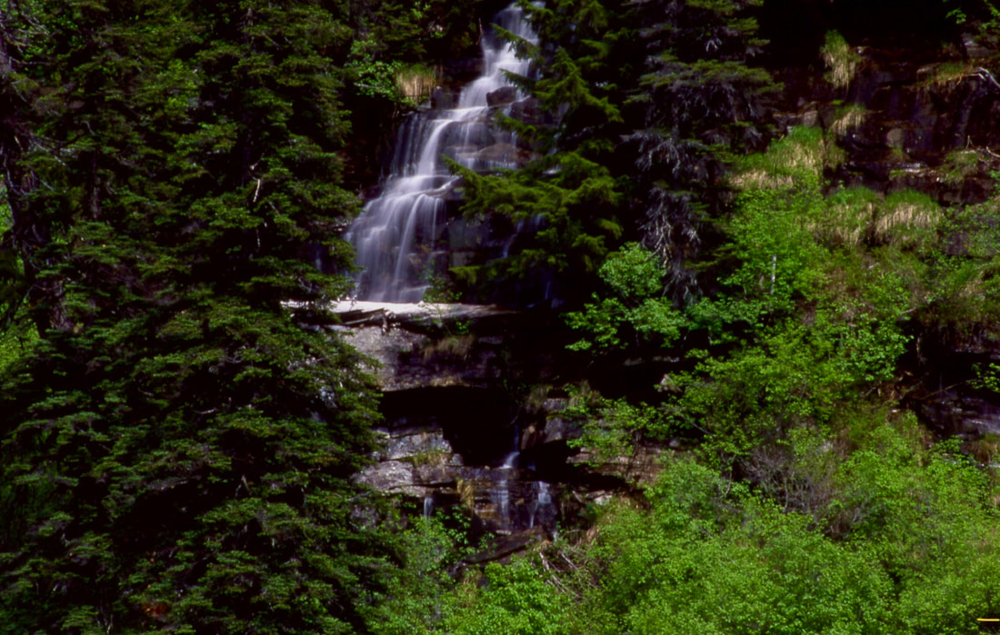
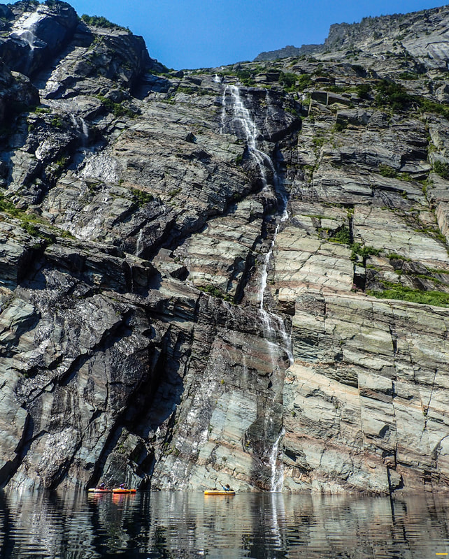

# Waterfalls

## How to shoot waterfalls like a pro

(Check out the camera instruction segment under RESOURCES.)

Tools Tools you will need for excellent waterfall images.

- A tripod---this is the most important tool in your quiver for great waterfall shots.

- A cable release---it allows you to take long exposed images without camera shake as you release the
  shutter. You can use the delayed timer, but you can’t control the length of the exposure manually.

- A polarizing filter---I would highly recommend a B+W Polarizing Filter. They are superior to the normal
  polarizers on the market, for the money.

- A graduated neutral density filter---this filter is used to bring down the brightness of a section of an
  image. One half of this filter is clear glass, while the other half is tinted darker. Put the darker
  sIde over the lighter portion of the image to balance the light and exposure.

Because waterfalls are very bright, a camera cannot adequately capture them in a Program Mode. So switch to
"manual" for this kind of image. As in any image you make in bright circumstances, the brighter part will
over power the darker part of the image. So when setting up your shot, ALWAYS ALWAYS meter off of greenery
(no waterfall) in the same light and aspect of the falls. Otherwise, move your camera so you only see green
in your viewfinder. Take that reading in manual and re-position your camera on the waterfall. Your meter
will spike to the plus or overexposed side so don't pay attention to it. By using a small aperture, f8 to
f16, your camera will create an image that is very sharp close and far from you, and will require the
shutter speeds to be long. It isn't uncommon to have a 1 to 5 second exposure. The depth of field from a
small aperture, and a long shutter speed will allow the water to veil as it falls. Look at your image in
your preview mode and make adjustments as needed to get the exposure you are looking for. When using a
polarizer, set your exposure first, then adjust your polarizer so the reflection of light off the water and
rocks remove the glare of light. This may cause your exposure to be darker, so slightly increase your
aperture size to compensate. When you are ready, take the image and review it for any needed corrections. If
your image is too light or dark, close your aperture down until you get what you want. If your image has a
brighter section (sky, water, etc), use a graduated neutral density filter to tone down the bright area.
This filter can be rotated in any direction to cover just the bright areas. Even side ways, if needed. This
procedure can be used in any image you make that you want any of the following: More depth of field. To
darken a sky. To enrich colors

Whenever you are shooting in normal lighting conditions, always use a low ISO like 100 to 400. Higher ISO's
tend to wash out the image.

If you notice your image is consistently over exposed, simply reduce your exposure in the "exposure
compensation mode". Modern digital sensors are designed to brighten the image. This does not fare well with
most circumstances. In both my DSLR and my PnS, I reduce my exposure compensation by as much as 1.7 stops.
By using the exposure compensation, all your images will be consistent, with less washout.

Another very important thing to know about digital cameras is, if you go into your Mode or Menu settings and
make any changes for a particular type of shooting (AWB, flash mode, etc.), BE SURE to cancel those
specifics out when you are done. Otherwise, your outdoor settings used indoors will be drastically
incorrect. I would suggest periodically going into the menu and hit reset, then go thru the menu and do your
changes. It will cancel out your settings that you forgot about and allow for better images in the future.

NEVER EVER change your lenses when you are in dusty circumstances. A speck of dust on your sensor, will
block several sensor pixels. DO NOT EVER ATTEMPT TO CLEAN YOUR SENSOR. Its a 120$+ job for a professional
repairman to do. Keep your camera

in a

plastic bag in your case when in dusty areas.

I never walk in a group on a dusty trail or in dusty circumstances. I’m often found way back from the pack.
Oh, and as I am thinking about it. Warn your non photo hikers that you take way too much time setting up and
shooting images.

It is my opinion, that the tripod is your most valuable piece of equipment after high quality lenses. Carry
it and use it to create maximum clarity and to eliminate camera shake.

Phone cameras When you come along a nice cascade or falls, fold your phone very steady and gently push the
shutter release button. Before shooting your images, touch the screen and notice that the exposure becomes
darker. A yellow square will appear with a yellow dot next to it. Using your finger, to move the dot down to
darken your image. It is much easier to lighten a dark image, then trying to darken a light image.

Airdrop your image to an iPad, or computer. Then select EDIT top right. From here, you can level your image,
crop, and adjust each image using the iPads Photo Editing Tool. If you are shooting a bright screen, touch
your screen and drag the \* down to darken your images.

Shooting PANOS & VIDEO on your phones If the top of the falls, or scenes are too light, start your image
from the top or lightest area. Touch your screen and reduce the exposure, as stated above, then do your
vertical pano down the waterfall to the bottom. The Photo Editing Tool, can correct out any bright spots in
post production.

Before shooting a regular pano, do several dry runs of the path you want to record. This wise, you can make
sure you don’t cut off any peaks, or foreground.

As you are shooting the many waterfalls in our region, if you notice a small, slate gray, fat little bird,
with yellow feet, in or around the falls. Be still, don’t talk or move around. And if you are luck, you may
spot a Water Ouzel, also called an American Dipper. They make a sharp sound like "zeet. With even more luck,
you might see them walking on gravel. They are known to dive under water for water insects. As they stop
walking, they have a distinctively dipping motion. In one waterfall, I have seen them dive thru the falls,
and living in the rocks of the stream. Consider yourself lucky for you see one.

Care around waterfalls

Due to their very nature, waterfalls can be located in very dangerous places. Many people have died falling
over the brink of a waterfall, or scrambling on a steep cliff, slippery, or rocky area to get a better view.
Please be very careful when visiting all waterfalls. Once years ago, a friend and I were shooting Granite
Falls up by Nordman. I slipped, and started to go over the edge. My buddy saw this happening and grabbed a
small tree, then my arm. He saved my life.

## A disclaimer

I/we take no responsibility for any trouble, injury, or death you or a loved one may experience when
visiting any waterfalls on our pages. I/we also take no responsibility if you get lost following (or trying
to follow) our directions or advice. Although I/we have done our best to provide accurate and easy-to-follow
directions, there could still possibly be errors, beyond our control.

## Types of waterfalls

## Plunge

These falls drop off a cliff’s lip and rarely touch the vertical rock below the rim. Plunge waterfalls tend
to dig out a hole, called a Plunge Pool, but not always. Plunge Pools are often under cut, leaving a large
open space below.

Towell falls, escure ranch, washington scablands

- 

## Horsetail

Named after the way a horses tail fans out from its lip. Rarely does a horsetail falls touch the vertical
face it drops off of.

Hawk creek falls s.p., washington

*Picture (Image missing)*

## FAN

As the name implies, a Fan type of falls spread out as they crown the lip of a cliff. A small exit spot, may
spread the falls to many times it’s original width.

Lower snow creek falls, american selkirks, idaho

*Picture (Image missing)*

---

## ***Punch bowl.   4067 & 5405***

Punch Bowl falls are similar to Plunge type of falls, except they carve out deep and large under water
caverns

below the

entry point of the falls.

Palouse falls, washington

- 

## *Block*

Block waterfalls tend to be as wide as the stream or river they fall from. They aren’t usually tall, but

spectacular in

that they cover such a wide.

expanse.

Kootenai falls, montana

- 

---

## Tiered

Tiered waterfalls tend to fall in a line and each tier can be of varying heights.

Hog canyon falls, washington

*Picture (Image missing)*

## Segmented

Segmented falls split at the lip of the drop into two or more falls.

Hunt Creek Falls, American Selkirks.

- 

## Cascades

Cascading waterfalls are small waterfalls that cascade or tumble down the slopes they follow. They can be of
any size wide or tall in their drop.

St. paul lake falls, cabinet mountain wilderness, mt.

- 

## Chutes

Chutes resemble rapids in their descent.

Lower lone lake falls, stevens peak, idaho

*Picture (Image missing)*

## Slide

Usually Slide falls, are similar to Cascades, but can be larger and much more beautiful.

Granite creek falls, washington Image coming soon.

## Ribbon

Ribbon falls tend to be taller, and are thin. They can touch the faces they fall over, and even create small
plunge pools along their drop.

Leigh lake, cabinet mountain wilderness, mt.

- 

A few websites to use to find waterfalls in your area.

<https://www.world-of-waterfalls.com/about-us/>

<https://www.waterfallsnorthwest.com>
