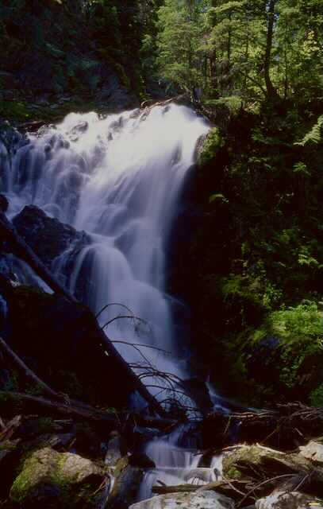

---
tags:
  - Waterfalls
stats:
  - label: Waterfall
    icon: waterfall
    value: Dipper Falls & an unnamed falls next to Hub Lake
  - label: Drop
    icon: arrow-collapse-down
    value: 60'
  - label: Waterfall Type
    icon: waterfall
    value: Tiered
  - label: Distance Car to Falls
    icon: map-marker-distance
    value: 1.4 miles from trailhead
  - label: Maps
    icon: map
    value: Lolo N.F., DeBorgia topo
  - label: GPS
    icon: crosshairs-gps
    value: 47°16′31″ N 115°22′29″ W
---

# Dipper Falls

_Dipper Falls along the trail to Hub Lake._

## Description

Trail #262 starts on Road 889 and wanders up through an old growth cedar forest for a little over a mile to
the junction with Hazel Lake. Just before the junction, look for 60' Dipper Falls below the trail on Ward
Creek.

When the creek flow is low, the falls look like hundreds of ladles (dippers), one on top of another. Other
times it roars down the ravine in a nice displaying trail side sound.

## Directions

Head east on I-90 into Montana and exit on 26, Ward Creek Road. Head south up the Ward Creek Road #889
for 6.5 miles to a trailhead just before Ward Creek and a left turn.

There is no west bound on ramp, so you have to drive east on I-90 to St. Regis to regain the west bound
lane.

## Cool Things Close By

Ward & Eagle Peaks, Lookout Pass Ski Area, the Route of the Hiawatha, and historic Wallace.

## Hazards

This trail is pretty easy with no hazards to speak of. The trail above Hub Lake is steep.

## Restaurants & Pubs

Pizza Factory, 1313 Club and Muchacho's Tacos in Wallace.

## Photo Gallery

Additional images coming soon. To contribute, contact Chic via this website.
