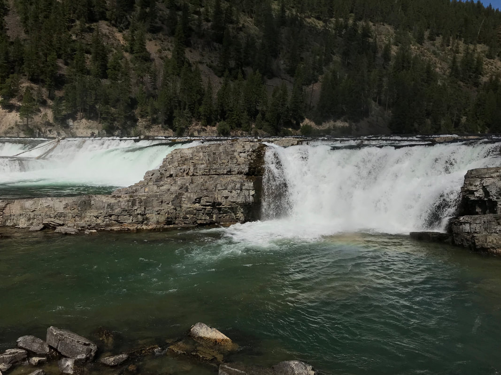
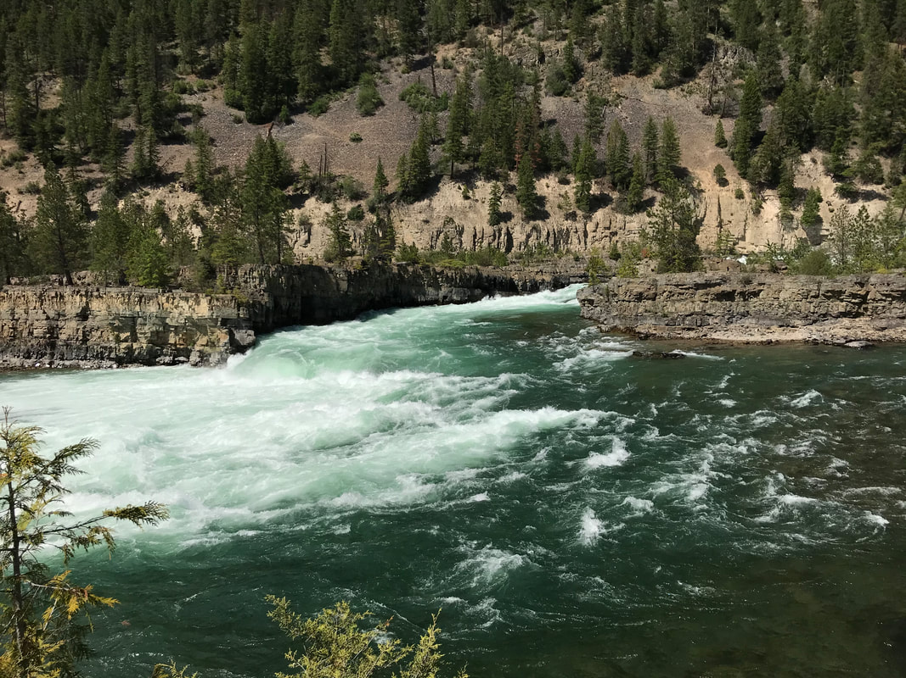
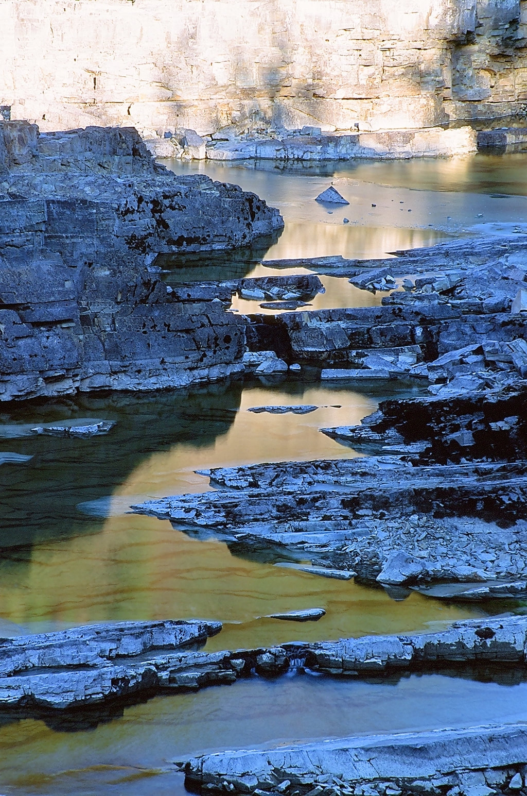
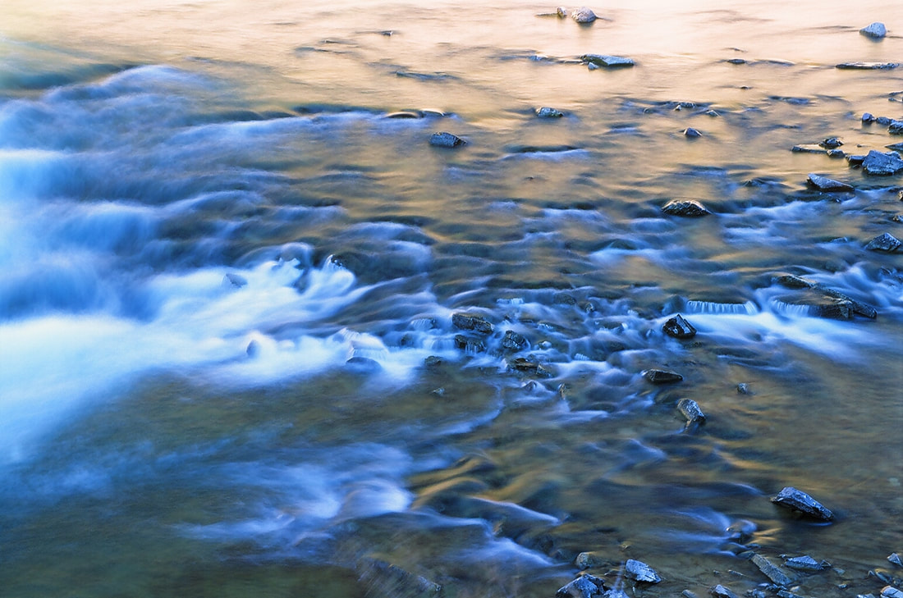
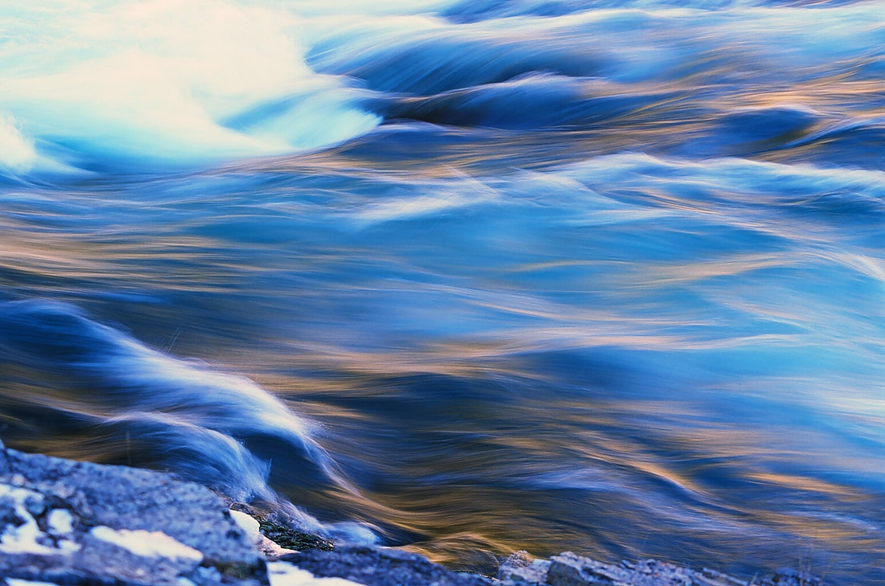
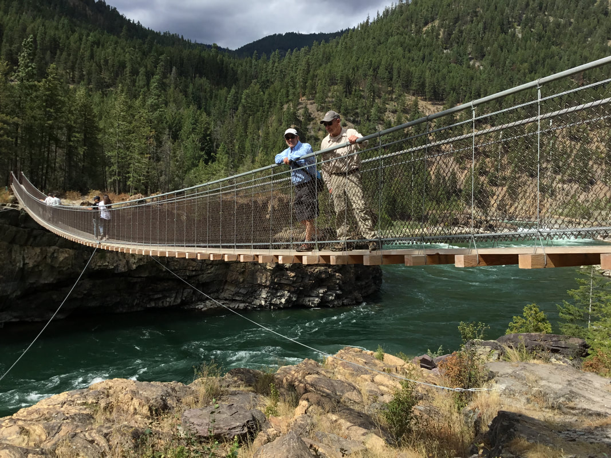

---
tags:
- Waterfalls stats:
- label: Waterfall icon: waterfall value: Kootenai Falls
- label: Drop icon: arrow-collapse-down value: Several
- label: Waterfall Type icon: waterfall value: several
- label: Distance Car to Falls icon: map-marker-distance value: .5 miles
- label: Maps icon: map value: Kootenai National Forest, Cabinet Ranger District 406.827.3533,
- label: GPS icon: crosshairs-gps
## value: 48°45’53" n 115°76’?38" w
## Kootenai Falls
## Description
While on your way to the Cabinet Mountain Wilderness via Libby, Montana, be sure to stop at the Kootenai
Falls on Hwy 2. As you start your walk to the falls, read the kiosk for info on the falls, like History,
Native American involvement, and directions.
After a short walk, you come to a railroad overpass. Please use this method to cross the tracks. Then you
will come to a "Y" in the trail. Going right will take you to the bulk of the falls, while going left will
take you to the swinging bridge. Keep in mind, after seeing one, you will go to the other.
All waterfalls are a hazard, due to their slippery nature. always be extra careful near any waterfall.
Going right. The falls come into view after about 5 minutes. from the "Y". There are great Block type drops
that are very wide, as well as bowls that the river drops into. You will also notice several islands all
along the river course. Hike east, up stream for many more views of this mighty river. If you are a photo
enthusiast, be sure to take your tripod, polarizing filter, and cable release.
After spending some time here, head back on the trail you came in on.
At the sign Head west to the swinging bridge. As you approach the bridge, notice the Stromatolites fossils
at the base of the swinging bridge. Stromatolites are a laminated usually mounded sedimentary fossil formed
from layers of cyanobacteria, calcium carbonate, and trapped sediment. They are a type of reef.
Stromatolites date back to 3.5 billion years. But these samples are not that old. They are very rare, but
there are still living in Tasmania. Stomatolite mean "layer rock".
Not too long ago, the swinging bridge was replaced, with a new modern one. Take a walk over to the other
side. There are additional views of the Kootenai River, and even a trail along its north shore. But be
aware, the drop offs are dangerous. When you head back to your car, stop by the concession stand for an ice
cream or other treats.
The kootenai river is huge and very dangerous if you get too close to the edge. please keep your children
safe.
## Directions
95 & Hwy 2 North of Bonners Ferry. From Hwy 95 north of Bonners Ferry, turn right (E) onto Hwy 2.. You will
drive thru Troy, Montana, and past Hwy 56. There are restrooms at this intersection. At about 4.4 miles from
Hwy 56, the falls parking is on the left (N) side of the highway. Please, use extra care as you cross over
the on coming lane of traffic.
From Clark Fork Head east on Hwy 200 to the left (N) turn onto Hwy 56. Hwy 56 is by far the most beautiful
drive in the area. On your right (E) is the Cabinet Mountain Wilderness, while on your left (W) is the
Proposed Scotchman Peaks Wilderness. Do this drive slow, and look around as you head north. After a little
over 35 miles, you will come the junction with Hwy 2. (Restrooms) Turn right (E) onto Hwy 2 to the parking
area for Kootenai Falls. Please, use extra care as you cross over the on coming lane of traffic
---

# Kootenai Falls

## Cool things close by

The Cabinet Mountain Wilderness, with trails to Cedar Lakes. The Proposed Scotchman Peaks Wilderness with
trails to Pillick Ridge, Scotchmans Peak, Ross Creek Cedars, and L.& U. Spar Lakes

## Hazards

All waterfalls are a hazard, due to their slippery nature. always be extra careful near any waterfall. The
rivers edge are exposed. PLEASE take care of your children while all along the Kootenai River

## Restaurants & Pubs

Henry's, The Shack, in Libby.

Click for Current NOAA Weather Conditions

## Photo gallery

---

### Picture (Image missing)

## Kootenai falls. the bowl on the right is very photogenic

## This is a view of the falls at tis widest

## The river rounds one island then another as it winds down its course

### Picture (Image missing) Details

## The mighty kootenai river

### Picture (Image missing) Details

## The river as it winds its way down stream

### Picture (Image missing) Details

## In the very late fall, the river gives up its secret places

### Picture (Image missing) Details

## Opd posing for me as he moves into place for these unusual images

## The photo ops are everywhere if you just look

## During run off, this area is inundated with raging water

## As the water moves, it creates many photo ops

David, our it guy on the left, with erwin on the swinging bridge Although the stromalites aren't in this
image, they are below the bridge
