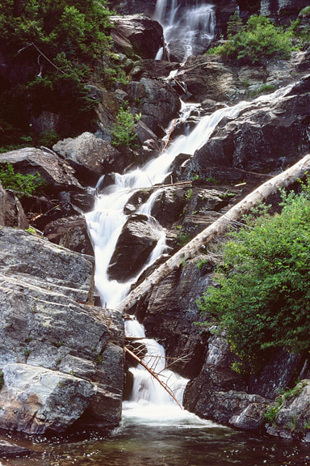
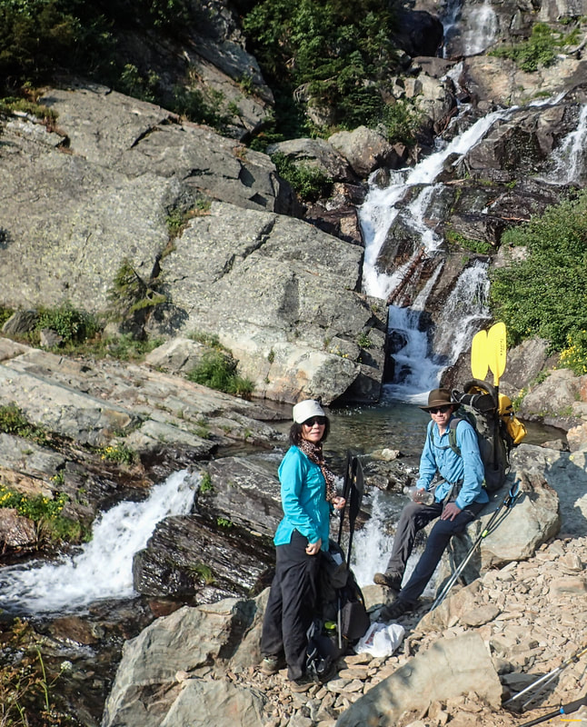
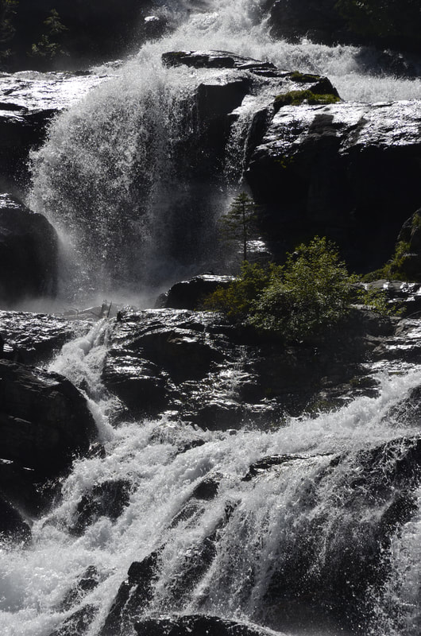
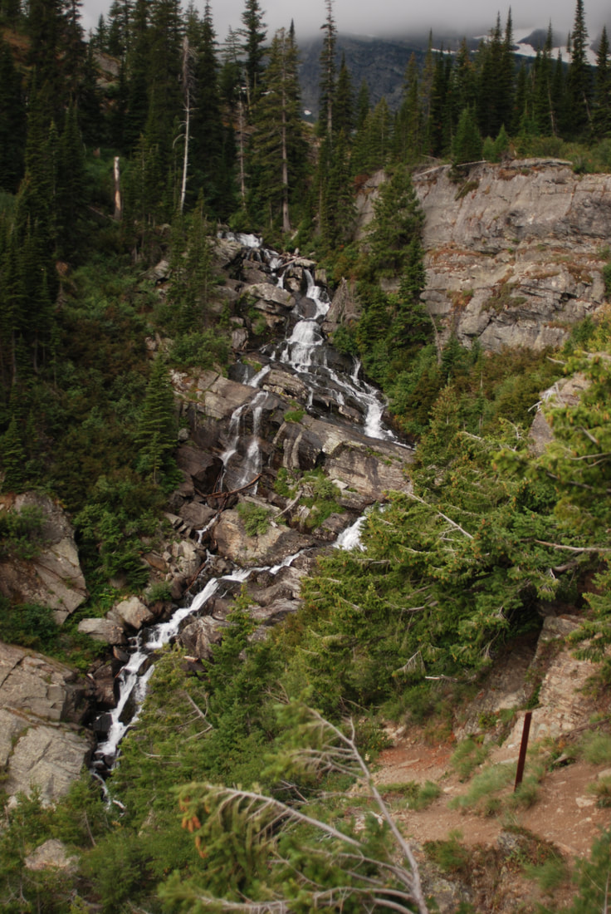
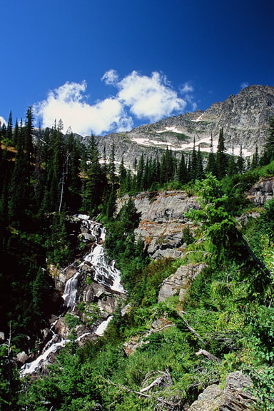
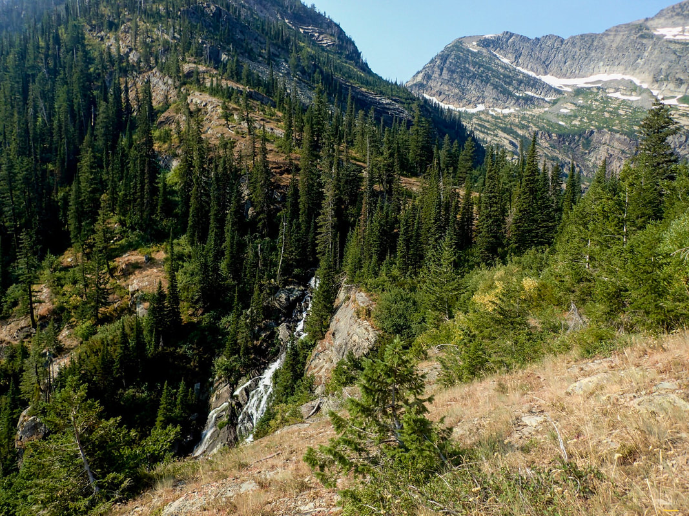

---
tags:
  - Lakes
  - Waterfalls
stats:
  - label: Waterfall
    icon: waterfall
    value: 'Leigh Creek Falls Trail #132'
  - label: Drop
    icon: arrow-collapse-down
    value: About 100'
  - label: Waterfall Type
    icon: hiking
    value: Plunge, cascades, fans, blocks, horsetails, tiers, chutes, and slides
  - label: Distance Car to Falls
    icon: map-marker-distance
    value: 1.2 miles
  - label: Maps
    icon: map
    value: Kootenai National Forest, Cabinet Mountain Wilderness, Snowshoe Peak topo
  - label: GPS
    icon: crosshairs-gps
    value: 48°13′32″ N 115°39′17″ W
---

# Leigh Lake Falls Lower

_Leigh Creek Falls and your first break._

## Description

Leigh Creek Falls is one of the most spectacular waterfalls in the Inland Northwest. With a drop of about
100', it is a spectacular sight along a most beautiful trail to one of the most beautiful lakes in our
region. After hiking 1.2 miles up Trail #132, you come to a spot that requires you to stop and enjoy its
beauty.

If you are adventurous, you can scramble up the sides of the falls to photograph many of its numerous drops.

### Option #1

As long as you are in the area, climb the almost 200 vertical feet to the upper trail. Here, as you walk out
to Leigh Lake, Leigh Creek Falls is below you for about .1 of a mile. The sounds and views along this section
of the trail are well worth the effort to get here.

### Option #2

In about .1 of a mile, Leigh Lake stretches out before you. This would be a great spot to have lunch, take a
nap, and enjoy the spectacular scenery.

### Option #3

For a closer view of some of the falls along Leigh Lake's shoreline, walk a user-created path along the
north shore to a rock beach.

## Directions

From Libby, drive south on Highway 2 towards Glacier National Park for about 8 miles to the Bear Creek Road #278.
Turn right (west) for three miles to FR#867. Turn right (west) for about 5 miles to FR #4786. Drive up 4786 for
about 2 miles to the trailhead. Notice along this last stretch of road that there is a pull off to the left to a
very primitive campsite. If it's occupied, you can camp at the parking area.

## Cool Things Close By

Snowshoe Peak (8,738'), A Peak, Granite Lake, L. & U. Geiger Lakes with Lost Buck Pass and the Cabinet Divide
Trail with views of Wanless Lake. The Proposed Scotchman Peaks Wilderness, the Bull River and Lake, and the
Clark Fork River.

## Hazards

All waterfalls are a hazard due to their slippery nature. Always be extra careful near any waterfall. Please
keep a close eye on your children when climbing the vertical section above Leigh Creek Falls.

## Restaurants & Pubs

Henry's and The Shed in Libby.

## Photo Gallery

_When you first see Leigh Creek Falls, you wonder how far up it goes._

_Elite hikers Shuwen and Tyler pose for an image in front of the falls._

_A telephoto shot of a section of Leigh Creek Falls._

Above the vertical section of the trail is this view; below the trail, the sights and sounds are well worth
the effort.

_Leigh Creek Falls with the west wall above the lake._

_What an incredible view._

All too soon the view of the falls fades, and then you are at the lake.

You may wonder where all this water comes from. All the benches above the lake hold some degree of snow
year round.
