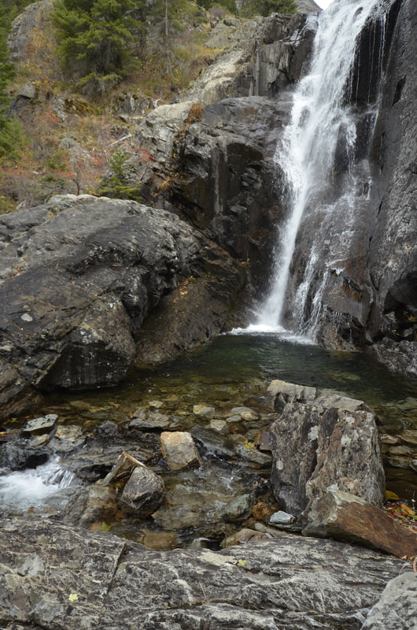
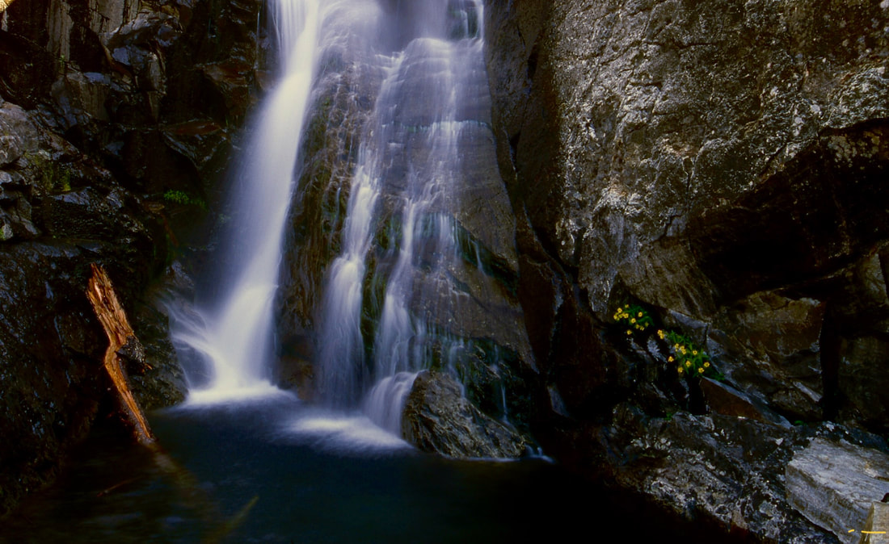

---
tags:
  - Waterfalls
stats:
  - label: Waterfall
    icon: waterfall
    value: "Rock Creek Falls Trail #935"
  - label: Drop
    icon: arrow-collapse-down
    value: About 40'
  - label: Waterfall Type
    icon: waterfall
    value: Slider
  - label: Distance Car to Falls
    icon: map-marker-distance
    value: 2.5 miles
  - label: Maps
    icon: map
    value: Kootenai N.F., Cabinet Ranger District 406.827.3533, Elephant Peak & Howard Lake topos
  - label: GPS
    icon: crosshairs-gps
    value: "Trailhead 48°02′24″ N 115°40′47″ W; Rock Lake 48°03′33″ N 115°37′41″ W"
---

# Rock Creek Falls

## Description

Although Rock Lake is 4.2 miles in, it offers many reasons to visit it. The trail along Rock Creek has
several tributaries that are sometimes difficult to cross in spring and early summer. In about .6 miles is
an old mining camp with several buildings to explore. At a little over 3 miles, off to your right (S) is
the Rock Creek Meadows. The trail has climbed about 750 vertical feet to here. In about .5 miles, the trail
starts its ascent towards Rock Lake.

In about .5 miles further, you will come to the Heidelberg mine site and Rock Creek Falls. As you approach
the falls, take notice of the trail to Rock Lake on your right (NE). Stop a while here and photograph the
falls, and wonder just what all this machinery was for. In less than a mile, you see Rock Lake for the
first time. Walk the level trail out to a peninsula. You are now at the SE end of Rock Lake.

### Option #1

To further your hike, walk the left (SW) side of the lake all the way back to its NW end. If you are very
ambitious, continue up the valley above the lake to St. Paul Pass. If you were to continue over the pass,
it will take you to St. Paul Lake.

## Directions

From Sandpoint, drive east on Hwy 200 towards Clark Fork and the Idaho-Montana border. In Clark Fork there
is a great little store, the Clark Fork Pantry, where you can buy sandwiches, cookies, and bulk foods.
Continuing east on 200, in about 18 miles, just past a bridge over the railroad tracks, turn left (NE) onto
F.R. 150. Drive .3 miles under the power lines and bear right onto F.R. 150. Follow this road for 5.3 miles
to F.R. 150A, and turn right onto the East Fork Rock Creek Road. The road becomes rough here, so if your car
has lower clearance, park here. If you have high clearance, continue for another mile to a gated trailhead.

## Cool Things Close By

Rock Peak, Ojibway Peak, Libby Lakes, Elephant Peak, Scotchman Peak, and the Clark Fork River.

## Hazards

!!! warning "Mining Equipment"
    This waterfall holds little danger, unless you climb on the old mining equipment. But just to be safe,
    use caution around the falls.

## Restaurants & Pubs

The Clark Fork Pantry, and the Squeeze Inn (not open in the winter).

## Plan Your Trip

Click for Current NOAA Weather Conditions

## Photo Gallery

_Some of the mining equipment near Rock Creek Falls._

_The lower section of Rock Creek Falls._

### Also Along the Trail

A few more sights along the way, described here since photos of them didn't survive:

- Rock Creek Falls and the Heidelberg mine.
- The beauty of wildflowers next to the falls.
