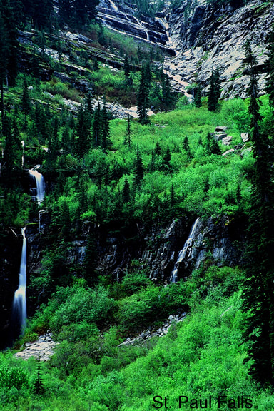
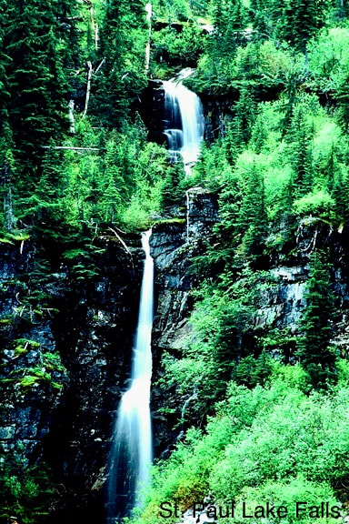
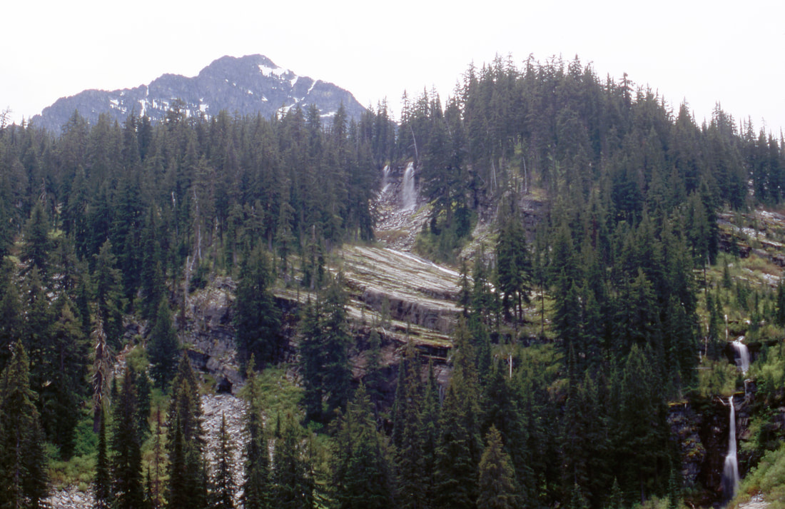
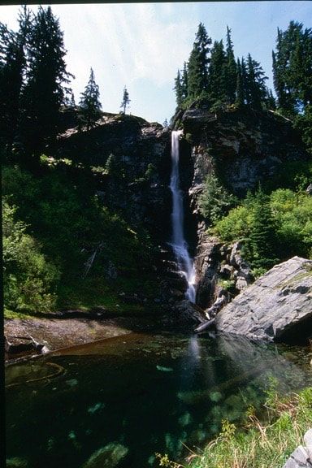
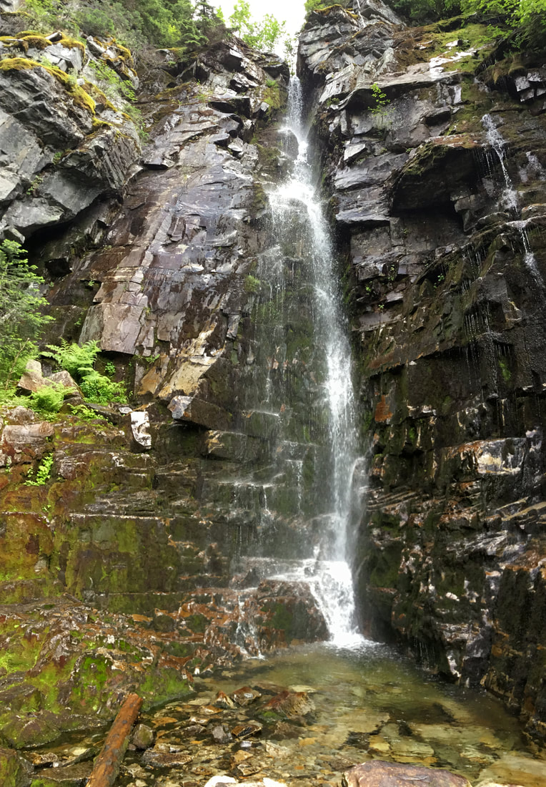
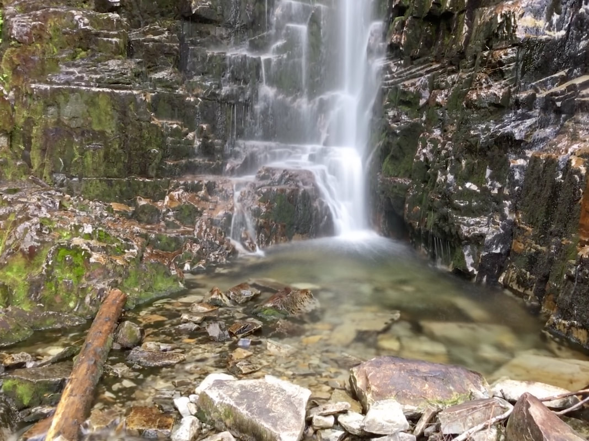
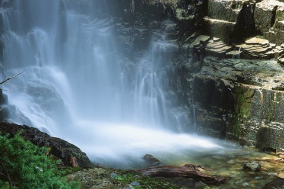

---
tags:
  - Waterfalls
stats:
  - label: Waterfall
    icon: waterfall
    value: St. Paul Lake Waterfalls
  - label: Drop
    icon: arrow-collapse-down
    value: Varies from about 25' to 60'
  - label: Waterfall Type
    icon: waterfall
    value: Plunge, horsetail, tiered, ribbon and more
  - label: Distance Car to Falls
    icon: map-marker-distance
    value: 4.5 miles one way
  - label: Maps
    icon: map
    value: Kootenai National Forest, Cabinet Mountain Wilderness, Elephant Peak topo
  - label: GPS
    icon: crosshairs-gps
    value: 48°05′24″ N 115°39′32″ W
---

# St Paul Lake Falls

_St. Paul Lake viewed from its northwest corner, with several waterfalls visible across the water._

## Description

If you take children on this hike, use extra caution everywhere around the lake except the south shore. Once
you reach the lake, you won't see any falls right away. Before heading to the south shore, drop your packs,
grab your camera with a wide angle, a large telephoto, and a tripod, and carefully walk the north side of the
lake up high in the trees — the lake has very steep shorelines, so staying high is safer. Once you reach the
northwest corner, several waterfalls appear to the south across the lake, up about 200' above the water. Use
your telephoto to shoot these falls, plus a few more above them. After shooting from this side, walk
carefully back to your packs and continue along the trail on the east shore. There are several spots along
the way to stop for lunch and enjoy this small lake.

### Option #1

To the south and uphill, there are many waterfalls you can scramble up to. Please be careful here, since the
rocks can be slippery. There are about a dozen falls to visit, depending on how far you want to scramble.

## Directions

Turn east off Hwy 56 at about milepost 8. The trailhead is up F.R. #407, about 6 miles from Hwy 56. Along the
way is the old Bull River Historic Ranger Station.

From the trailhead, hike southeast up the East Fork Bull River for about 2 miles to a bridge over the creek.
Placer Creek is on the right, with the East Fork Bull River on your left. As you leave the bridge, notice the
stereo sound of the two creeks as you climb from here — for most of the hike to the lake, the sound alone is
worth the trip. After about 1.75 miles, the trail begins a few switchbacks before the lake appears through
the trees. St. Paul Lake is over 800 feet across and has no obvious outlet. There are two campsites: one as
you arrive at the lake, and another on its south shore.

## Cool Things Close By

The Historic Bull River Ranger Station (available as a rental), Libby Lakes, Milwaukee Pass, Rock Lake, St.
Paul Peak, Rock Peak, and Ojibway Peak.

## Hazards

There is no visible outlet to St. Paul Lake, so the shoreline is very steep. Take extra caution along any of
the shoreline except the south shore.

The falls are located on the south side of the lake, up in the forest. Because of the steep terrain and wet
rocks, take every precaution as you scramble up to the many falls.

## Restaurants & Pubs

Henry's & Pizza Hut in Libby; Clark Fork Pantry in Clark Fork; and Mr. Sub, Jalapeños & Eichardt's in
Sandpoint.

## Plan Your Trip

Click for Current NOAA Weather Conditions

## Photo Gallery

_Another view from the northwest corner of St. Paul Lake._

_Above the lake, two waterfalls appear as twins._

_Twin falls with Elephant Peak in the background._

_Tucked back in the rocks, this 60' waterfall is shown here in sections, starting with the lower section._

_The middle section of the 60' waterfall tucked back in the rocks._

_The upper section of the 60' waterfall tucked back in the rocks._

### Also Along the Trail

A few more sights along the way, described here since photos of them didn't survive:

- Rounding a corner along the north shore, several falls suddenly come into view — you can't see them until
  you're right on top of them.
