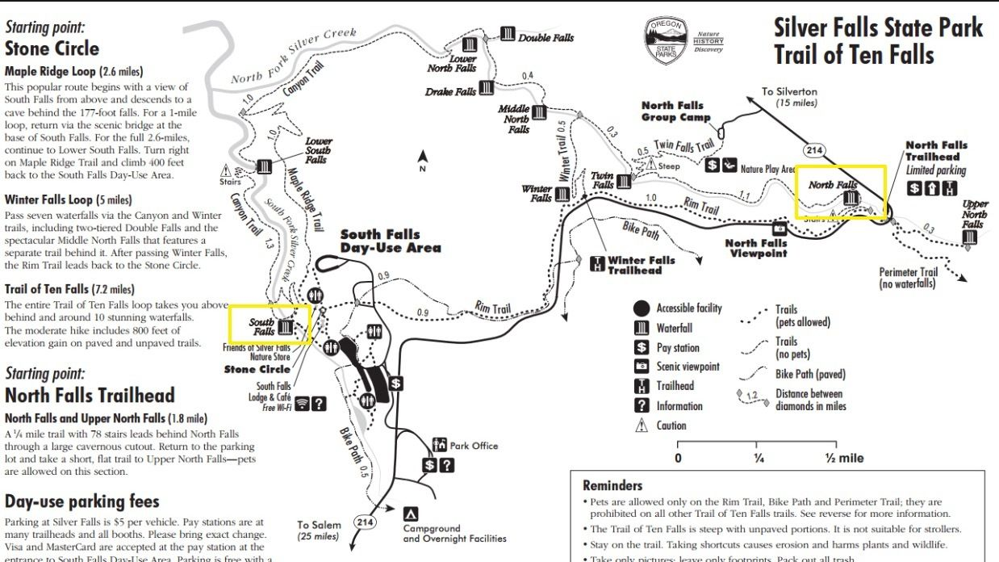
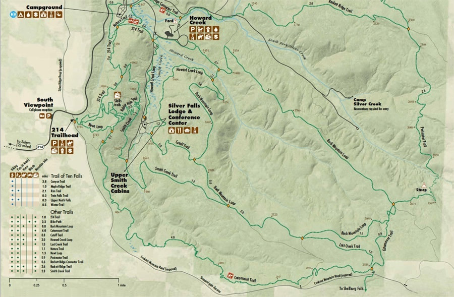
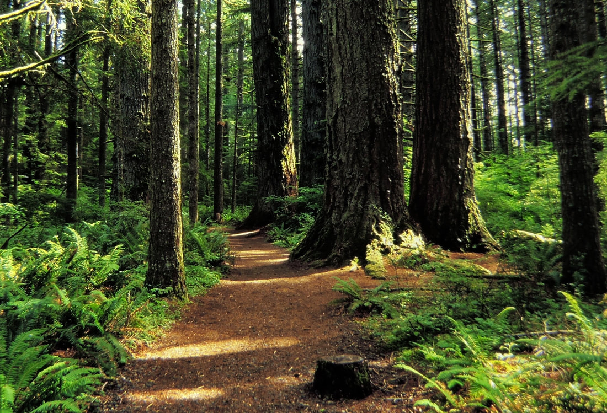
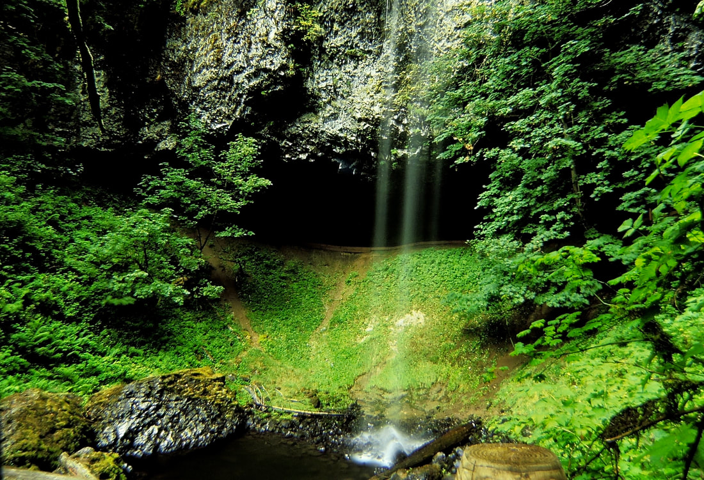
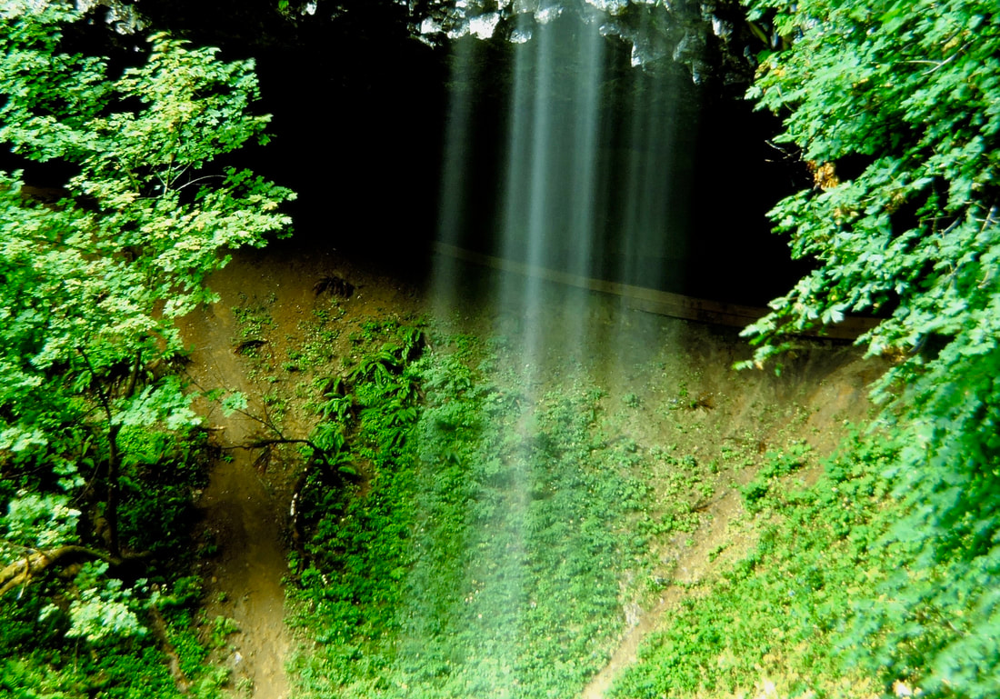

---
tags:
  - Waterfalls
stats:
  - label: Waterfall
    icon: waterfall
    value: Silver Falls State Park
  - label: Drop
    icon: arrow-collapse-down
    value: 31' to 178'
  - label: Waterfall Type
    icon: waterfall
    value: All types of falls
  - label: Maps
    icon: map
    value: Not documented
  - label: GPS
    icon: crosshairs-gps
    value: Not documented
---

# Silver Falls State Park

_Silver Falls State Park._

_Scenic view within Silver Falls State Park._

## Description

Silver Falls State Park is home to falls ranging from 31 feet to 178 feet in drop, with all types of falls
represented along its trail system.

## History

!!! quote "History provided by Oregon State Parks"

    The park's history document, originally provided by Oregon State Parks, could not be archived on this
    page.

## Photo Gallery

### On the Trail

_The trail in is about as good as it gets._

_Photo unavailable: The lushness of this area is worth the walk._

### North Falls (136')

_North Falls (136 feet)._

_Photo unavailable: North Falls (136 feet), second view._

_North trail from the trail in the above image._

_Photo unavailable: Most all the trail is outstanding._

_Close up of upper North Falls._
