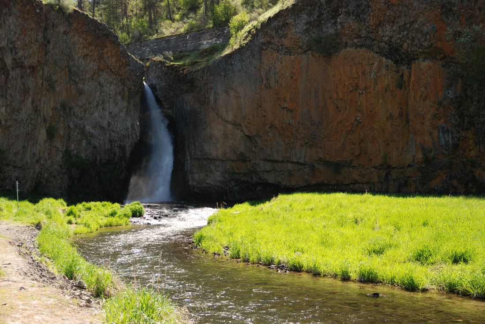
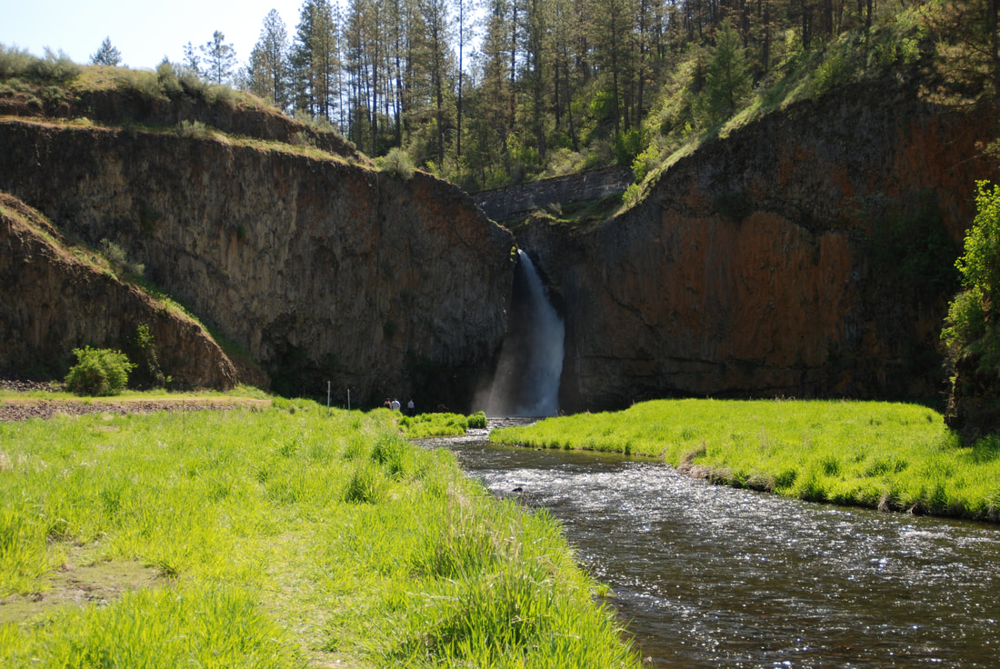

---
tags:
  - Waterfalls
  - State Parks
  - Lakes
stats:
  - label: Waterfall
    icon: waterfall
    value: Hawk Creek Falls State Park
  - label: Drop
    icon: arrow-collapse-down
    value: About 40'
  - label: Waterfall Type
    icon: waterfall
    value: Chute
  - label: Distance Car to Falls
    icon: map-marker-distance
    value: 300 feet
  - label: Maps
    icon: map
    value: Washington State Parks
  - label: GPS
    icon: crosshairs-gps
    value: 47°81′09″ N 118°31′04″ W
---

# Hawk Creek Falls State Park

_Hawk Creek Falls._

## Description

Hawk Creek Falls State Park is located along the south shores of the Columbia River north of Creston,
Washington, on Miles Creston Rd N. Turn left (west) into the State Park. Discover Pass is required, or you
can buy a day pass at the parking areas. The falls are located SE of the campgrounds, while the trailhead to
walk out to the Columbia River is west of the campgrounds. After visiting the falls, hike the shoreline west
out to the Columbia River.

### Option #1

As you enter the area, the campground sits below the road. A short distance upstream is beautiful Hawk
Creek Falls, dropping about 40' in a chasm beneath the road. From the parking area, the trail heads west
along the north side of Hawk Bay. There are several beaches to swim at. Further away from the parking area,
the trail eventually reaches the Columbia River. As you see Moonshine Canyon Bay across Hawk Bay, you will
have to climb up and over the hills to get to a spot with unobstructed views of the Columbia River. Paddling
this bay, and out into the Columbia River, offers great views and a nice paddling experience. Back on land,
out near the river is a ridge line coming down from above. On a step above the bay, there is a small sand
dune to explore. It's also a great place for lunch. Most of the bay is lined in basalt columns, that give it
an eerie feeling. Be aware that the land around Hawk Bay is private, and may require kayaking to beaches out
on Lake Roosevelt. There is another attraction worth exploring north of the bay. There are dozens of caves
etched out of the basalt cliffs. From the parking area, look north up hill at one of the larger caves in the
area.

### Option #2

By hiking the north shore, you can reach the beaches of the Mighty Columbia River.

## Directions

Drive west on Highway 2 to Davenport, and turn right on Hwy 25 towards Miles. Once in Miles, drive south
past Seven Bays for about 8 miles and turn right (west) into Hawk Creek State Park. Or drive Hwy 2 past
Davenport to a junction with Miles-Creston Road N. a short distance before Creston, and turn right (east)
for about 3 miles and bear right staying on Miles-Creston Road N. all the way to Hawk Creek. Turn left
(west) into the state park.

## Cool Things Close By

Columbia River and the Lake Roosevelt Reservoir, Lake Roosevelt National Recreation Area, the Colville
Indian Reservation, the Grand Coulee Dam, Steamboat Rock, and Northrup Canyon.

## Hazards

All waterfalls are a hazard, due to their slippery nature. Always be extra careful near any waterfall. As in
any walks in the Washington Scablands, you must be aware of rattlesnakes. There are lower leg wraps that
will protect you from snake bites.

## Restaurants & Pubs

Lenny's in Cheney.

## Plan Your Trip

Click for Current NOAA Weather Conditions

## Photo Gallery

_A view of the bay that Hawk Creek Falls sits in._
