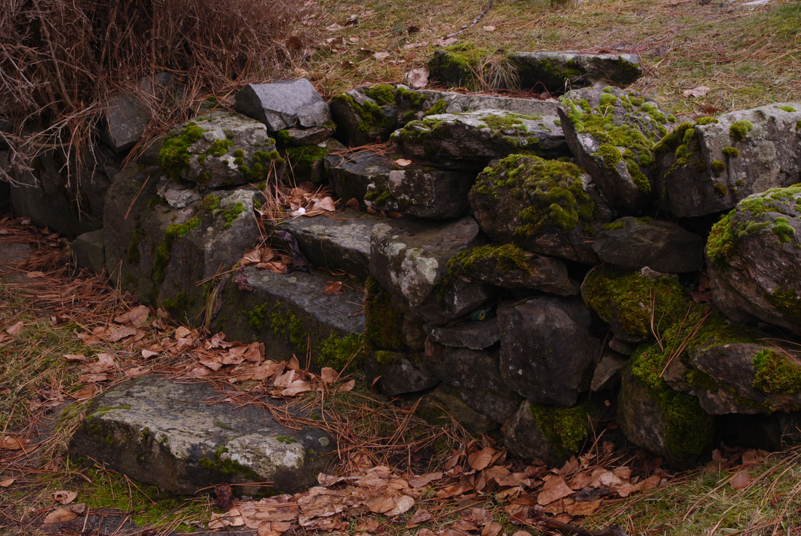
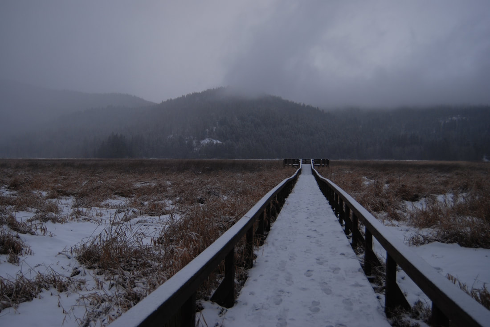
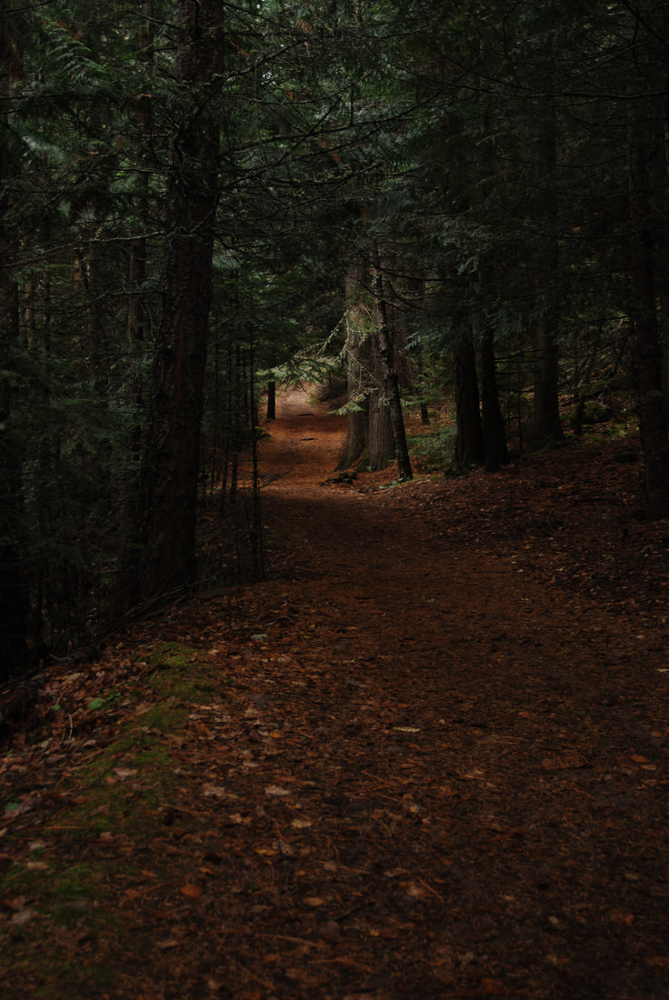
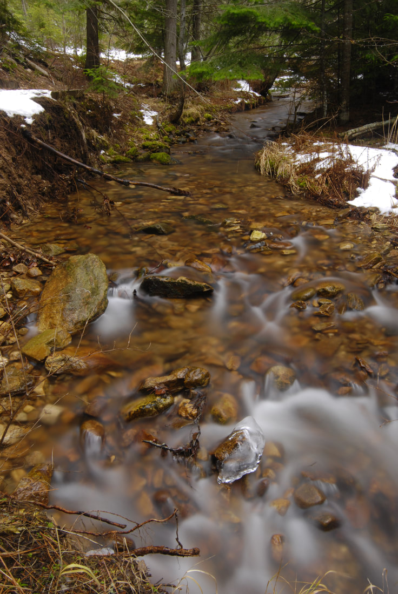
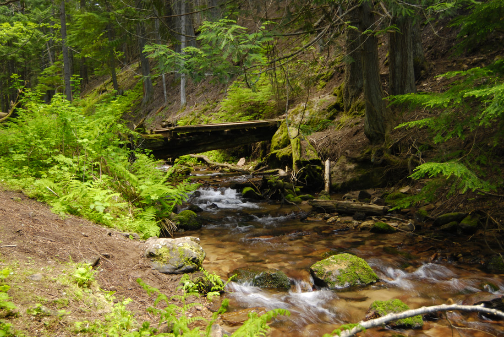
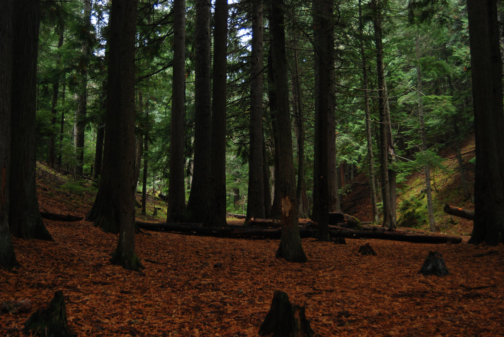
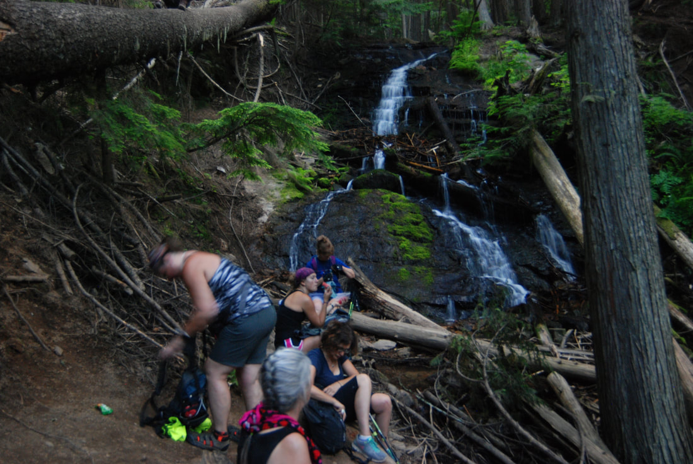

---
tags:
  - Waterfalls
stats:
  - label: Waterfall
    icon: waterfall
    value: U. & L. Liberty Creek Falls
  - label: Drop
    icon: arrow-collapse-down
    value: Both about 30'
  - label: Waterfall Type
    icon: waterfall
    value: Both are Slide falls
  - label: Distance Car to Falls
    icon: map-marker-distance
    value: 7 miles loop
  - label: Maps
    icon: map
    value: Liberty Lake Regional Park
  - label: GPS
    icon: crosshairs-gps
    value: 47°35′59″ N 117°02′36″ W
---

# Liberty Creek Falls

_Liberty Creek Falls._

## Description

Liberty Creek Falls is located within the Liberty Lake Regional Park south of Liberty Lake, WA. The park
offers several hikes, and is a connection point to the Mica Peak area. From the parking area, hike the
Liberty Lake Loop Trail to the Cedar Grove Conservation Area. The trail crosses the creek on an old log
bridge, and heads steeply up several switchbacks to a view point overlooking Liberty Lake at a switchback.
Continue along the loop trail to the falls. Keep in mind that the falls dry up a bit later in the season.

### Option #1

If you continue up the loop trail passed the lower falls, for about .3 miles, is the upper waterfall on the
same creek.

### Option #2

By continuing on the loop trail, you will come to the Camp Hughes Cabin. A bit further along the loop trail,
it circles around and takes you back towards the parking area. This loop trail is not to be missed.

### Option #3

You can do this loop trail backwards, but please pick up a park map to help you navigate the loop. And keep
in mind, this trail is open to horses and mountain bikes. If you feel unsure of your location, do not
hesitate to ask other trail users.

## Directions

From the Albertsons and Yokes, drive SSE on the N. Liberty Lake Road, past the golf course to E. Sprague
Ave., and turn left (east) past the southern end of the golf course where the road turns right (S) onto S.
Neyland Ave. past S. Winding Dr. to S. Liberty Lake Road and turn right (S) to S. Zephyr Road, to the park
entrance. There is a parking area just past the gate that is used for the day use area and the beach.
Continue a bit further to the first parking lot. Park here to hike. Do not continue to the campground to
park. You may get a ticket.

## Cool Things Close By

Liberty Lake, Liberty Lake Conservation Area, the Mica Peak Conservation Area, Saltese Upland Conservation
Area, Saltese Flats, the Spokane River, and the Spokane River Centennial Trail.

## Hazards

All waterfalls are a hazard, due to their slippery nature. Always be extra careful near any waterfall.

## Restaurants & Pubs

Mexico Lindo, Brothers Office Pizza, and the Barlows.

## Plan Your Trip

Click for Current NOAA Weather Conditions

## Photo Gallery

_Near the hikers parking lot is this very cool rock wall._

_Along the trail near the parking area, is this walkway & viewing deck._

_On the trail to Liberty Falls._

_Liberty Creek._

_One of the foot bridges along the main trail loop._

_The bridge at the Cedar Grove._
