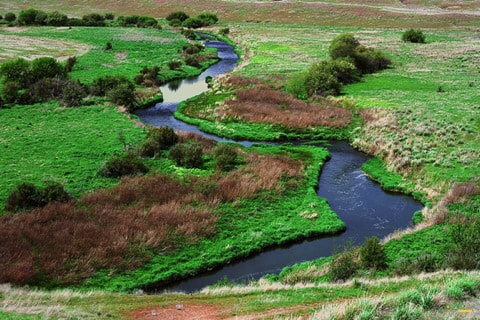
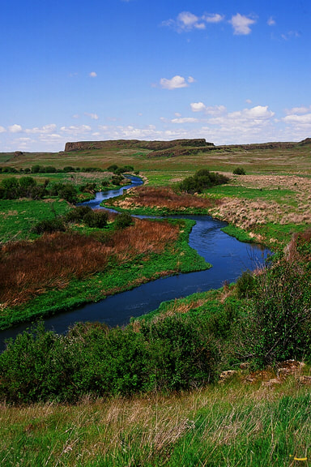
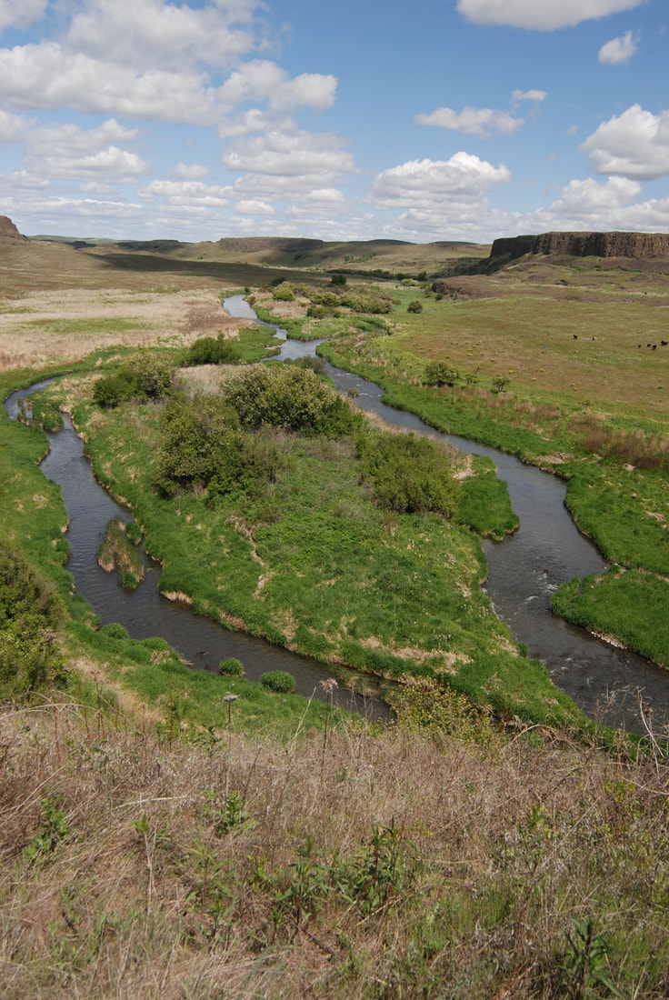
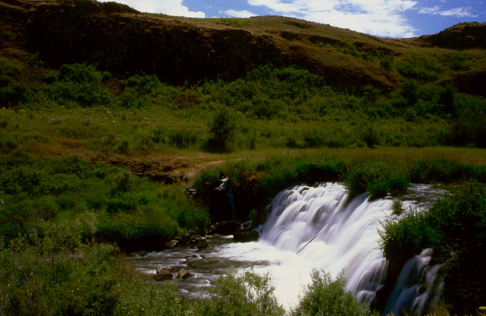
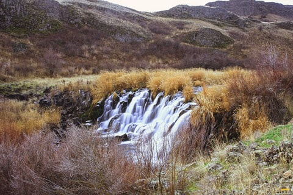
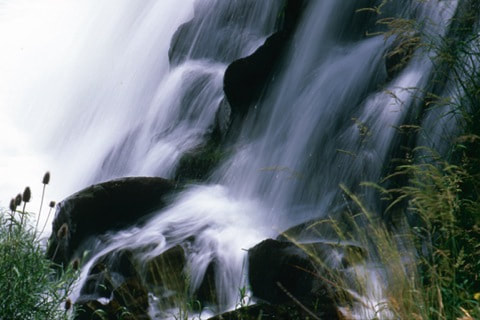
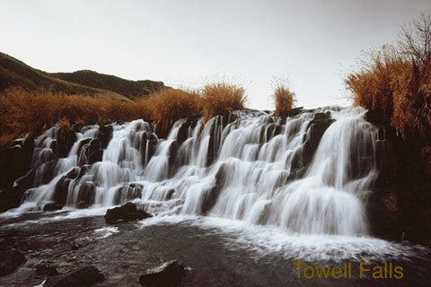
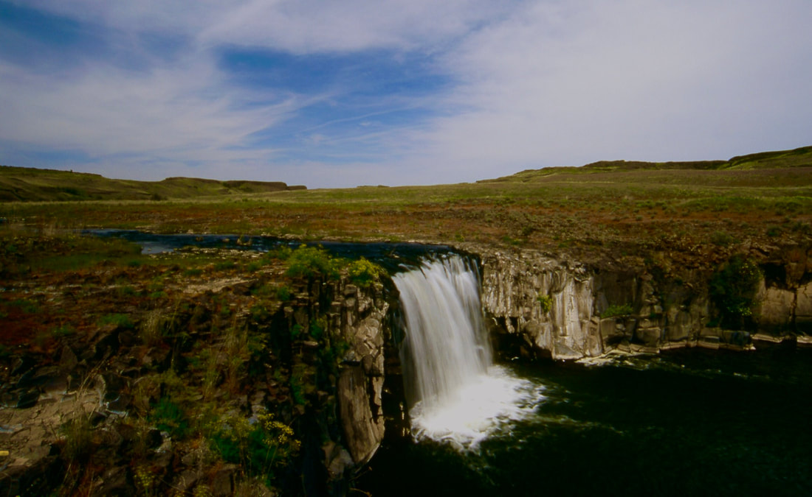
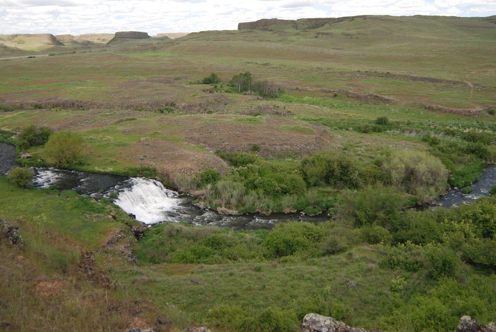
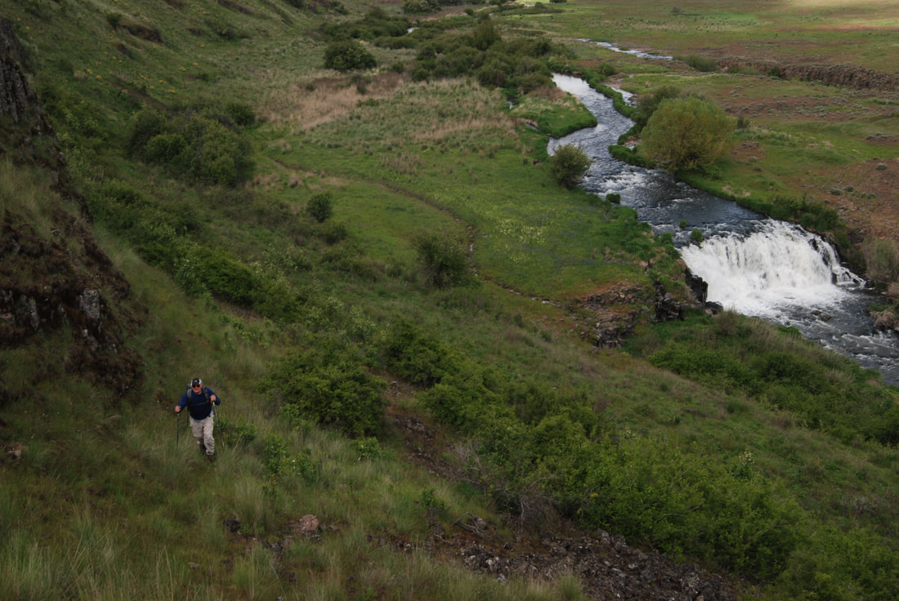

---
tags:
  - Waterfalls
stats:
  - label: Waterfall
    icon: waterfall
    value: Towell Falls
  - label: Drop
    icon: arrow-collapse-down
    value: Lower 12' & Upper 20'
  - label: Waterfall Type
    icon: waterfall
    value: Lower Cascade & Plunge
  - label: Distance Car to Falls
    icon: map-marker-distance
    value: 5 miles one way
  - label: Maps
    icon: map
    value: BLM Brochure
  - label: GPS
    icon: crosshairs-gps
    value: Trailhead 47°00′51″ N 117°56′36″ W, Falls 46°58′58″ N 117°55′55″ W
---

# Towell Falls

## Description

When you drive west on Hwy 2, I-90, or Hwy 26, you notice the area looks vacant and dry. But when you stop
along your travels, you notice a very unique landscape. This whole area west of Spokane is the way it is
because of the Glacial Lake Missoula Floods. As you walk off the road just a ways, imagine a wall of water
1,000 feet tall, moving at 55 mph from the east, scouring the landscape to bedrock. The floods removed about
1,000' of topsoil along their path, creating a landscape unique to Idaho, Washington, and Northern Oregon.

Escure Ranch and the Towell Falls area are great examples of what the floods destroyed then created. As you
drive down to the trailhead near the ranch building, all around you is evidence of the floods. Before or
after your hike out to Towell Falls, wander across the bridge and take a look at the old homestead, barns,
and outbuildings. You will notice that they were built to last not just decades but centuries. The BLM,
wanting to protect the heritage of the buildings, installed heavy metal grates on the ranch house. Wander
the area, and see what it took to ranch in this environment.

!!! warning
    A special note on hiking in the Washington Scablands: This terrain is different from around Spokane and
    the mountains of Eastern Washington and N. Idaho. YOU MUST pay very close attention to the terrain.
    Often stop and converse with your hiking partner(s) about visual landmarks, road junctions, and
    other visual features. You have a camera phone—use it to record the terrain, mesas, road junctions,
    and other details that will help you find your way back, especially after leaving the waterfalls and
    heading back.

    Do not drink or even filter this water; most of the water in the Scablands is agricultural runoff. Take
    all the water you will need for drinking and cooking.

    After touring the ranch buildings, go through the gate by the parking area. Please shut all gates firmly
    behind you. The trail to the falls is an old road for about 3.2 miles, but only gains 530 feet. The
    trail follows Rock Creek, though sometimes it is not in view. Near the path leading down to the
    falls, you will hear and see the falls off to the west. From this point on, pay very close attention
    to the trail as it descends to the falls; you will need to follow it back up from the falls exactly.

    The path winds its way down to the falls and the island it sits on (depending on the season). When you
    first get to the lunch tree, turn your party around and examine the route you took to get down from
    the road you hiked in on. As you near the falls, during high water, you will have to cross a small
    stream to get to both falls. There's a tree to have lunch under, just NW on the island. Lower Towell
    Falls will be obvious because of the sound, and is real close to your lunch tree. All the rock
    around the area is basalt, so be very careful when you walk down to view the front of the falls.
    This falls is about 20–25 feet wide and drops about 15 feet as a block waterfall.

    Once you have viewed the lower falls, walk north on the island. There are two intermittent cascades that
    drop off the east side, but often are dry. Continue your walk a bit further north and the Upper
    Falls will come into view. This falls is taller than the lower falls, and plunges without touching
    the face it goes over. Spend some time here examining the basalt rock around the falls. Images of
    these falls with the Scablands in the background make for some great shots.

    Now, you have to pay attention. In order not to take the wrong route away from the falls, collectively
    agree on your ascent away from the falls. Once at the road you hiked in on, turn left (N) and follow
    the road back out.

### Option #1

On the north side of Rock Creek, there is a primitive trail, mostly used by fishers. You can access this
cross-country trail by crossing over the bridge towards the buildings. At first there is a resemblance of a
trail, but it diminishes the further you hike. This is where you MUST pay attention to the terrain,
landmarks, and where you walk.

In my decades of hiking in the Scablands, this route is the only route where I've ever encountered a
rattlesnake. Consider lower leg wraps to prevent snake bites. A rattlesnake will only strike if threatened.
On cool days, they come out into the sun to warm themselves. Do not step over rocks, shrubs, or terrain
where you can't see where your foot is landing.

Continue hiking near Rock Creek, but not right next to it. This route is not marked and requires constant
observation of the terrain. When you eventually get to Towell Falls, you will be on the opposite side from
the write-up above. The views are different, but just as good. On your return, try to follow your route in.

## Directions

Take I-90 to Sprague, and exit at 245, then head south through Sprague on S.R. 23 towards St. John and
Steptoe. About 12 miles from Sprague, turn left, then right onto Davis Road. In less than 7 miles, turn left
onto Jordan-Knott Road. Head south a little over 2 miles and cross over Rock Creek, then turn right into the
Rock Creek Management Area. Continue 2.4 miles down to the trailhead.

## Cool Things Close By

While driving through Sprague, take a moment to go downtown and wander through Dave's Antique Car & Truck
Museum. Palouse Falls, Lyons Ferry State Park, the Snake River, and the Juniper Dunes Wilderness are also
nearby.

## Hazards

All waterfalls are a hazard due to their slippery nature. Always be extra careful near any waterfall.

As stated above, hiking in the Scablands can be dangerous but very rewarding. Observe all terrain features
and discuss them with your hiking partners. Always be on the lookout for rattlesnakes. Practice wise hiking.
Badgers have been seen on the trail to the falls; steer clear and give them space.

## R & P

N/A

## Plan Your Trip

Click for Current NOAA Weather Conditions

## Photo Gallery

_Rock Creek from the bridge._

_Rock Creek. Notice the mesa in the background as a visual landmark._

_Rock Creek further in._

_Towell Falls from its small island._

_Lower Towell Falls in November._

_The falls drop off basalt columns, causing many cascades within the greater falls._

_Lower Falls face on in November._

_Upper Towell Falls in the summer. Notice the terrain features in the background._

_Lower Towell Falls from the northern route._

_Galen hiking above to view the falls from a different angle._
