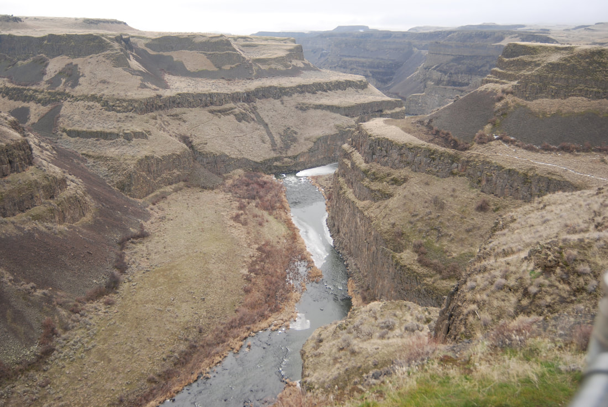
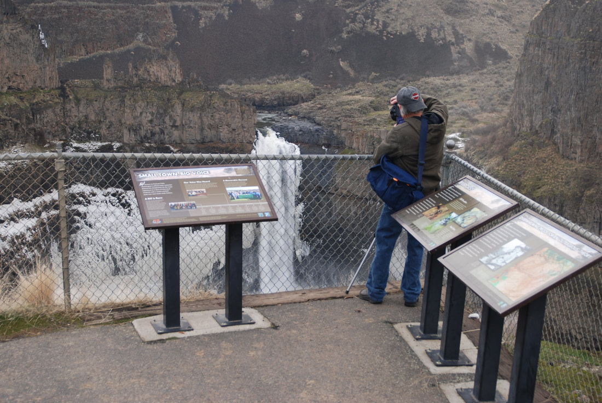
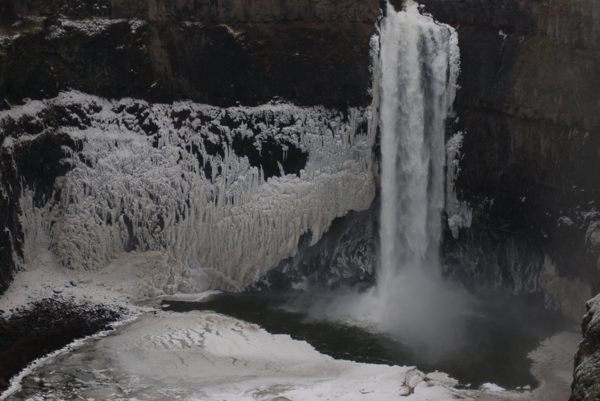
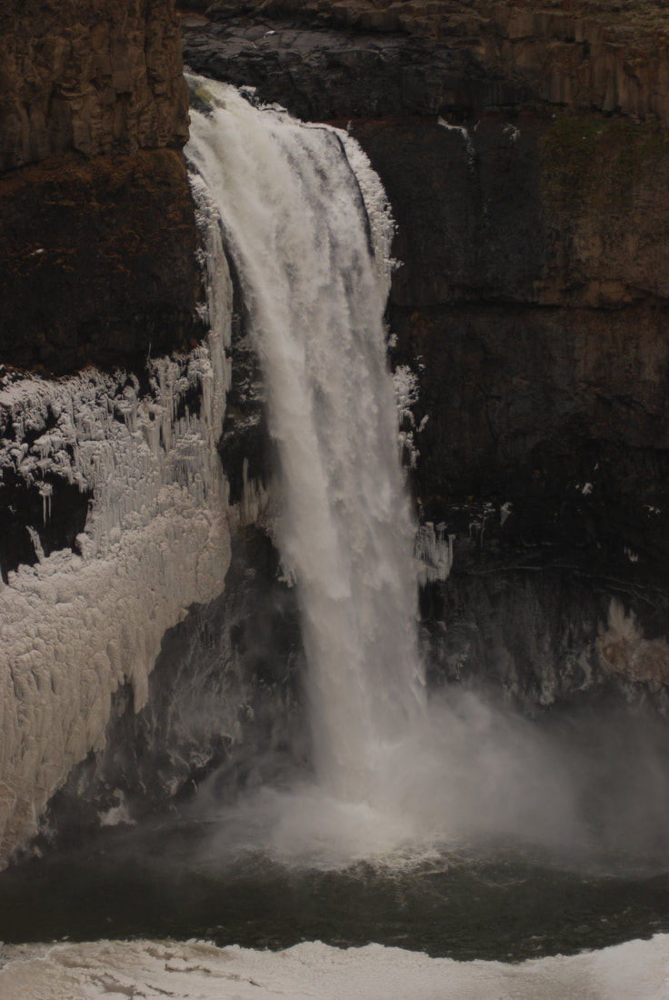
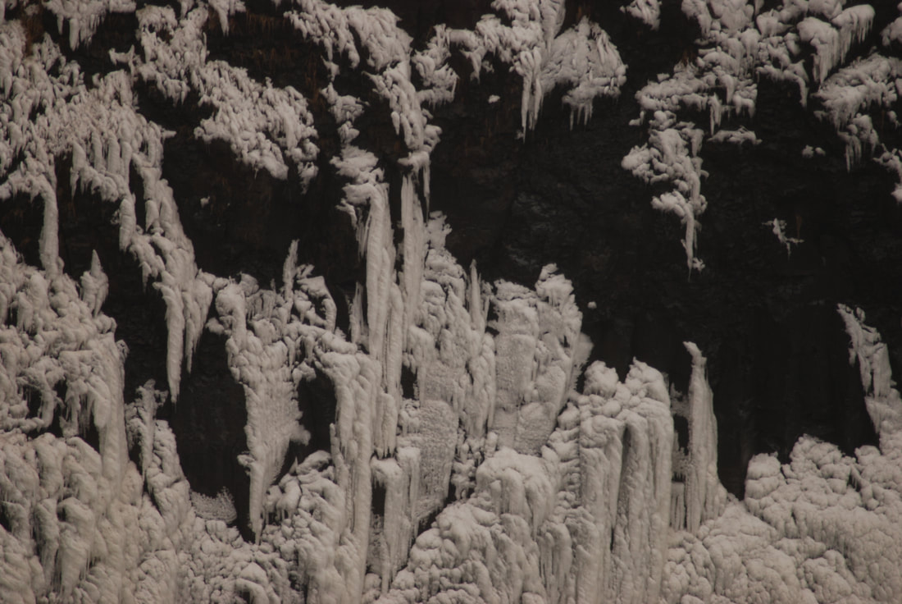
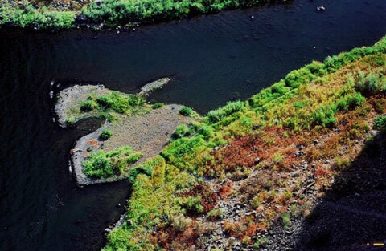
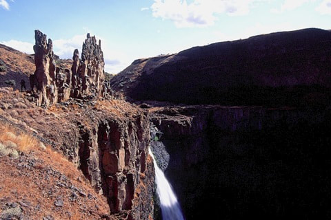
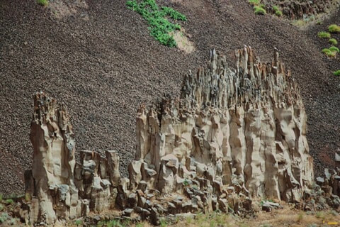
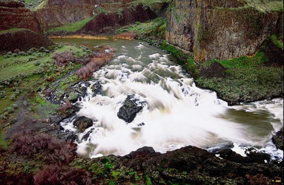

---
tags:
  - Waterfalls
  - State Parks
stats:
  - label: Waterfall
    icon: waterfall
    value: Upper & Lower Palouse Falls
  - label: Drop
    icon: arrow-collapse-down
    value: 185'
  - label: Waterfall Type
    icon: waterfall
    value: Plunge pool
  - label: Distance Car to Falls
    icon: map-marker-distance
    value: About 100' to the main viewpoint
  - label: Maps
    icon: map
    value: Washington Scablands, Palouse Falls State Park
  - label: GPS
    icon: crosshairs-gps
    value: 46°39′48″ N 118°13′25″ W
---

# Upper & Lower Palouse Falls

_Palouse Falls from the Fryxell Trail._

## Description

Palouse Falls was designated the official Washington State waterfall on 3.18.2014, and rightly so. The
falls sit amid the Washington Scablands near Washtucna. Lower Palouse Falls drops 185' in a single plunge,
while Upper Palouse Falls lies upstream of the main viewing area. A fenced viewing area overlooks the falls
and the canyon that eventually leads to Lyons Ferry State Park, about 7 miles downstream. Contact the park
at 509.646.3229.

!!! tip "Kayaking Palouse Falls"
    Search "Palouse Falls kayaker" to find footage of Tyler Bradt's descent of the falls, one of the most
    talked-about kayak runs in the Northwest.

### Lower Palouse Falls

From the main viewpoint, walk south to the Fryxell Overlook for a different view of the falls. It has a
covered shelter to get out of the sun. This area is fenced; please do not climb over the fencing.

See the [Hazards](#hazards) section below for safety information.

### Upper Palouse Falls

To view Upper Palouse Falls, head north from the pit toilets. The trail skirts the railroad tracks, then
drops down to the tracks before descending to river level on a graveled slope. A rugged path follows the
river to the SE and eventually reaches the "Castle" formations and the very top of the falls.

Be very careful here. As you walk along the cliffs, notice the huge rock wall on your right; if you look
closely, you may spot bolts placed to protect rock climbers.

See the [Hazards](#hazards) section below for safety information.

## Directions

From Spokane, drive west on I-90 to Ritzville. At Ritzville, turn south onto Hwy 261 to Washtucna. At
Washtucna, continue southwest on Hwy 261 for 7 miles to the Palouse Falls sign. From there it's a gravel
road to the falls.

## Cool Things Close By

Lyons Ferry State Park, the mighty Snake River, and the Potholes Reservoir.

## Hazards

All waterfalls are a hazard due to their slippery nature. Always be extra careful near any waterfall.

!!! warning
    Once you leave the fenced viewing area, viewing the falls becomes very dangerous. Please use extra
    caution everywhere in Palouse Falls State Park.

## Restaurants & Pubs

N/A

## Plan Your Trip

Click for Current NOAA Weather Conditions

## Photo Gallery

_The Palouse River Canyon from along the Fryxell Trail._

_The Palouse Canyon viewpoint towards the Fryxell Overlook._

_On the coldest day of winter, the falls take on a new look._

_The falls from the fenced area._

_Photography in the winter can be very productive._

_On one of my photo fun day trips, I spotted the Energizer Bunny visiting the falls._

_The castles from near the viewing area._

_The castles above the falls. Years ago, someone graffitied the castles; the Spokane Mountaineers came out
with a portable sandblaster to clean the graffiti off._

_The upper falls from above. While the lower falls look the same year-round, the upper falls change due to
river flow._
