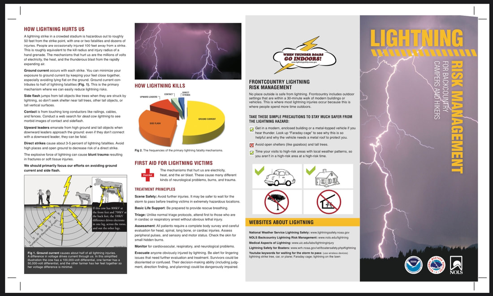
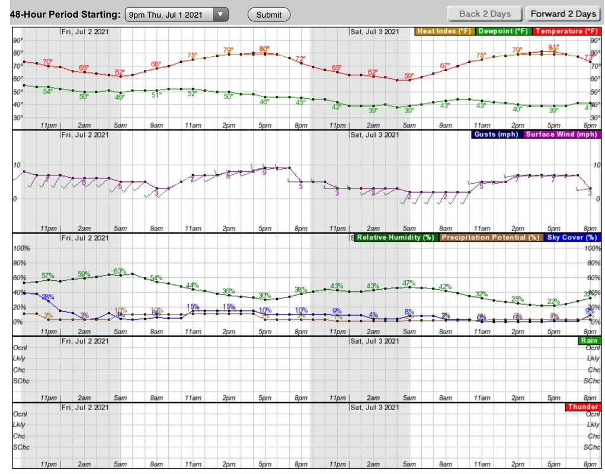
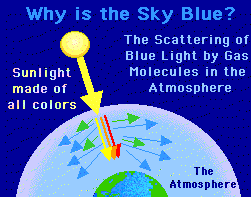
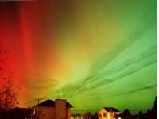
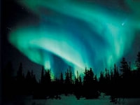

# Weather Thunderstorms And Lightning

as you read this section, please understand that it is designed to inform you.  but more importantly, all these topics are things you should do your own research on to further your knowledge. The most important thing you can take with you on your outing is…… Knowledge

##

## Weather, thunderstorms, lightning, and more

*Picture (Image missing)*

When using noaa's website, use the "geocolor" true color daytime panels above. click on animation loops, circled in red below. it takes a few seconds to load, and you can lengthen time shown

As you can see in this image that shows the western section of the United States,
you can see in real time images, where fires are, and the direction their smoke plumes are blowing.

Armed with these images, and data from the above 4 websites, you can see where not to go.
Windy.com, can show you the current wind direction and speed.
Airnow.gov, will show you the particulate matter in the air you will be breathing.

Please plan to succeed
When examining the image below on noaa, you can touch the screen to enlarge
You can also use the center panel to see fires, smoke plums and more.
GLM FED3+GeoColor to the left of the below image on NOAA.

### A method of determining if smoke will be an issue

 for your planning and outing.
Predicting smoke for hiking, Biking, climbing, running, paddling, and more.

In planning for some of my club and private hike/scrambles,I came across a few websites that may help us to determine if smoke will be an issue for an upcoming outing.

### Airnow.gov

<https://www.airnow.gov/>
Recently, a friend in McCall sent me this website.
After researching the site, I wanted to let all know of this very useful tool.
Spend some time and examine what all this website has to offer.

### Windy.com

https[://www.windy.com](https://www.windy.com/-PM2-5-pm2p5?cams,pm2p5,48.315,-116.529,5)
Windy.com has been upgraded.....check them out
By clicking on the above url, you can expand the map to examine the exact area you are considering going to.
Likewise, you can move around the world, to identify an area with less chance of smoke.
Once on the WINDY website, wonder the features to learn more about its full potential.

### inciweb.nwcg.gov

A couple of other websites to collaborate Windy.com, are….
<https://inciweb.nwcg.gov>

This website will spell out specifically where the fires are located.
From this info, you can see what the winds are doing on windy.com.

### Weather.gov or noaa

<https://www.weather.gov>
Whenever you log onto the above link, read the words explaining what the day will be like,
then scroll down to the "Hourly Weather Forecast" graph, usually down the right side.
Open the graph and examine each row to learn its value.
It’s my go to weather info site.
Please see the hourly weather forecast graph below

### benjamin franklin once said

### "if you fail to plan, you are planning to fail."

By combining any or all of these websites information, you can increase your chances of a successful and smoke free outing.

### Weather, thunderstorms and lightning

While doing research for ouwebsite,
I came across the following interesting facts and figures that I thought I’d pass along.

As you read this, there are 2,000 thunderstorms in progress on earth.
About 100 lightening strikes will hit the ground, in the time it takes to read this sentence.

***Hot air***
Have you ever wondered what causes the wind to blow?

As air is heated by the sun, hot air rises, and it causes a vacuum.
Cold air flows in from the sides to fill the void. Cold air sinks.
As the warm air rises, it cools, causing a form of downdraft.
After sinking, the air heats up, and causes updrafts.
These updrafts of warm air, hold much more water vapor, then cold air.
As the warm air rises, they form clouds. As more warm moist air rises, it makes the clouds bellow, much like a balloon blowing up.
There are conflicting air currents, which frequently becoming unbelievably strong.
A large thunder clouds may hold 150,000 tons of water, which will fill a pond 300 feet wide, a mile long, and 5 feet deep.
For instance, in a heavy storm of 2 inches of rain, an area one square yard gets 90 pounds of water, or more then 200 tons per acre.
Over 4 trillion gallons of water falls in the U. S. every day as precipitation.

Around the world, the Rocky Mountains experience between 50 and 70 thunderstorm days each year.
Kampala, Uganda gets about 242 thunderstorm days per year.
But in the Arctic and Antarctic regions where the air is cold and stable, there may be a thunderstorm once every 10 years.
In Florida, lightning strikes an average square mile of ground up to 46 times a year.

***The rumble of thunder***
The air around a lightning bolt can heat up to about 27,000° f.

In comparison, the surface of our sun is only 10,000°
Thunder is caused when the air along the bolt expands with explosive violence, radiating pressure waves thru the atmosphere.
Thunder can be heard clearly for up to 7 miles.
To determine the distance from you to lightning, count the seconds between when you see lightning and hear thunder.
For every 5 seconds, the lightning is 1 mile away.

***The purpose of lightning***
Lightning serves two purposes: it balances the electrical charge between earth and the sky.

And it fertilizes the soil.
On earth, there are more then 8 million lightning strikes every day.
Each strike carries about 250 kilowatt hours of electricity.
Lightning is the only way to achieve electrical balance on earth.

Life on earth could not exist without lightning.
Our air contains four parts nitrogen to one part of oxygen.
Lightning combines nitrogen chemically with rain.
Rain brings the fixed nitrogen to earth, where it is absorbed by plants.
100 million tons of nitrogen wash down into the soil each year.
Or way more then all the world’s manufacturers can produce.

A single lightning strike can scorch as small as a spot, or as large as 25 acres.
Lightning was responsible for half of the wildfires in our forests.
The largest dry lightning storm on record started 1,488 fires in the northern Rocky Mountains during a 10 day period in June of 1940.
Between 1940 and 1975, around 230,000 lightning fires occurred in western national forests.

When lightning strikes a tree, the effect depends on how much rain has fallen.
If a tree is wet to it’s base, the lightning travels down the film of water to the ground, leaving the tree intact.
If a tree is not wet to the ground, the lightning will follow the sap within the tree on the inside, to the ground.
The sap vaporizes, and because it is confined to a narrow channel, it blows the tree apart.
Oak trees suffer the most damage because the bark is rough and doesn’t carry the water as well as smooth bark.

***The do's and don'ts of being out during lightning***
First and foremost, check the weather reports. If thunder is predicted, don’t go out. Find another area to recreate.

To read a daily weather chart that explains all aspects of the weather report,
Log onto [Nooa.gov](http://nooa.gov/). or [forecast.weather.gov](http://forecast.weather.gov/)
Then scroll down the right side of the page to a graph called "Hourly Weather Forecast"

This graph will explain aspects of what is predicted.
Above the graph is an area to select the different features.
Select all Weather Elements, and Weather/precipitation.
From this graph, you can learn an hourly forecast.
Please see graph at bottom of this article.

The below information was collected from the CDC website.

***What are the odds?***
85% of all lightening fatalities are male.

15 to 34 year olds account for 1/2 of all lightning victims
87% are white
32% of fatalities can occur indoors
Our earth receives about 8 million strikes per day.
On average, 27 Americans die each year from lightning, and 300 are injured .
10% who are struck, die from heart attacks.
Florida and Texas are known as "Lightning Capitols".
Yet another reason to live in the opposite side of the U.S. But, DO NOT TELL ANYONE!

***Info you need to know***

***Outside***

Your car is the best place to weather a lightning storm. But be sure to not touch anything metallic.
In rain and lightning, the water running off your car, which conducts electricity to the ground.

***Remember the 30-30 Rule.***
If you see lightning, count to 30. If you hear thunder before you reach 30, go indoors, or take shelter.

When you see lightning, and hear thunder 5 seconds later, the strike is only one mile away +-~?

If you go indoors, DO NOT get near plumbing, all electrical appliances and walls.
DO NOT use corded phones. Cell phones are okay if lightning is far off.
Open  convertibles, golf carts, motorcycles, playground equipment, parks, ponds, lakes, pools and beaches are susceptible to lightning.

***Safety tips if caught in the outdoors***
Stand far apart from each other. Currently known as social distancing, times 2.

Avoid water or wet ground.
On the trail, stay off of ridges, summits, single tall trees, power lines, and ski lifts.
Run fast.
There will be less exposure to ground current.
Pets.
Replace all collars, leashes, etc with plastic connectors. No metal.
After a victim has been struck by lightning, it is safe to touch the victim.
Electricity does not store in humans.
Get rid of ALL metal objects on you or in your pack. And separate all metal objects so they don't get fused together.
Ski poles, skis, ice axes, tent poles, stoves, pans, tools, any thing metal, should be separated from you and each other.

All the above does not necessarily attract electricity, but rather conduct it.
No metal objects above your head.

If no shelter is available, crouch low next to small trees, or isolate yourself.

Once while climbing Mount Hood, the Mountain School got caught in a sudden thunder and electrical storm.
One persons hair became an Afro, sticking out under her helmet.
We scattered all out metal tools n the rocks.
One pot kit fused together, because its contents weren't separated.

***Other info***
DO NOT lie on the ground. Ground current happens when lightning strikes close.

Your best bet is to crouch close to the ground without any other contact.

If in towns and you can’t go inside, stay near tall structures that may get struck first.
DO NOT lean or lay on concrete. All concrete structures contain steel rebar and other conductive materials.

***Help***
First, call 911 on your cell phone, only.

That call, automatically sends the dispatchers, your GPS coordinates.
Assess the victim. Breathing, heart beat, bleeding, and clearing ones throat are common.
Check for a heart beat by placing your middle and ring fingers on the victims carotid artery, on each side of the neck.
It is located directly below the back curve of your jaw bone.
If needed, apply CPR and/or cardiac compressions until the EMT’s get to the victim.
Do not stop.
Even if you think the victim is dead, DO NOT STOP UNTIL AN EMT determines they are dead.

This is a summary of what you need to know about thunderstorms and lightning.
It is your responsibility to educate yourself further.
Rely only on reputable sources.
Noaa, [Weather.gov](http://weather.gov/), universities that study weather, and National Geographic are good sources.
Do not rely on here say. Even this article does not cover it all.
Educate yourself, especially if you are a trip leader.

ADditional lightning info

This section is courtesy of Thoughtco.com
The [National Weather Service](http://www.lightningsafety.noaa.gov/tips.shtml) recommends the following precautions:

* If you're outside, seek immediate shelter. Houses and other substantial structures with indoor electricity and plumbing, which are grounded, are your best option. Vehicles with solid tops (not convertibles) are also grounded and safe.

* If you are caught outdoors, move to the lowest ground possible. Do not seek shelter beneath trees or other tall objects.

* Avoid plumbing or running water. Metal pipes for water and sewage are not only excellent conductors of electricity, but the water they carry can be laden with impurities that also help conduct electricity.

* Don't use landline phones with cords or desktop computers. Electricity can also be transmitted through the wiring of your home. Cordless and mobile phones are safe to use indoors.

* Stay away from windows and doors. Lightning is a gorgeous sight, especially when arcing across a night sky. But it has been known to strike people after passing through glass or unsealed cracks along doors and windowpanes.

5 Ways Lightning Can Strike You
Lightning is a result of the build-up of [electrostatic](https://www.thoughtco.com/definition-of-electrostatic-forces-604451) charge in clouds. The top of the cloud typically becomes positively charged and the bottom of the cloud becomes negatively charged. As the separation of charges increases, the negative charges may jump toward the positive charges in the cloud or toward positive ions in the ground. When this happens, a lightning strike occurs. There are typically five ways in which [lightning](https://www.thoughtco.com/lightning-warning-signs-3444259) may strike a person. Any type of lightning strike should be taken seriously and medical attention should be sought if a person is thought to have been struck by lightning.

1. Direct Strike: Of the five ways in which lightning can strike individuals, a direct strike is the least common. In a direct strike, the lightning current moves directly through the body. This type of strike is the most deadly because part of the current moves over the [skin](https://www.thoughtco.com/integumentary-system-373580), while other portions typically move through the [cardiovascular system](https://www.thoughtco.com/cardiovascular-system-373577) and [nervous system](https://www.thoughtco.com/central-nervous-system-373578). The heat generated by the lightning causes burns on the skin and the current can damage vital organs such as the [heart](https://www.thoughtco.com/heart-anatomy-373485) and [brain](https://www.thoughtco.com/anatomy-of-the-brain-373479).

1. Side Flash: This type of strike occurs when lightning contacts a nearby object and part of the current jumps from the object to a person. The person is typically in close proximity to the object that has been struck, about one to two feet away. This type of strike often occurs when a person is seeking shelter under tall objects, such as a tree.

1. Ground Current: This type of strike occurs when lightning strikes an object, like a tree, and part of the current travels along the ground and strikes a person. Ground current strikes cause the most lightning strike-related deaths and injuries. As the current comes in contact with a person, it enters the body at a point closest to the current and exits at a contact point furtherest away from the lightning. As the current travels through the body, it can cause extensive damage to the body's [cardiovascular](https://www.thoughtco.com/cardiovascular-system-373577)and [nervous systems](https://www.thoughtco.com/central-nervous-system-373578). Ground current may travel through any type of conductive material, including garage floors.

1. Conduction: Conduction lightning strikes occur when lightning travels through conductive objects, like metal wires or plumbing, to strike a person. Although metal does not attract lightning, it is a good conductor of electrical current. Most indoor lightning strikes occur as a result of conduction. People should stay away from conductive objects, such as windows, doors, and objects connected to electrical outlets during storms.

1. Streamers: Before a lightning current forms, the negatively charged particles at the bottom of a cloud are attracted to the positively charged ground and positive streamers in particular. Positive streamers are positive ions that extend upward from the ground. The negatively charged ions, also called step leaders, create an electric field as they move toward the ground. When the positive streamers extend toward the negative ions and make contact with a step leader, lightning strikes. Once a lightning strike has occurred, other streamers in the area discharge. Streamers can extend from things such as the ground surface, a tree, or a person. If a person is involved as one of the streamers that discharge after a lightning strike has occurred, that individual could be seriously injured or killed. Streamer strikes are not as common as the other types of strike.

Consequences of Being Struck by Lightning
The consequences resulting from a lightning strike vary and depend on the type of strike and the amount of current traveling through the body.

* Lightning can cause burns to the skin, deep wounds, and tissue damage. The electrical current can also cause a type of scaring known as [Lichtenberg figures](https://weather.com/health/news/catching-lightning-body-what-happens-when-lightning-strikes-20140114) (branching electric discharges). This type of scaring is characterized by unusual fractal patterns that develop as a result of [blood vessel](https://www.thoughtco.com/blood-vessels-373483) destruction that happens as the lightning current travels through the body.

* Cardiac arrest can occur as a lightning strike can cause the heart to stop. It may also cause arrhythmias and pulmonary edema (fluid accumulation in the [lungs](https://www.thoughtco.com/anatomy-of-the-lungs-373249)).

* Lightning strikes may cause a number of neurological conditions and brain damage. A person may slip into a coma, experience pain and numbness or weakness in limbs, suffer from [spinal cord](https://www.thoughtco.com/the-spinal-cord-373189) injuries, or develop sleep and memory disorders.

* A lightning strike may cause damage to the [ear](https://www.thoughtco.com/anatomy-4133574) and hearing loss. It may also cause vertigo, corneal damage, and blindness.

* The sheer force of being hit by a lightning strike can cause clothing and shoes to be blown off, singed, or shredded. This type of trauma can also cause internal bleeding and can sometimes result in broken [bones](https://www.thoughtco.com/skeletal-system-373584).

The proper response to lightning and storms is to seek shelter quickly. Stay away from doors, windows, electrical equipment, sinks, and faucets. If you get caught outside, do not seek shelter under a tree or rocky overhang. Stay away from wires or objects that conduct electricity and keep moving until you find safe shelter.
Signs of Lightning
Cloud-to-ground lightning is nearby if you notice one or more of these early signs. Seek shelter immediately to reduce the risk of lightning injury or even death.

* A rapidly growing cumulonimbus cloud. Although [cumulonimbus clouds](https://www.thoughtco.com/clouds-that-spell-severe-weather-4089934)appear bright white and form in sunny skies, don't be fooled—they're the beginning stage of a [developing thunderstorm](https://www.thoughtco.com/how-thunderstorms-form-3444271). If you notice them growing taller and taller in the sky, you can rest assured that a storm is in the making and headed your way.

* Increasing winds and a darkening sky. These are telltale signs of an approaching storm.

* Audible thunder. Thunder is the sound created by lightning, so if thunder can be heard, lightning is near. You can determine how near (in miles) by counting the number of seconds between a flash of lightning and a thunderclap and dividing that number by five.

* A severe thunderstorm warning. The National Weather Service issues a severe thunderstorm warning whenever severe storms have been detected on [weather radar](https://www.thoughtco.com/identify-severe-thunderstorms-on-radar-3443882) or confirmed by storm spotters. Cloud-to-ground lightning is often the main threat of such [storms](https://www.thoughtco.com/things-to-never-do-during-lightning-storm-3444265).

Lightning always occurs during thunderstorms, but it isn't necessary for a storm to be directly overhead for you to be in danger of a lightning strike. The threat of lightning actually starts as a thunderstorm approaches, peaks when the storm is overhead, and then gradually diminishes as the storm moves away.
Where to Seek Shelter
At the first sign of approaching lightning, you should quickly seek shelter, ideally in an enclosed building or other structure, away from windows. If you're at home, you may want to retreat to a central room or closet. If you cannot find shelter inside, the next best option is a vehicle with all of the windows rolled up. If for whatever reason, you are stuck outside, you should make sure to stand away from trees and other tall objects. Keep away from water and anything that is wet, as [water is a strong conductor of electricity](https://www.weather.gov/safety/lightning-outdoors).
Signs of an Immediate Strike
When lightning strikes you or the area immediately nearby, you may experience one or more of these warning signs a few seconds beforehand.

* Hair standing on end

* Tingling skin

* A metallic taste in your mouth

* The smell of chlorine (this is ozone, which is produced when nitrogen oxides from lightning interact with other chemicals and sunlight)

* Sweaty palms

* A vibrating, buzzing, or crackling sound coming from metal objects around you

If you notice any of these signs, it may be too late to avoid being struck and possibly injured or killed. However, if you find that you do have time to react, you should run as fast as you can to a safer location. Running limits the amount of time that both of your feet are on the ground at any given moment, reducing the threat from ground current (lightning that travels outward from the strike point along the ground surface

I recently found this information on the noaa website Please know what to do if thunder is within ear shot thanks noaa for your expertise

*Picture (Image missing)*

Click to set custom HTML

## Noaa's hourly weather forecast sample

The below is information on a variety of interesting topics Why is the sky blue?  The sun shines white and black light to our planet. the white light has all the colors in it. in our upper atmosphere, we have dust particles and oxygen molecules. the white light meaning all of the colors in a rainbow shines through the upper levels of the atmosphere and the blue light scatters across the entire planet. that is why our sky is blue. now, during sunrise and sunset, the light traveling through atmosphere is longer at the horizon, then if you were to look up high in the sky. there are more dust particles and oxygen molecules at the horizon, so that is why you see such pretty colors like red, oranges and yellows

## What is an upside-down rainbow?

an upside-down rainbow is an unusual phenomenon caused by sunlight shining through a thin, visible screen of tiny ice crystals high in the sky. interestingly enough, it has nothing to do with rain. some people refer to this as a 'smile rainbow'

## **Can a rainbow appear during the night?**

Yes, they're called moonbows! the nighttime rainbow is very rare and occurs only when the moon is bright enough and positioned properly with respect to falling rain to produce the beautiful effect.

## **What are the northern lights?**

The northern lights, commonly referred to as the aurora borealis, are the result of interactions between the sun and earth's outer atmosphere. they are one of the most spectacular light shows to watch as vivid colors glow in the sky. in the southern hemisphere, it is called the aurora australis.

## **What causes the auroras?**

*Picture (Image missing)*

Most auroras occur in response to energetic particles from a solar storm, which cause the gases of the thin upper atmosphere to glow. they take place at heights between 50 to 100 miles above the earth. the aurora can last anywhere between a few minutes to several hours. auroras are most common in polar regions. the various colors, of which green and red predominate, are the results of various light emissions from oxygen and nitrogen gases being energized by the solar particles.

## **What are crepuscular rays?**

Crepuscular rays are a bands of sunlight shining through breaks in clouds on the horizon.

*Picture (Image missing)*

*Picture (Image missing)*

## **What are sun dogs?**

Sun dogs are bright spots that appear on either side of the sun when there are thin layers of high ice crystal clouds otherwise known as cirrus clouds. this can also happen at night. these are called moon dogs.

## **What are sun pillars?**

*Picture (Image missing)*

Sun pillars are luminous vertical streaks of light, while or sometimes slightly reddish in color, extending from above and below the sun. they are the result of the light being reflected by the mirror-like surfaces of ice crystals. they are common to see around sunrise and sunset.
