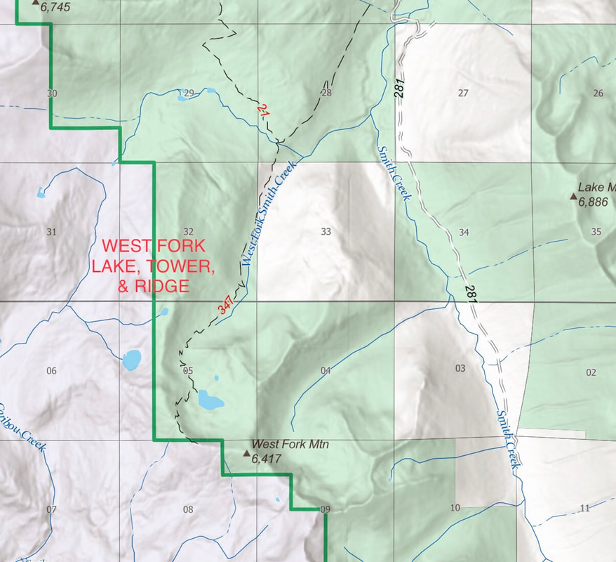
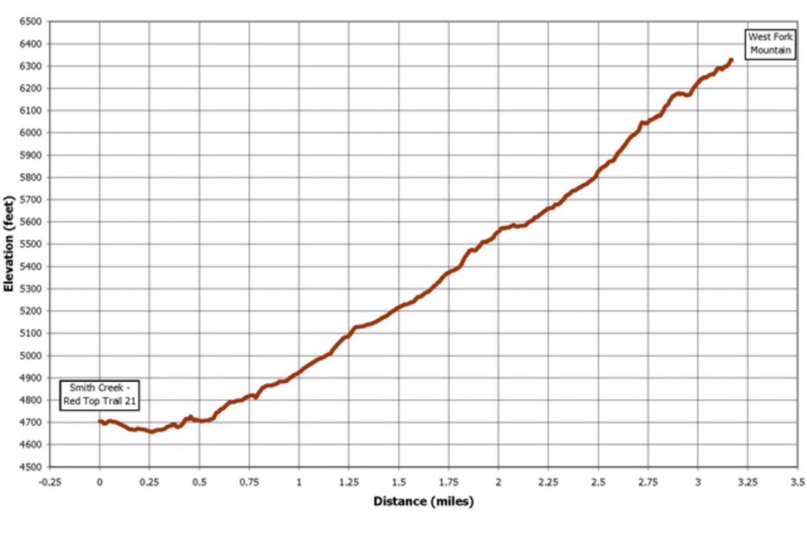
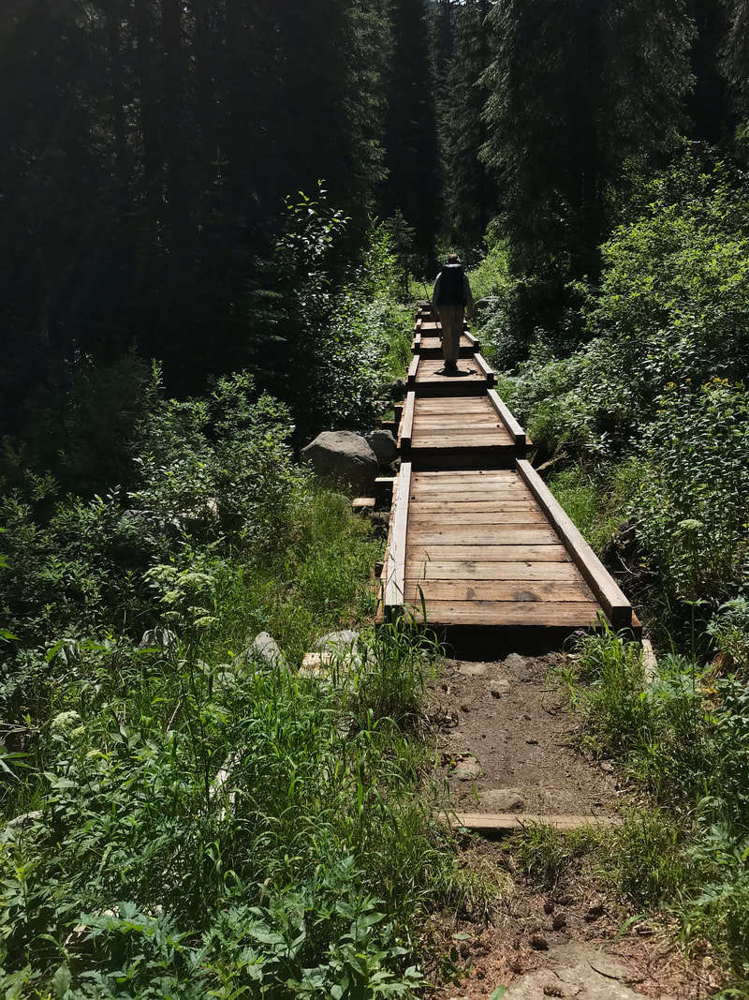
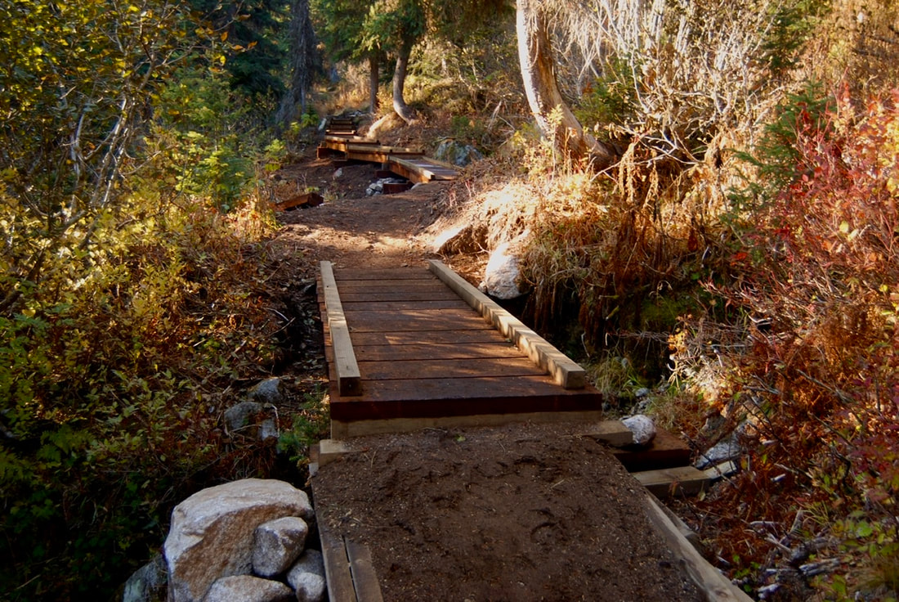
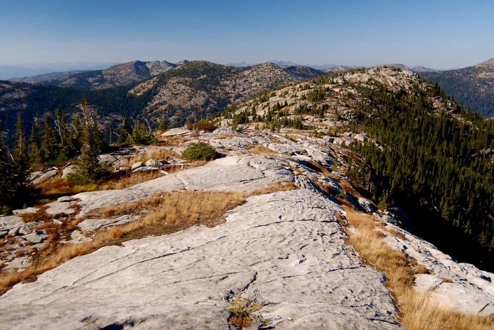
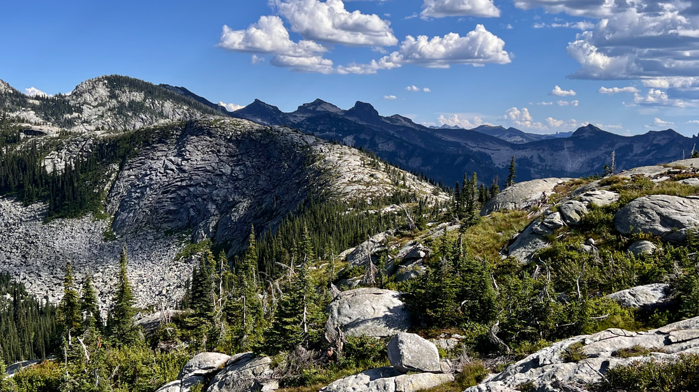
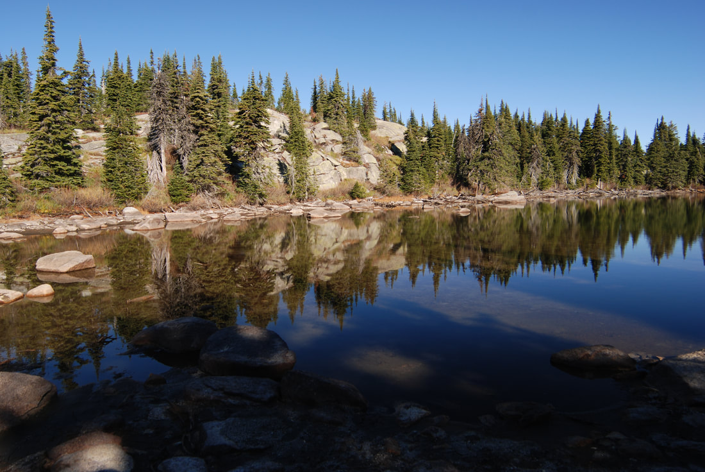
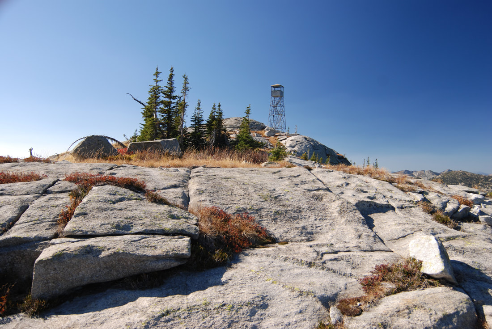
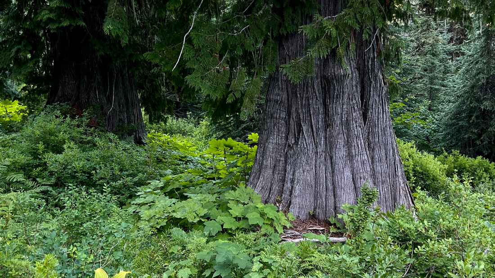

---
tags:
- Lakes
- Moderate
- Hike
- Backpack
- Scramble
stats:
- label: Event Type
  icon: hiking
  value: Hike, Backpack and Scramble
- label: Distance
  icon: map-marker-distance
  value: about 7 miles RT to the lake, another 3/4 of a mile to the summit and lookout
    tower.
- label: Elevation
  icon: terrain
  value: W.F.Lake- 1667'
- label: Acres
  icon: vector-square
  value: '11.2'
- label: Difficulty
  icon: speedometer
  value: Moderate
- label: Maps
  icon: map
  value: IPNF-Kaniksu N.F., USGS-Smith Peak, Shorty Peak & Caribou Creek
- label: GPS
  icon: crosshairs-gps
  value: 48° 51’ 54.0"n 116° 44’ 19.8"w
- label: Ranger District
  icon: pine-tree
  value: Bonners Ferry R.D. 208.267.5561
- label: Boundary County Sheriff
  icon: shield-account
  value: CALL 911 FIRST or 208.267.3151
notes:
- Idaho panhandle national forest/alerts
- <https://www.fs.usda.gov/alerts/ipnf/alerts-notices>
---

# West Fork Lake Mountain 6416  Lookout Tower Trail 347

## Description

The hardest part of this nice hike is the drive from Rathdrum.  it is a 2.5 hour drive.
Begin this hike on Trail #21 for about a mile on an easy grade, and across 4 boardwalks  to the junction with Trail #347.

At the junction, turn left for 3 miles to West Fork Lake.
Trail #347 has one bridge just after the junction. Along Trail #347 you will cross 15 boardwalks that protect the moist environments. There are many switchbacks on Trail #347.

Once at the lake, you will find it’s shoreline is to swampy to walk near. Stay on the dry paths at the lake.

## Option #1

To gain the ridge that the old fire lookout stands on, walk back to the junction where you turned left to the lake, and turn left up the trail for about .5 miles.
When you access the ridge, mark this point carefully. it will be your return route.
If you turn left, the tower is a little over .2  miles. You can explore this INCREDIBLE ridge SSE for as long as you like.
Return to your trail marker and head back to the lake.

## Option #2

To further extend your hike on this ridge, continue NNW past yourTRAIL  MARKER, and walk the ridge top out to a view of Middle and Upper Caribou Lakes.
Look for a descent route (no trail) down to Middle Lake, if you want to go there.
Continue NNW enjoying easily one of the most magnificent ridge walks in our area.

It is your choice to drop down 363v to the Middle Lake.
Continue NNW to Upper Caribou Lake at about .4 of a mile past Middle lake.
Upper Caribou Lake sits right on the ridge, and is a good place for lunch.

## Directions

From Bonners Ferry drive north on 95, 15 miles to Hwy #1. Turn left (west) onto Hwy #1 thru Copeland and on to the West Fork Road (417) across the KootenaI River. Once on West Side Road, head north for 9 miles on a paved road which becomes FR #281 Smith Creek.

Stay on FR #281 to a poorly marked junction with FR #2446, and bear right to the end of the road and its parking area.

## Hazards

The drive, is long, but beautiful.
Boggy and rocky trail requires some care.
So much beauty you won’t want to leave.

---

## Cool things close by

Hidden Lake, Red Top Mt., Shorty & Lone Tree Peak, Joe Lake, the Kootenai National Wildlife Refuge, Myrtle Falls, and Smith Creek Falls.

## R & P

Jalapeños, Mr. Sub, Burger Express, Eichardt’s in Sandpoint

---

## Photo gallery

*Picture (Image missing)*

## chris shooting a small cascade near the junctions of trails 21 & 347

*Picture (Image missing)*

Not too far up from the trail junction, The walk is thru 4' to 8' diameter giant western red cedars image by chris herath

## There are 14 boardwalks, like this one on trail #347

## Boardwalks protect wet areas

*Picture (Image missing)*

## West fork lake

---

## West fork ridge looking nw

---

*Picture (Image missing)*

## West fork mountain lookout tower

---

*Picture (Image missing)*

## West fork lookout tower

---

*Picture (Image missing)*

## Lion head and surrounding peak from inside the tower

---

*Picture (Image missing)*

## A view of the ridge nnw of the tower. do not miss this walk Image by chris herath

*Picture (Image missing)*

## Descending the tower

---

*Picture (Image missing)*

## Chris pausing on the west fork ridge looking north

---

*Picture (Image missing)*

## The famous american selkirks granite

*Picture (Image missing)*

## Middle caribou lake from west fork's nne ridge image by chris herath

*Picture (Image missing)*

## When hiking tuff routes, always have well prepared lunches

## The ridge that the tower is on, is a very beautiful. do not miss it image by chris herath

*Picture (Image missing)*

## Middle caribou lake with the nne ridge above

## Upper caribou lake

## The lookout tower from the south

## Did i mention the giant western red cedars?

## West fork cabin

The silence of the mountains include:         The roar of a stream,         The rustle of leaves in the wind,         The songs of birds,        The tumbling of water along it's path,         The crunch of foot step,         The soft warm light,       The experience of beauty,       The click of a shutter,         The capture of an image,         and the company of friends.                                                              chic.  7.29.11
