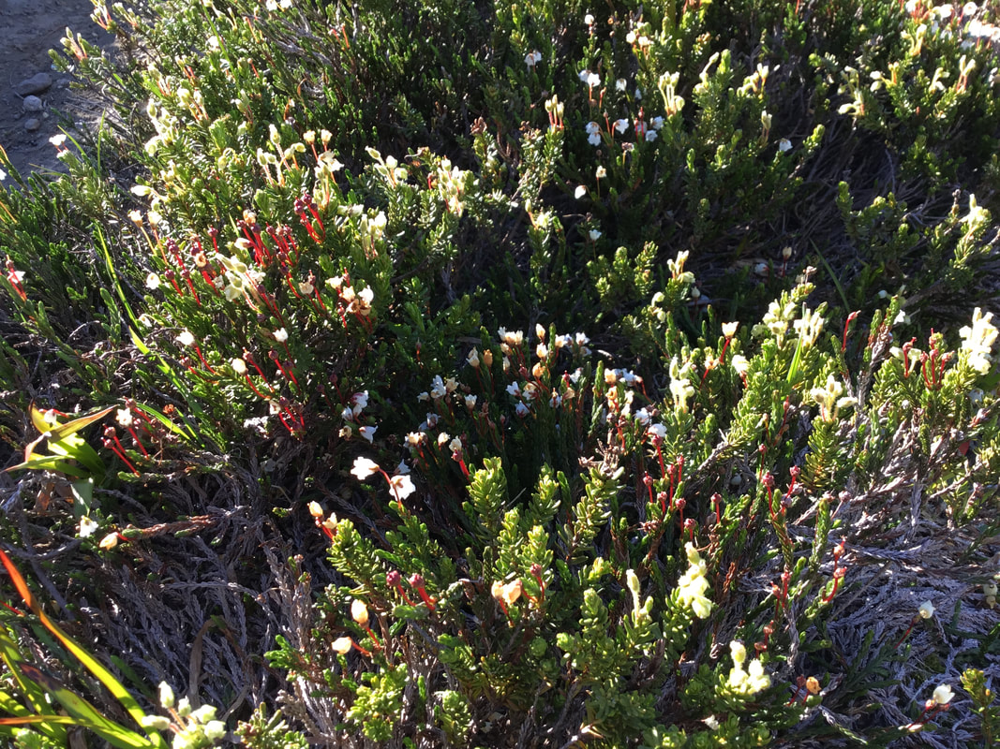
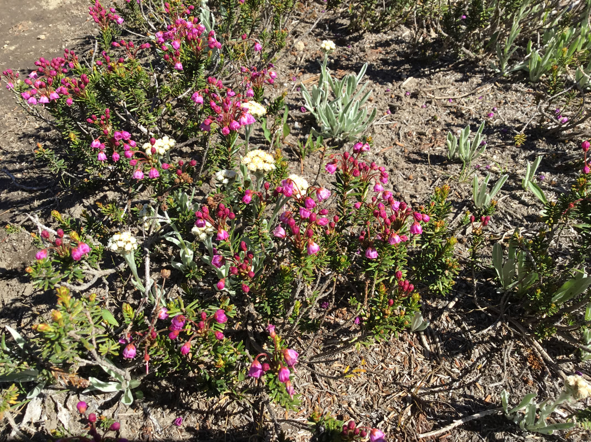

---
tags:

- Flora & Wildlife

stats:

- label: Genesis Name
  icon: book-open-variant
  value: Cassiope mertensiana

- label: Distribution
  icon: earth
  value: This heather is native to [subalpine](https://en.wikipedia.org/wiki/Subalpine)
    areas of western North America, from Alaska to the mountains of California. It
    is a small, branching shrub which forms patches along the ground and in rocky
    crevices.

- label: Season
  icon: calendar
  value: Blooming July thru August

- label: Medical Use
  icon: medical-bag
  value: The flower, leaf, and plant top are used to make medicine. People take heather
    as a **tea for kidney and lower urinary tract conditions**, prostate enlargement,
    fluid retention, gout, arthritis, sleep disorders, breathing problems, cough,
    and colds.

- label: Poisonous
  icon: skull-crossbones
  value: It's important to err on the side of caution and educate yourself on the
    harmful effects a poisonous plant or flower can have. Common flowers like heathers,
    foxgloves and even some of the blooms on our site **can have toxic properties**.

- label: Edibility
  icon: food-apple
  value: 'The flowers were often used as a flavouring for beverages including **tea
    and ale**. Best places to find : Most readily found on heaths, moors and in open
    woodlands. Heather has a preference for acidic soil conditions. ... Other uses
    : Historically, Heather has been a very useful crop.'

- label: Features
  icon: information-outline
  value: A low, matted, evergreen shrub with tough branches up to 12 in. tall. Small
    white bell-like flowers hang from the tips of slender stalks that grow from the
    axils near the ends of the branches on this matted plant. One to few bell-shaped
    flowers are borne near the branch tips. Because the flowers are pendent, the reddish
    sepals are visible. The somewhat star-like white flowers may have inspired the
    genus name of this plant, for in Greek mythology Cassiopeia was set among the
    stars as a constellation. Firemoss Cassiope (*C. tetragona*), near the Canadian
    border, has a prominent groove on the lower side of each leaf. Starry Cassiope
    (*C. stellariana*), which grows in bogs from Mount Rainier northward, has alternate,
    spreading leaves.

- label: Leaves
  icon: leaf
  value: Cassiope mertensiana (Western Moss Heather) is a species of shrub in the
    family Ericaceae. They have a self-supporting growth form. They are native to
    Western North America, The Contiguous United States, Alaska, and Canada. They
    have **simple, scale leaf leaves**.

- label: Fruits
  icon: fruit-cherries
  value: Fruit a 5-celled, globose capsule.
---

# Western Moss Heather

## Description

*Cassiope mertensiana* has short, erect, snakelike stems that are covered in tiny leathery scalelike leaves only a few millimeters long. From between the layers of scale leaves emerge reddish  [pedicels](https://en.wikipedia.org/wiki/Pedicel_(botany)) each bearing a petite, hanging, down-facing, bell-shaped flower. The [bractlets](https://en.wikipedia.org/wiki/Bract)are red and the contrasting flower is white.

The white flower contrasts with the red bractlets.
Although the shrub tends to grow in areas where there is a lot of accumulation of snow, adequate rain precipitation is needed for the continued growth of Cassiope Mertensiana. The shrub must be exposed to enough sunlight and warmer conditions for proper growth during the growing season.
Cassiope mertensiana is a species of flowering plant known by the common names western moss heather and white mountain heather. This heather is native to subalpine areas of western North America, from Alaska to the mountains of California. It is a small, branching shrub which forms patches along the ground and in rocky crevices. The short, erect, snakelike stems are covered in tiny leathery scalelike leaves only a few millimeters long. >From between the layers of scale leaves emerge reddish pedicels each bearing a petite, hanging, down-facing, bell-shaped flower. The leaflets are red and the contrasting flower is white.

---

## Photo gallery

---

