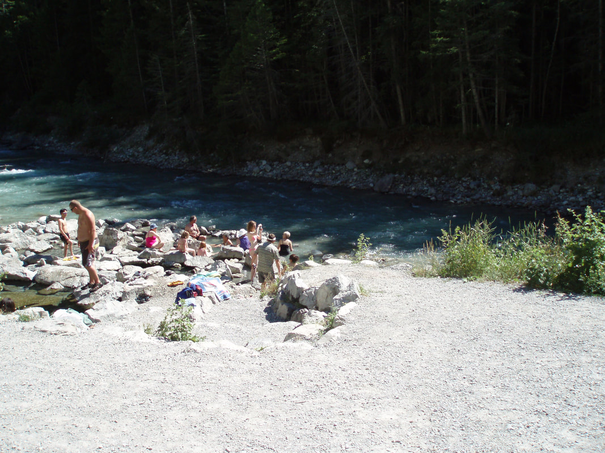
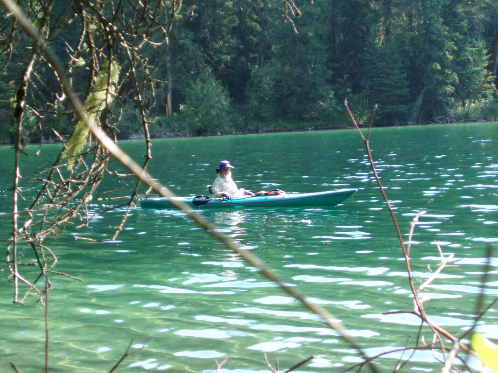
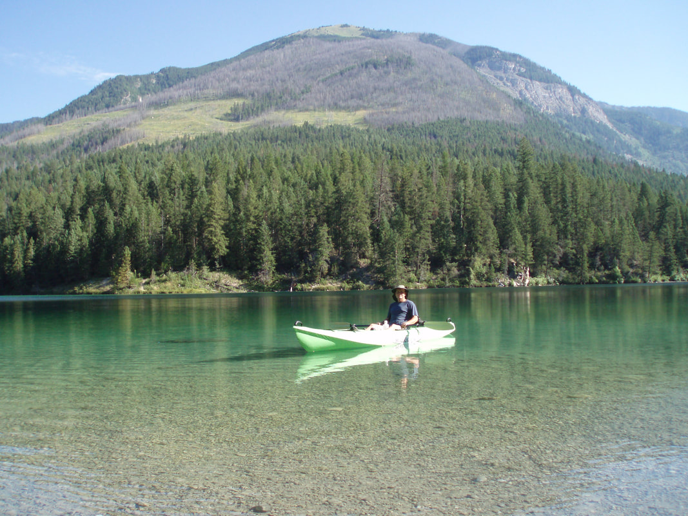

---
tags:
- Trails & Scrambles
stats:
- label: Paddle Distance
  icon: map-marker-distance
  value: aleces lake .8 miles. whiteswan lake is 4 miles
- label: Lake Elevation
  icon: terrain
  value: aleces 3770'. whiteswan 3754
- label: Maps
  icon: map
  value: whiteswan provitial park,
- label: Launch GPS
  icon: crosshairs-gps
  value: 50°08" 08’ "n 115° 29’ 26"w
---

# Whiteswan Provintial Park

## Description

Alces Lake is the first lake you come to in the park. it is not deep, but the surrounding mountains make for
a pleasant paddle. Whiteswan lake. is just a bit further in and offers a more exciting paddling among
towering mountains. Around both lakes are several campgrounds.

But a large attraction to these lakes is the primitive Lussier Hot Springs. it along the shore line of
Lussier River.

## Directions

You will enter Canada at the Kingsgate Port of Entry on Hwy 95. Stay on 95 thru Yakh, Moyie, Cranbrook, Fort
Steele and Wasa. At 3.4 miles turn right onto Canadian Hwy 93/95, Kootenay Hwy. From the town of
Skookumchuck, drive 14.4 miles turn right (east) onto Whiteswan Lake Forest Service Road. Follow this road
past Lussier Hot Springs, staying on Whiteswan Lake F.DS. Road to Alces Lake and White Swan Lake.

## Red tape

You will need the appropriate Passport or equivalent to get into Canada. Be aware that Canada will not let
you into their country if you have been convicted of a crime, no guns, including DUI, etc.

## Hazards

Watch out for deer on all the roads in Canada. The Whiteswan Road is well maintained but stuff happens. On
the lakes stay safe if the winds are up.

## Paddles close by

Premier Lake P.P., Columbia Lake, Faairmont Hot Springs,Wiondermere Lake Invermere, Radium Hot Springs,
Kootenay National Park, and Banff NationalPark.

## R & P

NA

---

## Plan your trip

[Click for Current NOAA Weather
Conditions](https://www.nws.noaa.gov/wtf/udaf/MapClick.php?lel=4000&uel=9000&polygon=49.016%2C-114.180%2C48.994%2C-114.381%2C48.890%2C-114.341%2C48.924%2C-114.151%2C&area=63)

## Photo gallery

---

*Picture (Image missing)*

*Picture (Image missing)*

