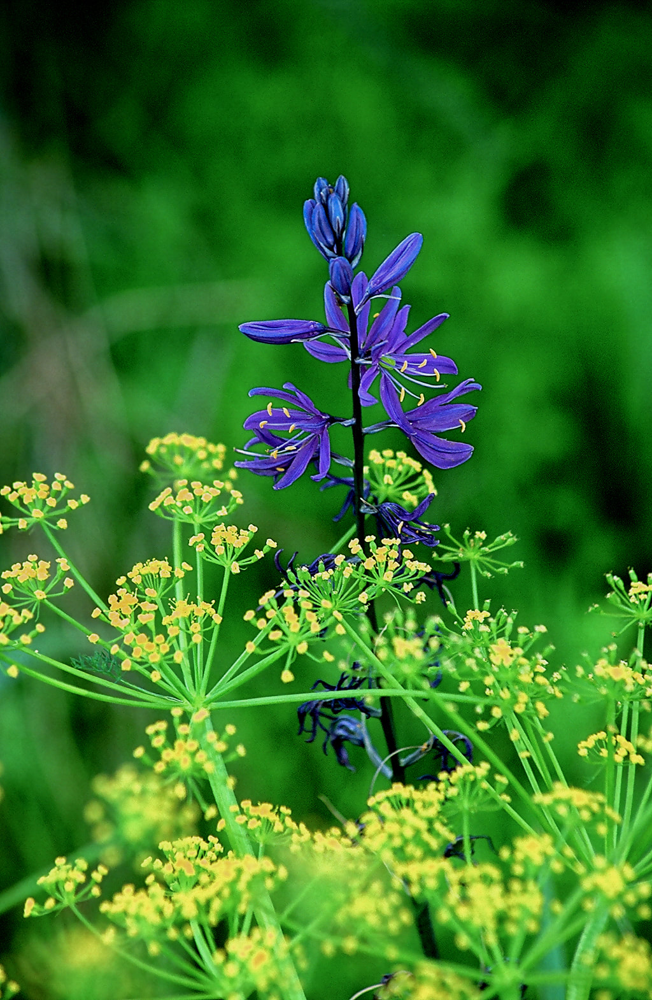

---
tags:
  - Wildflowers
  - Trails & Scrambles
stats:
  - label: Botanical Name
    value: "Camassia quamash"
  - label: Common Names
    value: "Common Camas, Small Camas, Indian Camas"
  - label: Distribution
    value: "CA, ID, MT, NV, OR, UT, WA, WY; BC (Canada)"
  - label: Bloom Season
    value: "April through June (Mid-Spring to Early Summer)"
  - label: Plant Height
    value: "12 to 28 inches (30 to 70 cm)"
  - label: Flower Characteristics
    value: "Star-shaped, light to deep blue-violet, 6 tepals with bright yellow anthers"
  - label: Medicinal Uses
    value: "Boiled bulb juice mixed with honey as a therapeutic cough syrup"
  - label: Edibility & Flavor
    value: "Sweet native delicacy; taste often compared to baked pear, fig, or sweet potato"
notes:
  - label: "Nutritional Profile: High in carbohydrates and protein (5.4 oz protein per pound of root)."
  - label: "CRITICAL SAFETY CAUTION: Common Camas bulbs closely resemble deadly Death Camas (Zigadenus spp.)."
    url: ../white/mountain-deathcamas.md
---

# Common Camas (Camassia quamash)

_Common Camas (Camassia quamash)_

Common Camas (*Camassia quamash*), also known as Small Camas or Indian Camas, is a stout perennial herb in the
asparagus family (*Asparagaceae*). Growing from an edible underground bulb, it produces dense, showy racemes of
sky-blue to deep blue-violet star-shaped flowers that frequently carpet entire moist subalpine meadows across the
Inland Northwest.

---

## Overview & Botanical Profile

Camas is one of the most culturally, historically, and ecologically significant native plants of the Pacific Northwest.
During peak bloom in mid-spring, high-elevation wet meadows and grassy slopes become vivid seas of blue-violet
blossoms.

Indigenous peoples—including the Kalispel ("Camas People"), Nez Perce, Kootenai, and Flathead tribes—harvested and
managed extensive Camas grounds across the Pend Oreille, Clearwater, and Willamette valleys for thousands of years.

---

## Physical Characteristics

### Stems & Foliage

- **Stems:** Leafless flowering stems (scapes) range from 12 to 35 inches (30 to 90 cm) in height. The plant grows
  from a stout, dark-coated tunicated bulb.
- **Leaves:** Basal, long, and narrow with a bright green, grass-like appearance, emerging directly from the base of the
  plant.

### Inflorescence & Flowers

- **Inflorescence:** A terminal, spike-like raceme bearing dozens of radially symmetrical, star-shaped flowers.
- **Tepals & Anthers:** Flowers feature six distinct tepals ranging from light sky-blue to deep royal blue-violet, six
  stamens tipped with bright yellow anthers, and three stigmas.
- **Asymmetry:** Unlike Great Camas, the flowers of Common Camas are slightly irregular, with the lowest tepal
  curving outward away from the stem.

### Fruit & Seeds

The fruits are barrel-shaped to three-angled capsules that split into three distinct chambers upon maturity, releasing
numerous glossy, black, angled seeds.

---

## Distinguishing Features & Similar Species

| Characteristic | Common Camas (*C. quamash*) | Great Camas (*C. leichtlinii*) |
| :--- | :--- | :--- |
| **Floral Symmetry** | Slightly irregular (lowest tepal curves outward) | Radially symmetrical |
| **Anther Color** | Bright yellow | Dull yellow to bluish-violet |
| **Plant Height** | Shorter & stouter (12–28 in / 30–70 cm) | Taller & robust (24–48 in / 60–120 cm) |
| **Leaf Coating** | Smooth green (no waxy powder) | Often coated in a glaucous waxy powder |
| **Distribution** | Widespread across inland valleys & subalpine ranges | Primarily west of the Cascade Mountains |

---

## Traditional Uses & Edibility

!!! info "Nutritional & Culinary Value"

    Common Camas bulbs are rich in complex carbohydrates (inulin) and remarkably high in protein, yielding
    **5.4 ounces of protein per pound of root**—exceeding the protein density of salmon (3.7 oz per pound).

### Indigenous Harvesting & Culinary Preparation

Native tribes dug Camas bulbs in late summer after flowering. The bulbs were slow-cooked in earthen pit ovens over
hot stones for 24 to 48 hours. This extended steaming converted complex inulin starches into sweet fructose,
producing a rich delicacy with a flavor compared to baked pears, figs, or sweet potatoes. Cooked bulbs were eaten
immediately, mashed into sweet cakes, or dried for winter storage and trade.

### Medicinal Applications

Traditionally, Camas bulbs were boiled to produce a thick, sweet juice that was mixed with honey or wild berries to
formulate a therapeutic cough syrup and soothing tea for pulmonary infections.

---

## Critical Caution: Toxicity & Death Camas

!!! danger "Lethal Look-Alike: Death Camas (*Zigadenus spp.*)"

    Common Camas bulbs look nearly identical to **Death Camas** (*Zigadenus spp.* / *Toxicoscordion venenosum*), a
    highly toxic plant containing the deadly steroidal alkaloid **zygacine**.

    - **Toxicity Warning:** Consuming Death Camas causes severe gastrointestinal distress, rapid heart rate drops,
      respiratory paralysis, and death in both humans and livestock.
    - **Identification Rule:** Never harvest wild Camas bulbs unless the plants are in full bloom and positively
      identified by an expert botanist. When dormant in autumn, the bulbs of both species cannot be reliably
      distinguished.

For detailed identification of toxic look-alikes, read our [Mountain Deathcamas Guide](../white/mountain-deathcamas.md).

---

## Habitat & Regional Distribution

Common Camas thrives in moist subalpine meadows, stream margins, marshy flats, and damp grassy slopes at elevations
ranging from valley bottoms up to 5,300+ feet. Its native distribution spans California, Idaho, Montana, Nevada,
Oregon, Utah, Washington, Wyoming, and British Columbia.
