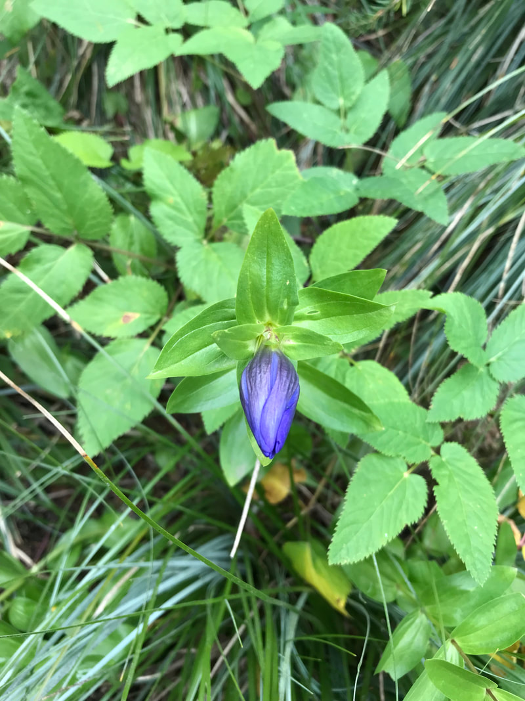

---
tags:
  - Wildflowers
  - Trails & Scrambles
stats:
  - label: Botanical Name
    value: "Gentiana affinis"
  - label: Common Names
    value: "Rocky Mountain Gentian, Pleated Gentian, Trailing Gentian"
  - label: Distribution
    value: "AZ, CA, CO, ID, MN, MT, ND, NM, NV, OR, SD, TX, UT, WA, WY; SK (Canada)"
  - label: Bloom Season
    value: "August through September (Late Summer to Early Autumn)"
  - label: Plant Height
    value: "8 to 16 inches (20 to 40 cm)"
  - label: Flower Characteristics
    value: "Trumpet-shaped, intense deep blue to blue-violet, 5 petals with pleated frilled sinuses"
  - label: Foliage
    value: "Opposite, sessile, lanceolate leaves (2-7 cm long) with minutely scabrous margins"
  - label: Medicinal Uses
    value: "Bitter root extracts used traditionally in herbal digestive tonics and appetite stimulants"
notes:
  - label: >-
      Herbal & Culinary Profile: Non-poisonous, though extremely bitter. Related to European yellow
      gentian used in alpine digestive liqueurs.
---

# Rocky Mountain Gentian (Gentiana affinis)

_Rocky Mountain Gentian (Gentiana affinis)_

Rocky Mountain Gentian (*Gentiana affinis*), also known as Pleated Gentian or Trailing Gentian, is a striking
perennial wildflower in the gentian family (*Gentianaceae*). Renowned for its vivid "gentian blue" trumpet-shaped
blossoms, it blooms during late summer and early autumn when most other subalpine wildflowers have set seed.

---

## Overview & Botanical Profile

Gentians represent a large global genus of moisture-loving alpine and temperate plants. The genus name *Gentiana*
honors King Gentius of ancient Illyria, who according to legend first discovered the bitter medicinal properties of
gentian root.

While many wildflower species fade by late July, Rocky Mountain Gentian provides a brilliant late-season display
across damp mountain meadows, subalpine stream banks, and boggy flats throughout the Inland Northwest.

---

## Botanical Description & Morphology

### Growth Form & Stems

- **Habit:** Perennial forb growing from a fibrous root system with decumbent to erect stems reaching 8 to 16 inches
  (20 to 40 cm) in height.
- **Stems:** Simple or clustered, often purplish-tinged near the base.

### Foliage & Leaves

- **Arrangement:** Opposite and sessile (stemless).
- **Shape & Size:** Oblong to lanceolate, 0.8 to 2.8 inches (2 to 7 cm) long and 0.2 to 0.8 inches (0.5 to 2 cm) wide.
- **Texture:** Margins and midrib lower surfaces are minutely scabrous (rough to the touch).

### Inflorescence & Flowers

- **Flower Structure:** Bright sky-blue to deep blue-violet tubular corollas 1.0 to 1.6 inches (2.5 to 4 cm) long,
  clustered in the upper leaf axils.
- **Plaited Membranes:** Corollas are united for most of their length by folded (pleated) membranes. The free
  triangular corolla lobes curve outward at the mouth, while small, pointed pleat teeth in the sinuses create a
  distinctive frilled appearance.

---

## Taxonomy & Related Genera

The gentian family (*Gentianaceae*) encompasses 87 genera and nearly 1,700 species worldwide. Botanists distinguish
true gentians (*Gentiana*) from related regional genera:

- **Gentianella:** Fringed gentians featuring un-plaited corolla sinuses.
- **Gentianopsis:** Starred gentians with distinct ciliate corolla margins.
- **Gentiana lutea:** Great Yellow Gentian of Europe, the commercial source of bitter flavorings in alpine liqueurs.

---

## Traditional & Herbal Uses

!!! info "Herbal & Digestive Properties"

    Gentian roots contain some of the most bitter natural compounds known (including gentiopicroside and amarogentin).
    Traditionally, bitter root extracts were brewed into teas and tonics to stimulate appetite, relieve indigestion,
    reduce fevers, and ease gastrointestinal spasms.

---

## Habitat & Regional Distribution

Rocky Mountain Gentian inhabits moist subalpine meadows, gravelly stream margins, spring heads, and damp grassy
slopes at moderate to high elevations across Western North America (AZ, CA, CO, ID, MN, MT, ND, NM, NV, OR, SD, TX,
UT, WA, WY) and Saskatchewan.

---

## Photo Gallery

_Rocky Mountain Gentian in late summer bloom._

_Close-up of deep blue pleated corolla tube._

_Cluster of Gentiana affinis blossoms along stem._

_Side profile showing opposite sessile leaves._
