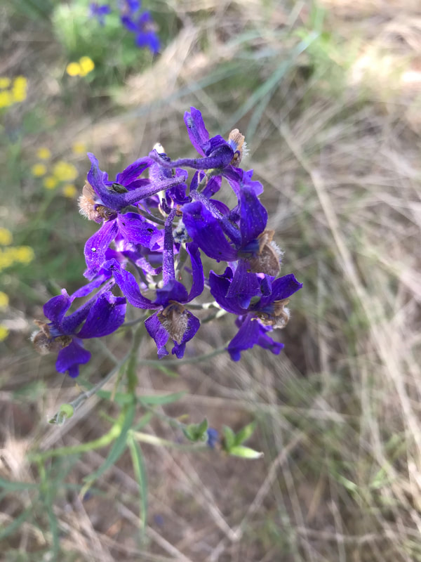

---
tags:
  - Wildflowers
  - Trails & Scrambles
stats:
  - label: Botanical Name
    value: "Delphinium nuttallianum"
  - label: Common Names
    value: "Nuttall's Larkspur, Low Larkspur, Two-Lobe Larkspur"
  - label: Distribution
    value: "AZ, CA, CO, ID, MT, NE, NM, NV, OR, SD, UT, WA, WY; BC, AB (Canada)"
  - label: Bloom Season
    value: "May through July (Late Spring to Early Summer)"
  - label: Plant Height
    value: "6 to 16 inches (15 to 40 cm)"
  - label: Flower Characteristics
    value: "Cobalt blue to violet-purple with a prominent backward-projecting spur"
  - label: Foliage
    value: "Deeply palmately lobed basal leaves with linear segments"
  - label: Toxicity Level
    value: "EXTREMELY POISONOUS to humans and livestock (diterpenoid alkaloids)"
notes:
  - label: >-
      CRITICAL SAFETY WARNING: All parts of Delphinium nuttallianum contain lethal diterpenoid alkaloids.
      Young spring shoots and seeds carry the highest toxicity.
---

# Nuttall's Larkspur (Delphinium nuttallianum)

_Nuttall's Larkspur (Delphinium nuttallianum)_

Nuttall's Larkspur (*Delphinium nuttallianum*), also known as Low Larkspur or Two-Lobe Larkspur, is a striking
native perennial wildflower in the buttercup family (*Ranunculaceae*). Named after 19th-century naturalist Thomas
Nuttall, it is one of more than 60 species of larkspur native to North America.

---

## Overview & Botanical Profile

Nuttall's Larkspur is a wide-ranging, spring-blooming wildflower famous for its intense cobalt blue to deep
violet-purple flowers. Each blossom features a long, backward-pointing spur characteristic of the genus *Delphinium*.

It is commonly encountered across sagebrush steppes, ponderosa pine open forests, mountain brush slopes, and subalpine
meadow edges throughout the Inland Northwest.

---

## Physical Characteristics

### Foliage & Stems

- **Stems:** Slender, unbranched to sparingly branched erect stems growing 6 to 16 inches (15 to 40 cm) tall.
- **Leaves:** Deeply divided into narrow, linear, finger-like lobes. Most leaves are concentrated in a basal cluster,
  with a few smaller, alternate leaves borne higher along the flowering stem.

### Spurred Flowers & Inflorescence

- **Inflorescence:** A terminal, open raceme bearing 3 to 15 showy, spurred flowers.
- **Sepals & Spurs:** Five petal-like sepals form the outer flower, with the uppermost sepal extending backward into a
  hollow, 10–20 mm long spur.
- **Petals:** Four inner central petals surround the stamens; the upper two petals are often white or pale blue with
  dark purple veins.

---

## Habitat, Elevation & Range

Nuttall's Larkspur is remarkably adaptable, occurring from low elevation sagebrush basins at 1,000 feet up to subalpine
ridges at 10,000 feet.

- **Preferred Soil:** Well-drained gravelly soils, coarse sands, and rocky loam on moist (but not waterlogged) sunny
  slopes.
- **Geographic Range:** Extends from British Columbia and Alberta south to California, Arizona, and New Mexico, and
  east across the Intermountain West to South Dakota and Nebraska.

---

## Critical Caution: Toxicity & Livestock Hazard

!!! danger "Lethal Toxicity: High Livestock & Human Risk"

    All parts of *Delphinium nuttallianum* are **severely poisonous to humans and livestock**.

    - **Toxic Compounds:** Contains potent diterpenoid alkaloids (including methyllycaconitine) that block
      neuromuscular nicotinic acetylcholine receptors, leading to muscle weakness, respiratory paralysis, and cardiac
      arrest.
    - **Rangeland Hazard:** Larkspur poisoning is a leading cause of cattle mortality on Western public land grazing
      allotments. Young spring growth and seed pods contain the highest concentrations of toxins.
    - **Treatment:** There is no proven chemical antidote for severe larkspur poisoning. Avoid ingesting any part of the
      plant and keep domestic animals from grazing near dense larkspur patches.
