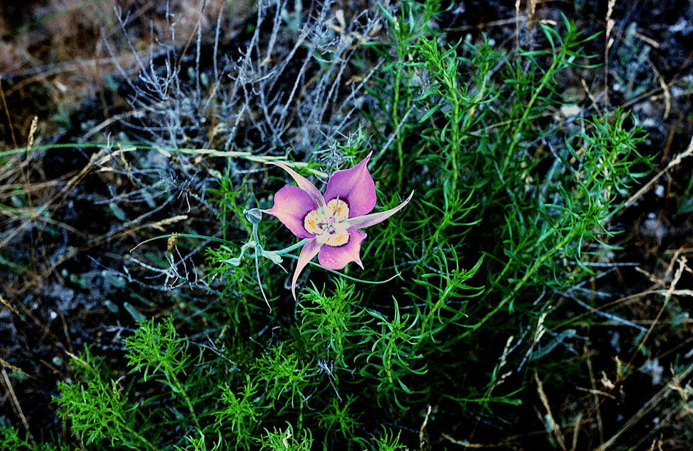

---
tags:
- Trails & Scrambles
stats:
- label: Genesis Name
  icon: book-open-variant
  value: Calochortus macrocarpus
- label: Distribution
  icon: earth
  value: Occurring east of the Cascades crest in Washington; British Columbia to California,
    east to Montana and Nevada.
- label: Season
  icon: calendar
  value: Blooms in June and can also thru summer
- label: Medical Use
  icon: medical-bag
  value: '**Okanagan-Colville** - Poultice of mashed bulbs applied to the skin for
    poison ivy. Bulbs eaten raw or pit cooked with other roots. Roots used as a principle
    food. Corms formerly cooked and used for food. Sweet flower buds used for food.'
- label: Poisonous
  icon: skull-crossbones
  value: 'no'
- label: Edibility
  icon: food-apple
  value: Mariposa-lily (Calochortus spp.) Calochortus spp. **bulbs are edible raw**.
    bulbs are best when cooked.
- label: Features
  icon: information-outline
  value: Umbels 1-3 flowered; flowers large, lavender to white, erect, each petal
    with a median green stripe; sepals 3, longer than the petals, narrowly lanceolate,
    pointed; petals 3, obovate, moderately bearded above the gland; gland triangular-oblong,
    surrounded with a broad, fringed membrane, and densely covered with slender processes;
    stamens 6, style tapered, stigma trifid, persistent.
- label: Leaves
  icon: leaf
  value: The leaves are blue-green and grass-like
- label: Fruits
  icon: fruit-cherries
  value: Capsule linear-lanceolate, 3-angled, pointed.
notes:
- label: individual plants of Calochortus macrocarpus can remain dormant for a period
    of one to four years. This seems to be a strategy by the plant to avoid unfavourable
    environmental conditions in a particular year, allowing it to instead grow within
    an environmental regime that is more favourable to eventual reproduction.
  url: '#'
---

# Sagebrush Mariposa

_Sagebrush Mariposa_

## Description

The flowers of this plant can only be described as stunning! Bob emailed us recently wondering about the
plants. He and his family were enchanted with the bloom, found during a family vacation at the Steamboat
Rock State Park in Eastern Washington State. This brought a bit of nostalgia for us, along with the delight
in a beautiful flower. We enjoyed a family gathering some years back at that same park. This species was one
of many collected on the Lewis and Clark expedition. The perennial herb is one of about 70 species in the
genus, part of whose name means beautiful grass in Greek. Mariposa, in Spanish, means butterfly. Bob did a
good job in showing two differing blossoms from this plant.

---

## Photo gallery

---
