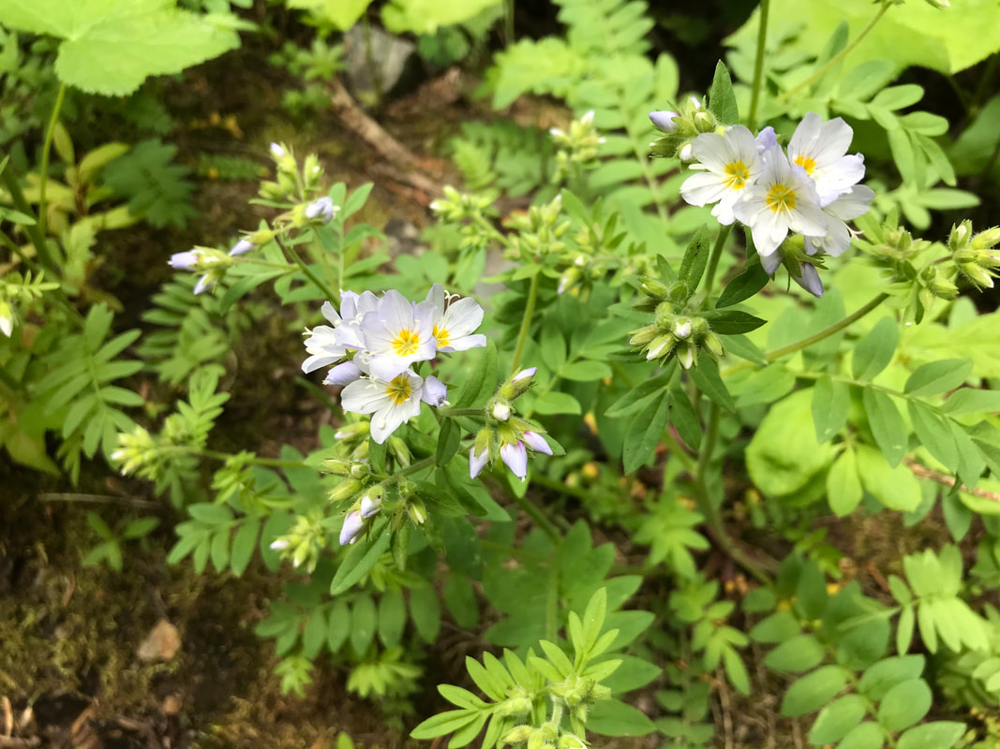

---
tags:
- Trails & Scrambles
stats:
- label: Distribution
  icon: earth
  value: wa, id mt
- label: Season
  icon: calendar
  value: Spring
- label: Medical Use
  icon: medical-bag
  value: Jacob's ladder is a plant. The parts that grow above the ground are used
    to make medicine. People take Jacob's ladder for **fever and swelling (inflammation)**.
    They also take it to dry out tissues (as an astringent) and to promote sweating.
- label: Poisonous
  icon: skull-crossbones
  value: 'no'
- label: Edibility
  icon: food-apple
  value: The flowers of "False Jacob's Ladder" **can be used as a salad garnish**.
    Both varieties were used in herbal folk medicines.
- label: Features
  icon: information-outline
  value: Polemonium caeruleum is a PERENNIAL growing to 0.4 m (1ft 4in) by 0.4 m (1ft
    4in).
- label: Suitable For
  icon: information-outline
  value: 'light (sandy) and medium (loamy) soils and prefers well-drained soil. Suitable
    pH: acid, neutral and basic (alkaline) soils. It can grow in semi-shade (light
    woodland) or no shade. It prefers moist soil.'
- label: Leaves
  icon: leaf
  value: na
- label: Fruits
  icon: fruit-cherries
  value: na
notes:
- label: ',GENESIS NAME: Polmonium caeruleum'
  url: '#'
- label: It is hardy to zone (UK) 2 and is not frost tender. It is in flower from
    June to July, and the seeds ripen in July. The species is hermaphrodite (has both
    male and female organs) and is pollinated by Bees.
  url: '#'
---

# Polemonium

_Polemonium_

## Jacob's ladder. aka. polemonium

## Description

*Polemonium reptans*is a sprawling rhizomatous perennial groundcover. Plants have a short vertical crown and
many fibrous roots. The attractive leaves are alternately arranged on green or purplish stems. They appear
to be compound but are actually pinnately divided into inch long oval or oblong segments. Each segment has a
pointed tip and smooth edge. The entire leaf averages 8-9" length. The fertile stems terminate in loose open
flower corymbs. The individual florets are bell shaped and about ½" across. Each floret has 5 rounded
blue-violet or pinkish petals. Blooming occurs in late spring for 2-3 weeks. Small oval tan colored seed
capsules follow. Plants grow 12-18" tall with an equal spread. Even though plants have short rhizomes, they
spread mostly by reseeding. A low, weak-stemmed, often sprawling, herbaceous perennial. Flowers in loose
terminal clusters, bell-shaped, ¾ inch long, 5-lobed, with short tubes, light blue to blue lavender. Stamens
5, with white anthers; style tip divided into three parts. Blooms April-June. Leaves alternate, pinnately
("feather") compound with smooth, ovate, opposite leaflets. The basal leaves are on long petioles. Size:
Height: to 15 inches.

---

## Photo gallery

---

### Picture (Image missing)

### Picture (Image missing) Details
