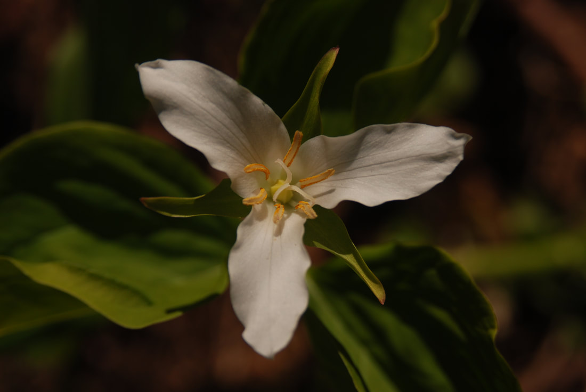
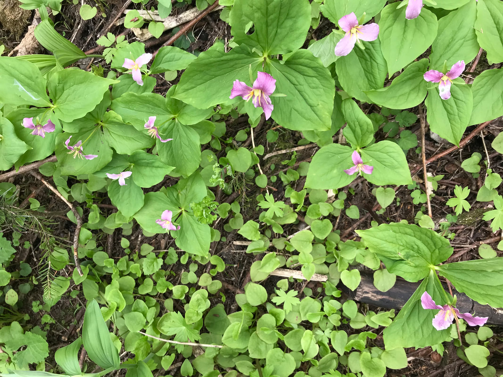
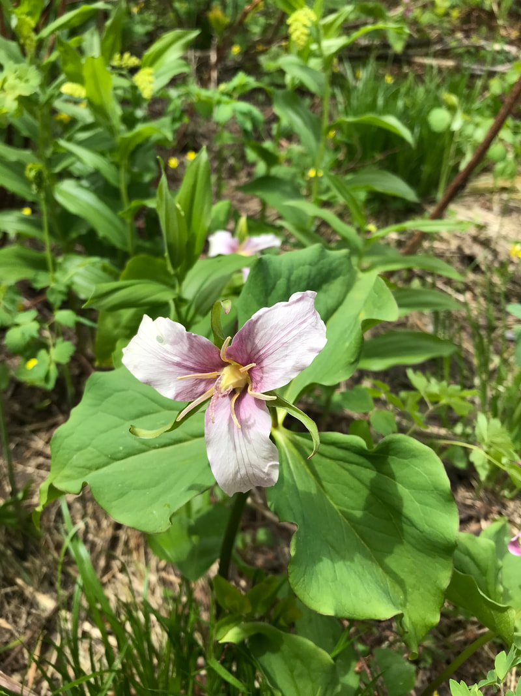
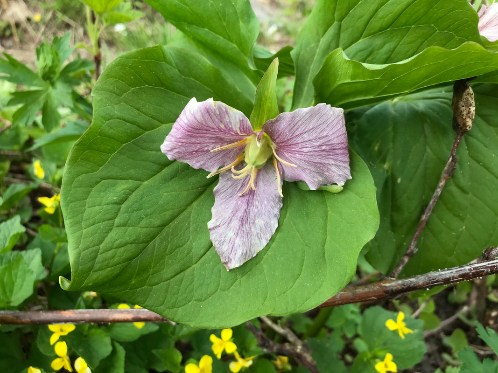
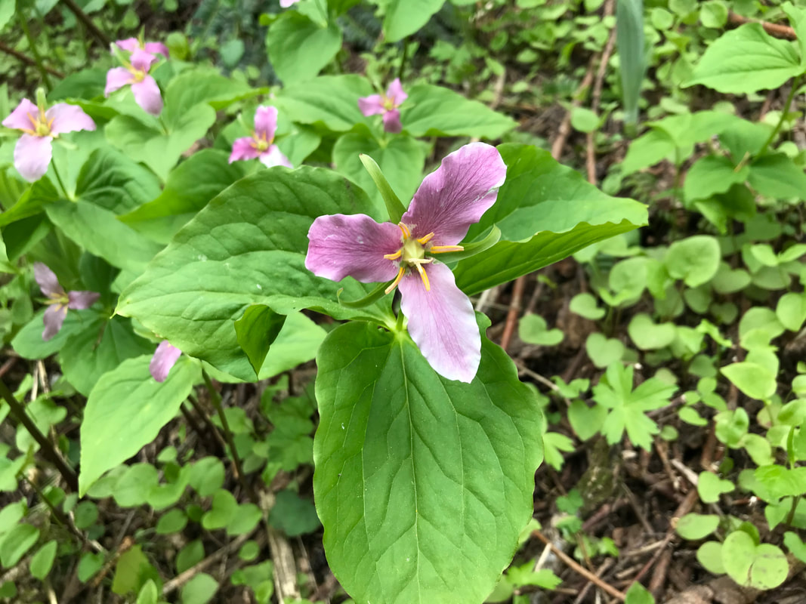
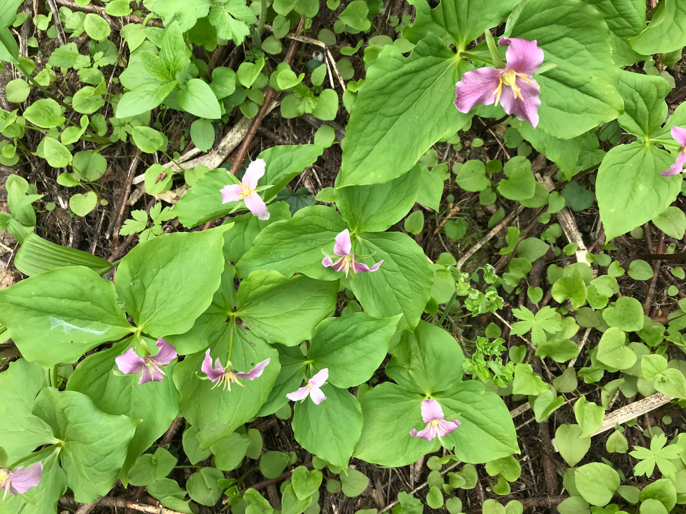
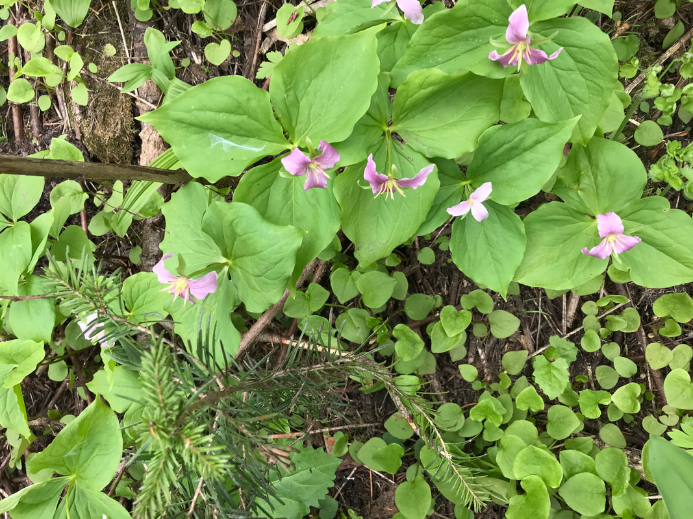

---
tags:
- Trails & Scrambles
stats:
- label: Genesis Name
  icon: book-open-variant
  value: Trillium ovatum
- label: Distribution
  icon: earth
  value: U.S....California, Colorado, Idaho, Montana, Oregon, Washington, Wyoming
    and British Columbia
- label: Season
  icon: calendar
  value: Blooms February thru June
- label: Medical Use
  icon: medical-bag
  value: Several species of Trillium contain chemical compounds called sapogenins
    that have been used medicinally though the ages as astringents, coagulants,
    expectorants, and uterine stimulants. This is evidenced in common names given
    to some trilliums such as birthwort and Indian balm.
- label: Poisonous
  icon: skull-crossbones
  value: 'POISONOUS PARTS: Berries and roots. Only low toxicity if eaten. Toxic
    Principle: Toxicity unknown, but caution because of its relationship with
    known toxic plants'
- label: Edibility
  icon: food-apple
  value: Young, unfolding leaves. Wash leaves in warm water to remove dirt and
    debris. Do not use dish detergent or any type of sanitizer. Cook in boiling,
    salted water for ten minutes and serve like greens.
- label: Features
  icon: information-outline
  value: Rhizome (A horizontal underground stem.) division or seed. Seeds do best
    when planted outdoors soon after fruits have ripened. Seedlings take many
    years to bloom. Divide rhizomes in fall
- label: Leaves
  icon: leaf
  value: Trilliums (they all have three petals and three sepals) they are actually
    a very complex group of plants that can confuse even the best of botanists
- label: Fruits
  icon: fruit-cherries
  value: '**The trillium flower produces a fruit**, the seeds of which are spread
    about by ants and mice. Through the summer the seeds is kept warm and moist
    for 90 or more days. This conditioning is followed by germination when a root
    will emerge from the seed.'
---

# Trillium

_Trillium._

## Western trillium. aka waking robin

## Description

The 8-20 in. stem of this variable trillium bears leaves in a whorl of three. The flower rises on a short
stalk above the leaves and is pure white, fading to rose at the end of a week. Very large-flowered forms come
from the Siskiyous of n.w. CA. This is a perennial plant. A low plant with 1 white flower on a short stalk
that grows from the center of a whorl of 3 broad, ovate leaves at top of an otherwise leafless stem. The name
Wake Robin indicates that the flowers bloom in early spring, about the time the robin arrives. Only one other
species in the West has a stalk between the flower and the leaves, Klamath Trillium ([*T.
rivale*](https://www.wildflower.org/plants/result.php?id_plant=TRRI2)), of northwestern California and
southwestern Oregon. Giant Wake Robin ([*T.
chloropetalum*](https://www.wildflower.org/plants/result.php?id_plant=TRCH2)), which grows in dense patches
west of the Cascade Mountains and in the Sierra Nevada, has no stalks at the base of the mottled leaves. Its
petals vary from white to maroon; if maroon, usually with a white base. Roundleaf Trillium ([*T.
petiolatum*](https://www.wildflower.org/plants/result.php?id_plant=TRPE3)), from eastern Washington and
Oregon, has long stalks on the leaves and dark red-brown petals.

## Species diversity and identification

Forty-three species of trillium are known worldwide with a startling thirty-eight represented in North
America. Within the United States, the bulk of Trillium diversity is found in the eastern states where
***Terrific Trilliums*** are among the favorites on many a spring wildflower walk. Their blooms can be either
showy or obscure, a dazzling display of color on a hillside, or a chance surprise hidden under a leaf. With
their eye-catching flowers, it is hard to imagine anyone not enjoying the sight of a trillium along a trail
on a fine spring morning!

Despite the visual simplicity of trilliums (they all have three petals and three sepals) they are actually a
very complex group of plants that can confuse even the best of botanists. The many different species of
trillium exhibit only a few and obscure structural differences, making separating the species difficult. One
might think that the striking colors of the flowers might be a useful character for identification, yet many
of the species have a variety of color forms, and it is not uncommon to find the two growing together!
Additionally, many species hybridize, making identifications more difficult.

## Plant morphology

All trillium species belong to the Liliaceae (lily) family and are rhizomatous herbs with unbranched stems.
Morphologically, trillium plants produce no true leaves or stems above ground. The "stem" is just an
extension of the horizontal rhizome and produces tiny, scale like leaves (cataphylls). The above-ground plant
is technically a flowering scape, and the leaf-like structures are bracts subtending the flower. Despite
their morphological origins, the bracts have external and internal structure like a leaf, function in
photosynthesis, and most authors refer to them as leaves.

## Pedicellate and sessile trilliums

Trilliums are generally divided into two major groups: the ***pedicellate*** and ***sessile*** trilliums. In
the pedicellate trilliums, the flower sits upon a pedicel that extends from the whorl of bracts, either
"erect" above the bracts, or "nodding" recurved under the bracts. In the sessile trilliums there is no
pedicel and the flowers appear to arise directly from the bracts. The photos below represent some of the
diversity in each group.

## Conservation and collecting

In addition to medicinal uses, like many of our native, showy wildflowers, trilliums are also subject to
pressure from overzealous collectors and habitat loss due to land-use changes. If you desire to have
trilliums in your garden, please visit a reputable nursery that propagates these species using ecologically
sustainable methods. Remember, collecting seed or any other plant material on the national forests and
grasslands [requires a permit](https://www.fs.fed.us/wildflowers/ethics/permit.shtml). Please contact your
nearest Forest Service office to [request a permit](https://www.fs.fed.us/wildflowers/ethics/permit.shtml)
before attempting to collect any native plant products. Native trilliums and their many derived hybrids and
cultivars are readily available from the nursery trade and should not be collected in the wild.

## Ten things to know about trilliums

1. **There are 39 native trilliums in the U.S.** All trillium species belong to the Liliaceae (lily) family. Native to temperate regions of North America and East Asia, the genus 'Trillium' has 49 species, 39 of them are native to various areas across the United States.
2. **The plants are extremely long-lived.** Trilliums are relatively easy to grow from their rhizomatous root but slow to develop and spread. To make up for it, the plants can live for up to 25 years.
3. **Early season sunlight is needed.** Even though it is a woodland species, the dormant plant needs to be warmed by the early spring sun. It's best to avoid planting them in a location that never gets sun (such as the north side of a building).
4. **Trilliums are either sessile** (the flower sits directly on top of its whorled leaves) **or pedicellate** (the flower is raised on a short stalk). Sessile trilliums usually have mottled foliage, while pedicellate trilliums have showier flowers.
5. **Traditional names for trilliums:** Toadshade (for its resemblance to a toad-sized umbrella), Wakerobin (for its appearance with the first robins), and Birthroot (for its medicinal uses during childbirth).
6. **Red Trillium (Trillium erectum) has no nectar** and is pollinated by flies (Diptera) and beetles (Coleoptera). The petals of the flowers exude an odor that attract carion flies and beetles which pollinate the flower.
7. **Trillium grandiflorum is pollinated by Hymenoptera insects,** including honey bees, bumblebees, and wasps.
8. **Trilliums are not very competitive.** It's best to avoid planting them with very aggressive species.
9. **Seed germination is 'a process'.** The trillium flower produces a fruit, the seeds of which are spread about by ants and mice. Through the summer the seeds is kept warm and moist for 90 or more days. This conditioning is followed by germination when a root will emerge from the seed. In general, trillium seedlings do not produce a green leaf during their first season. The sprouted seeds are then kept damp and cool for 90 to 120 days. The seedling develops in the dark, underground, for almost a year before sending a green leaf up to find the light.
10. **Trillium may die-back in the heat of summer, but don't cut them back.** Picking a trillium flower does not kill the plant but damage can result if the green leaves are taken as well. If the leaves are taken you won't see renewed growth until the following year – which may not happen at all depending on the size of the rhizome. This fact makes the colonies susceptible when they are heavily browsed by deer. Plants will die out after several years of repeated browsing.
11. **Bonus #11!** For best results, mulch with leaf litter. This woodland native loves a leaf covering that replicates its forest home and keeps the ground tempreature and moisture 'just right' (one more reason to keep those leaves in your yard).

## Spring emergence and life cycle

Oh, the first wildflower of spring is exciting! I always watch a certain spot in the woods where the
trilliums seem to emerge first. Trilliums are one of the first spring wildflowers, hence the nickname "wake
robin", but they aren't the fastest growing flower.

**Western white trillium.** The western white trillium (Trillium ovatum var. ovatum) starts blooming in late April at lower elevations
and continues into June in the mountains. Trilliums are perennials and long-lived ones too–one trillium in
Oregon was recorded to be 72 years old! Trillium is derived from Latin for triple and everything on the plant
is in threes except for the stem–petals, leaves, sepals and stigmas. However, trilliums don't actually have
leaves. What we see as a stem with leaves is actually a flowering scape (a scape is a long, leafless flower
stalk coming directly from the root). While the "leaves" resemble a typical leaf and can structurally perform
photosynthesis, they are technically bracts (a modified leaf) beneath the flower. For simplicity though, I'll
still refer to them as leaves and stems.

**Trilliums grow in moist to wet forests.** Have you noticed short trilliums and tall trilliums? The difference reveals the age of the trillium and
trilliums are definitely not fast growing. The seed can take two years to germinate into a single-leaf plant
which persists for a few years. Then as a juvenile, the plant grows three leaves. At maturity a trillium can
stand nearly 20 inches tall. While the crisp-white petals atop a whorl of three leaves may be tempting to
pick, please don't! Trilliums take an amazing 18 years to bear the first flower! And then they don't always
bloom every year. Being one of the first wildflowers in spring, they are important food sources for insects
such as beetles and bees. Interestingly, trilliums let insects know when the flower is past its pollination
stage by turning the petals a pinkish-purple or rose color.

**Pinkish-purple leaves indicate to insects that the flower is past its prime.** Then deer and ants help disperse the seeds. Deer eat the seed-containing fruit. Ants haul the brown seeds
back to their nest and eat the yellow, fleshy extension (called elaiosome) that is fatty and protein-rich.
The seeds are discarded and will germinate to begin the long life cycle again. While trilliums are one of the
earliest bloomers in the woods each year, they definitely are a late bloomer considering the first flower
takes 18 years.

## Photo gallery

_Trillium colony blooming among violets and false lily of the valley._

The below images are trilliums that are past their prime, which gives notice to insects that the flower is
past its pollination stage. Found in the I.P.N.F.

_Trillium flower fading to deep rose-purple._

_Faded trillium petals resting on a broad leaf._

_Trillium past its prime among a colony of blooms._

_Overhead view of a trillium colony with fading pink blooms._

_Trillium colony past bloom alongside a young conifer seedling._
