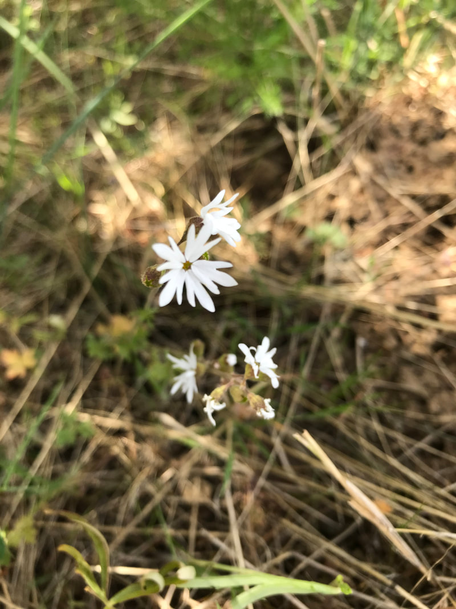

---
tags:
- Trails & Scrambles
stats:
- label: Genesis Name
  icon: book-open-variant
  value: Lithophragma parviflorum
- label: Distribution
  icon: earth
  value: U.S.A. - CA, CO, ID, MT, NE, NV, OR, SD, UT, WA, WY; Canada - AB
- label: Season
  icon: calendar
  value: Blooms March, April, May, June
- label: Medical Use
  icon: medical-bag
  value: The Mendocino Indians chewed the roots to combat colds and
    stomachaches.
- label: Poisonous
  icon: skull-crossbones
  value: The small bulb they spring from are poisonous if eaten.
- label: Edibility
  icon: food-apple
  value: Unknown
- label: Features
  icon: information-outline
  value: It is a rhizomatous perennial herb growing erect or leaning with a
    naked flowering stem. The leaves are mainly located low on the stem, each
    cut into three lobes or divided into three lobed leaflets. The stem bears
    up to 14 flowers, each in a cuplike calyx of red or green sepals.
- label: Leaves
  icon: leaf
  value: The leaves are mainly located low on the stem, each cut into three
    lobes or divided into three lobed leaflets.
---

# Woodland Star

## Woodland star, one of my favorite wildflowers

## Description

Lithophragma parviflorum is a species of flowering plant in the saxifrage family known by the common name
smallflower woodland star. It is native to much of western North America from British Columbia to California
to South Dakota and Nebraska, where it grows in several types of open habitat. It is a rhizomatous perennial
herb growing erect or leaning with a naked flowering stem. The leaves are mainly located low on the stem,
each cut into three lobes or divided into three lobed leaflets. The stem bears up to 14 flowers, each in a
cuplike calyx of red or green sepals. The five petals are bright white, up to 1.6 centimeters long, and
usually divided into three toothlike lobes.

## Photo gallery

---

_Woodland star wildflower in bloom._
