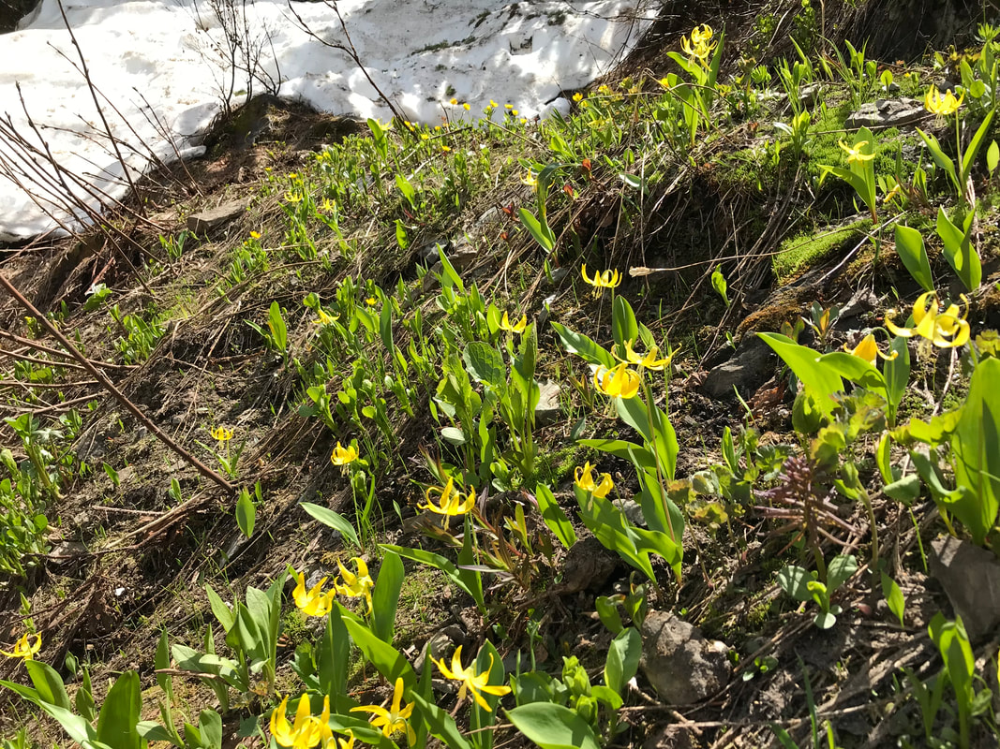
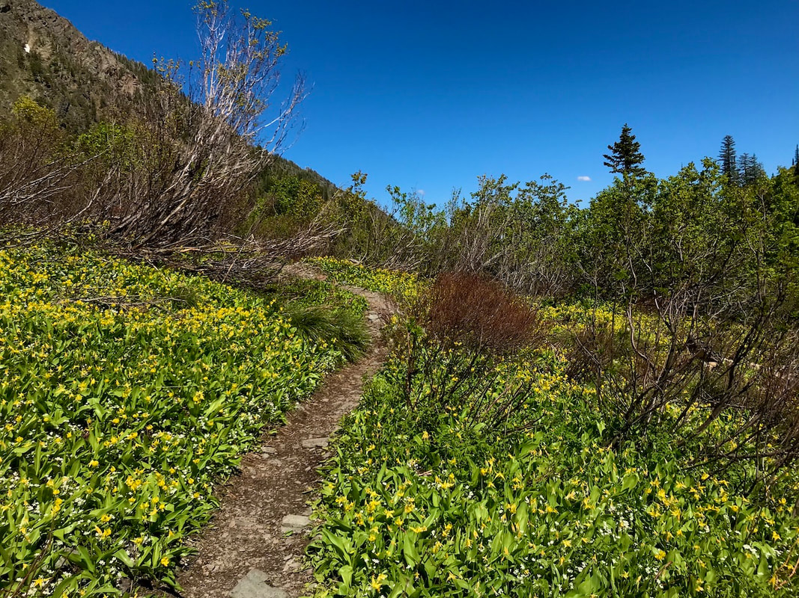

---
tags:
- Trails & Scrambles
stats:
- label: Genesis Name
  icon: book-open-variant
  value: Eyrthronium grandiflorum
- label: Distribution
  icon: earth
  value: Western Canada and U.S.A. including California, Utah and Colorado
- label: Season
  icon: calendar
  value: April thru June
- label: Medical Use
  icon: medical-bag
  value: Medical applications include **reducing fever, swelling, infection**, and
    they were used as a contraceptive. The glacier lily was collected during the Lewis
    and Clark Expedition.
- label: Poisonous
  icon: skull-crossbones
  value: 'No'
- label: Edibility
  icon: food-apple
  value: Yes. Try them in sandwiches and salads.
- label: Features
  icon: information-outline
  value: Gorgeous yellow pedals that curl up to expose their petals and sepals.
- label: Leaves
  icon: leaf
  value: The leaves are green and can measure 3-5 inches long. The stem to the flower
    can be around 6 inches tall.
- label: Fruits
  icon: fruit-cherries
  value: The yellow leaves are edible as well as the bulbs. But the bulbs need to
    be cooked or baked
notes:
- label: Glacier lily bulbs were a food source for some Native American tribes. These
    deep-rooted bulbs were difficult to dig, which probably contributed to the fact
    that they were used infrequently. Bulbs were eaten boiled or dried to eat during
    the winter months. The bulbs can cause a burning sensation when eaten.
  url: '#'
- label: What I later found is that glacier lilies are ephemeral, living only 10 weeks
    between first emergence and leaf fall. A perennial herb, the flower is also known
    as the dogtooth violet, fawn lily or avalanche lily and is native to western North
    American from southern British Columbia to northern California, and east to Alberta,
    Colorado and Wyoming. It overwinters as a corm, lying dormant under the frozen
    ground, and emerges soon after the snow melts on sagebrush slopes. In Montana,
    glacier lilies also regenerate by dropping their seeds gradually and slowly as
    the wind or animals disturb the flowers. In turn, the seeds require one hundred
    days of cold before they can germinate. Some individuals of the flower take eight
    years to reach full reproductive maturity.
  url: '#'
- label: The Shoshone ate the corms fresh or with soup, and the dried bulbs were a
    popular trade item between tribes. The leaves are edible as well and the green
    seed pods taste like green beans when cooked. Medical applications include reducing
    fever, swelling, infection, and they were used as a contraceptive. The glacier
    lily was collected during the Lewis and Clark Expedition. Meriwether Lewis mentioned
    this species numerous times in his journal. This may be because he thought it
    could be used as a "botanical calendar" to help track the onset of spring.
  url: '#'
---

# Glacier Lilies

## Glacier lilies. aka fawn lilies, dogtooth violet

## Description

Scapose, glabrous perennials from slender bulbs. Scape erect, 7–30 cm, ebracteate. Leaves 2, basal,
short-petiolate; the blade 5–20 cm long, narrowly elliptic, fleshy. Inflorescence solitary or few terminal,
nodding flowers. Flowers regular, narrowly campanulate, opening to star-shaped in full sun; tepals yellow,
rarely white, separate, narrowly lanceolate, 15–40 mm long, reflexed during the day; stamens shorter than
tepals; anthers yellow or red; stigma capitate or 3-lobed. Fruit an erect, oblong-ovoid, 3-lobed,
many-seeded capsule 25–50 long
([Lesica et al. 2012. Manual of Montana Vascular Plants. BRIT Press. Fort Worth, TX](https://shop.brit.org/Manual-of-Montana-Vascular-Plants_2)).
Two to three mottled, fleshy, elliptic, basal leaves, to 14 in. long, surround the one- to several-flowered

6-18 in.

flower stalks. 1-5 pale to golden yellow flowers hang at end of a stalk that grows from between 2 broadly
lanceolatebasal leaves. One to five graceful, nodding, bell-shaped flowers are bright yellow. The sepals and
petals are bent back fully, revealing the large, white stigma and yellow, red or white anthers. Yellow
avlanche-lily, a perennial, often occurs in large patches.

This species often blooms as snow recedes. A form with white or cream petal-like segments with a band of
golden yellow at the base grows in southeastern Washington and adjacent Idaho. A second species with bright
yellow flowers. Mother Lode Fawn Lily (*E. tuolumnense*), grows in woodland at low elevations on the western
slope of the Sierra Nevada in central California.

---

## Photo gallery

### Picture (Image missing)

## Glacier lilies as the are about to open up

---

Glacier lilies are one of the first plants To bloom in late winter or early spring. If there is a snow patch
on your hike, Be sure to check out below the snow

## On the upper trail to leigh lake

### Picture (Image missing) Details

## When glacier lilies are abundant, they are beautiful & edible
