# Wildlife

---

## Wildlife

## Click on image to enlarge

---

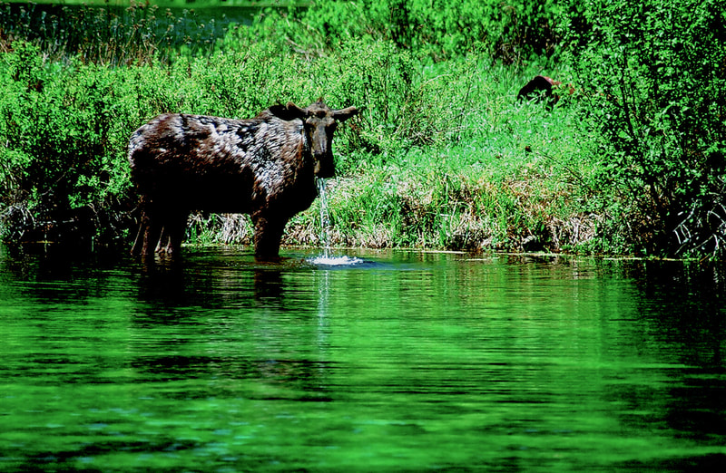{: data-src=" data-title="A MOOSE IN A BOG NEAR MURRY, IDAHO" }

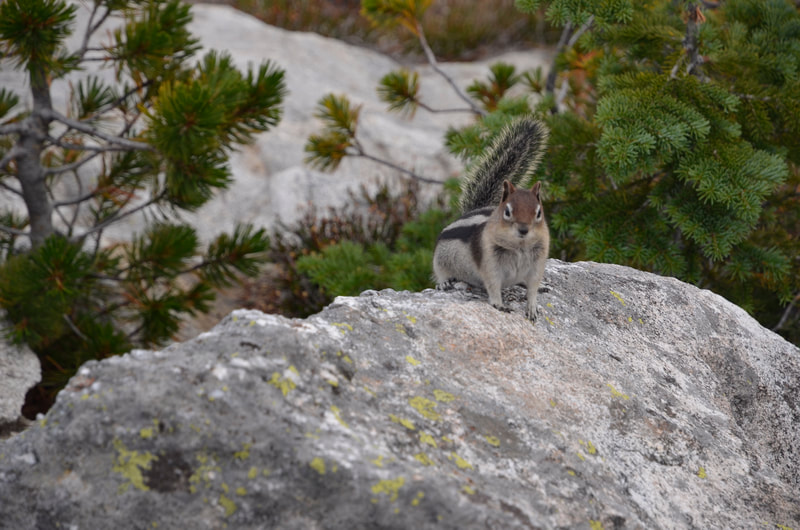"

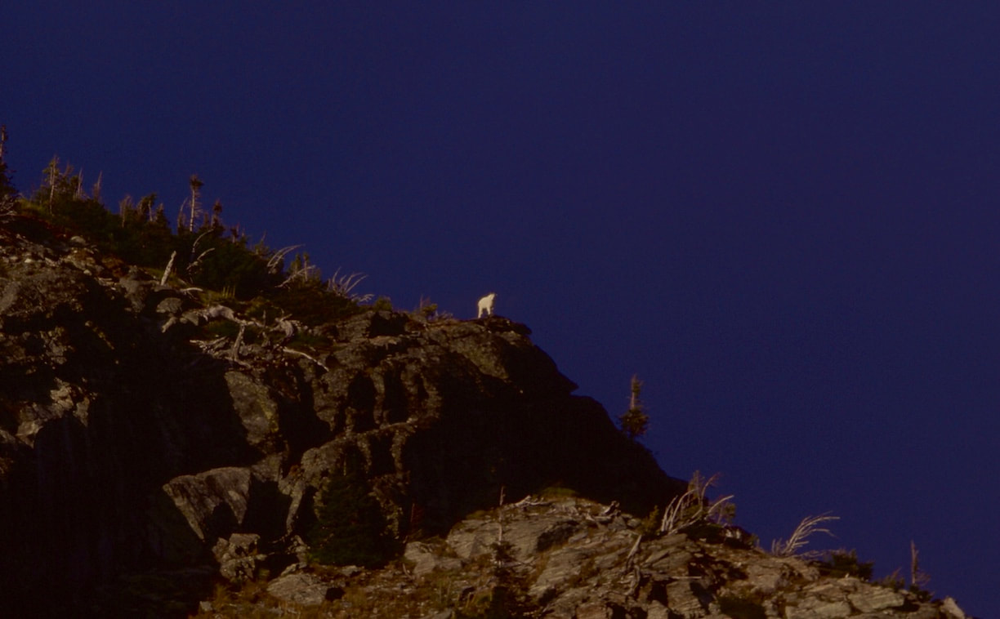{: data-src=" data-title="AS I HIKED INTO LEIGH LAKE, I FELT I WAS BEING WATCHED, THEN I SPOTTED THIS MOUNTAIN GOAT" }

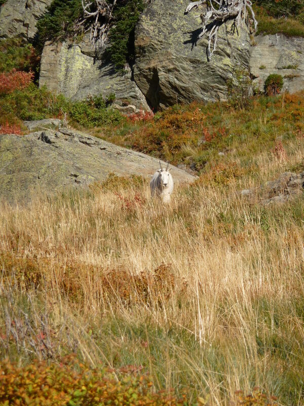"

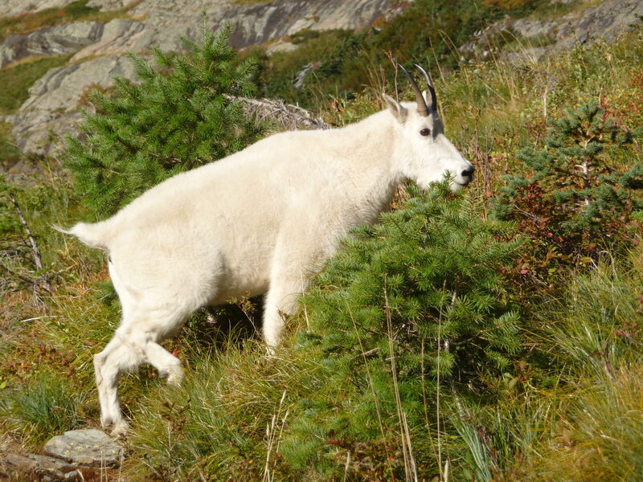{: data-src=" data-title="WHEN MY HIKING BUDDY AND HIS SON CLIMBED SNOWSHOE PEAK FROM LEIGH LAKE, THEY RAN INTO THIS CURIOUS GOAT" }

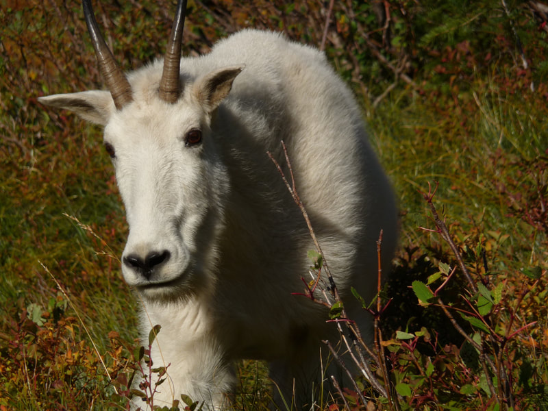"

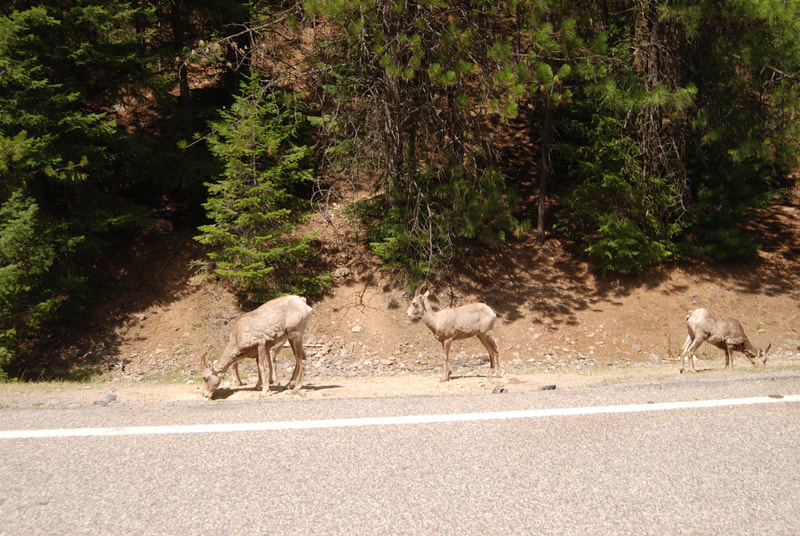{: data-src=" data-title="BIG HORN SHEEP NEAR TROY, MT" }

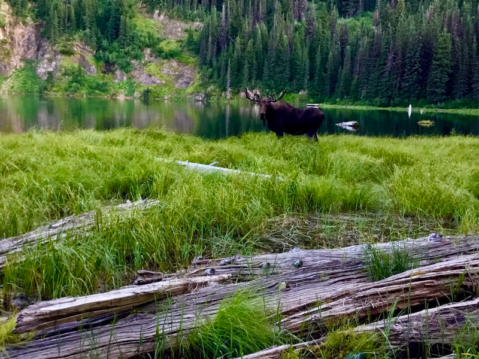"

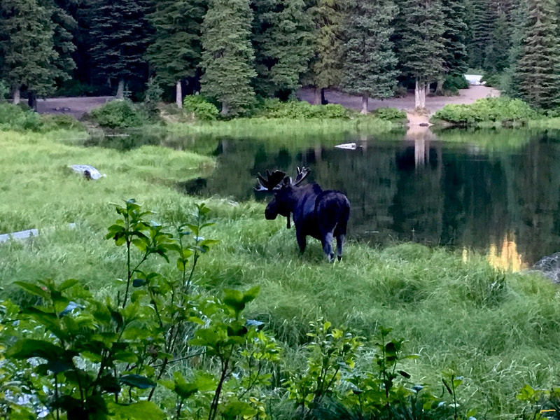{: data-src=" data-title="A BULL MOOSE HEADING BACK TO CAMP AT ELSIE LAKE, SILVER VALLEY" }

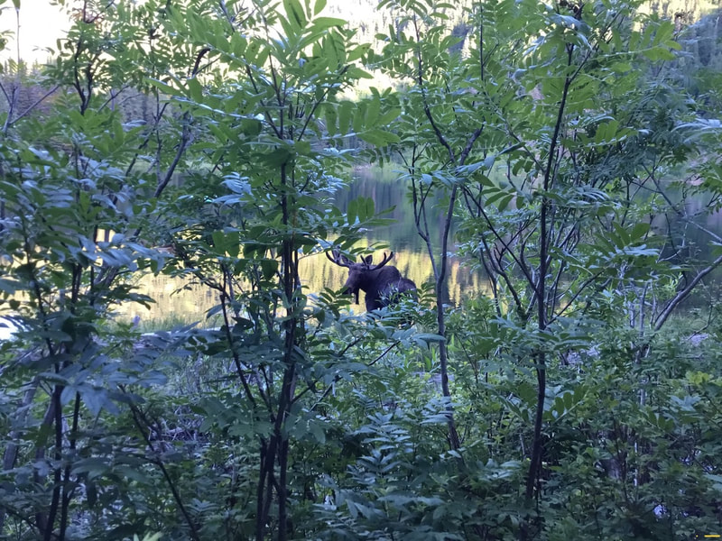"

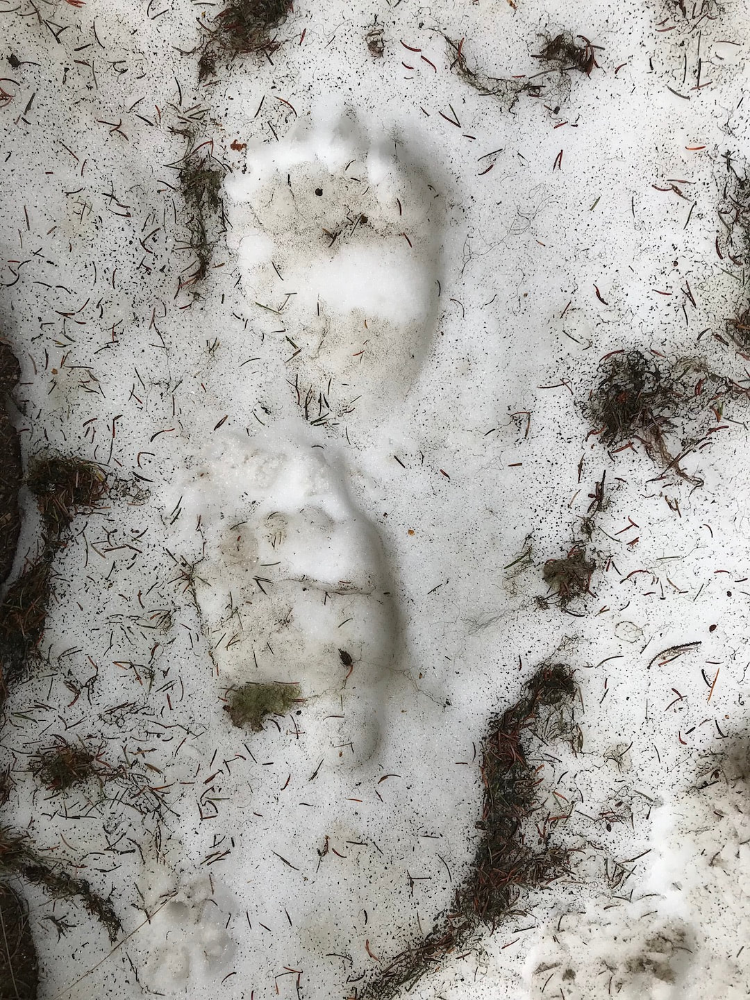{: data-src="assets/images/1520221225p_orig.jpeg" data-title="THESE THREE IMAGES ARE OF A GRIZZLY BEAR PRINT ALONG THE TRAIL TO HARRISON LAKE" }

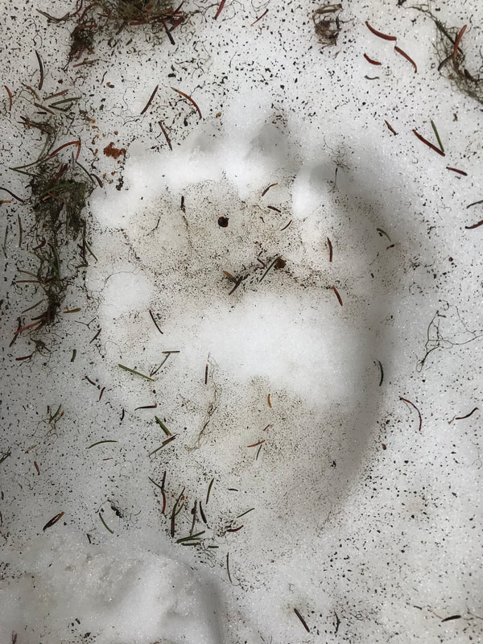"

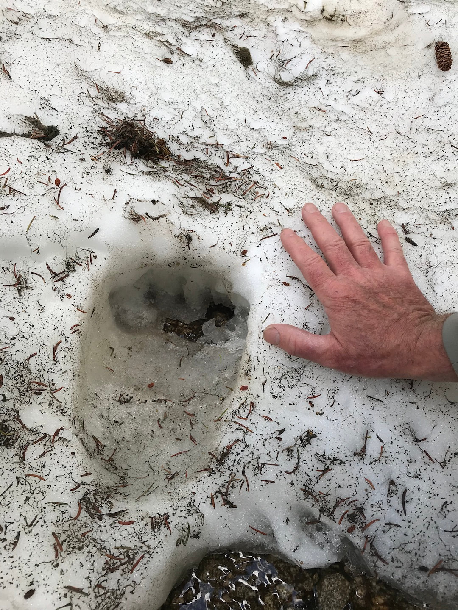{: data-src="assets/images/1520221227p_orig.jpeg" data-title="BIG GRIZ PRINTS" }

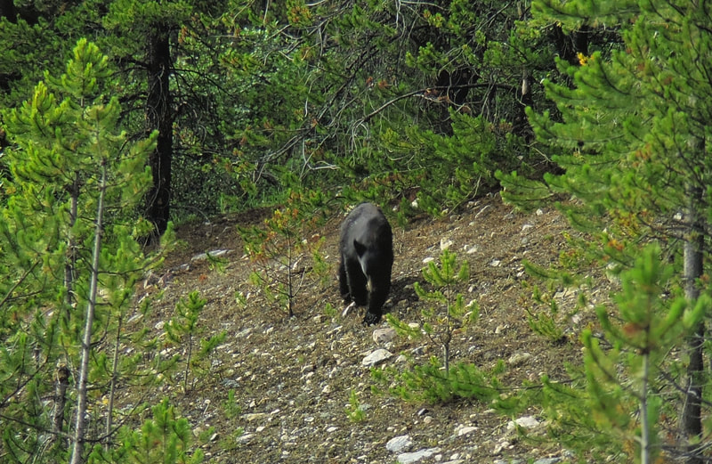"

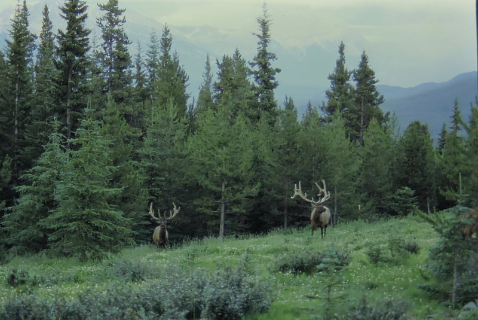{: data-src=" data-title="BULL ELK AT MARMOT BASIN SKI AREA, JASPER, B.C." }

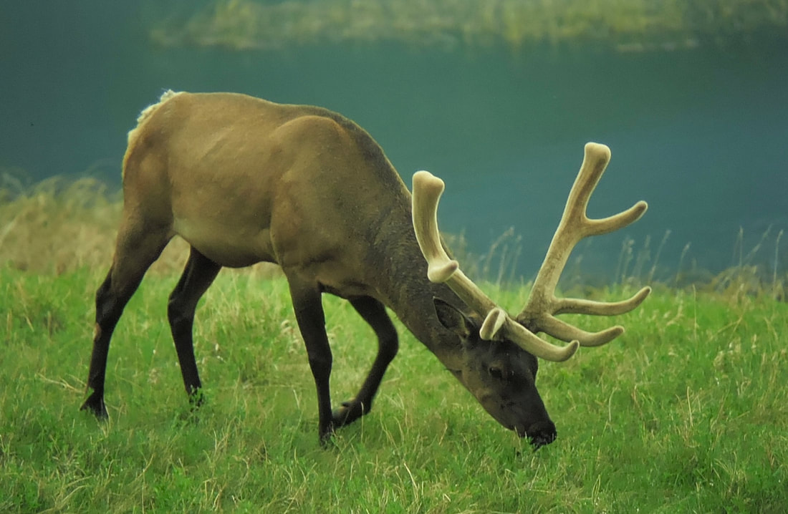"

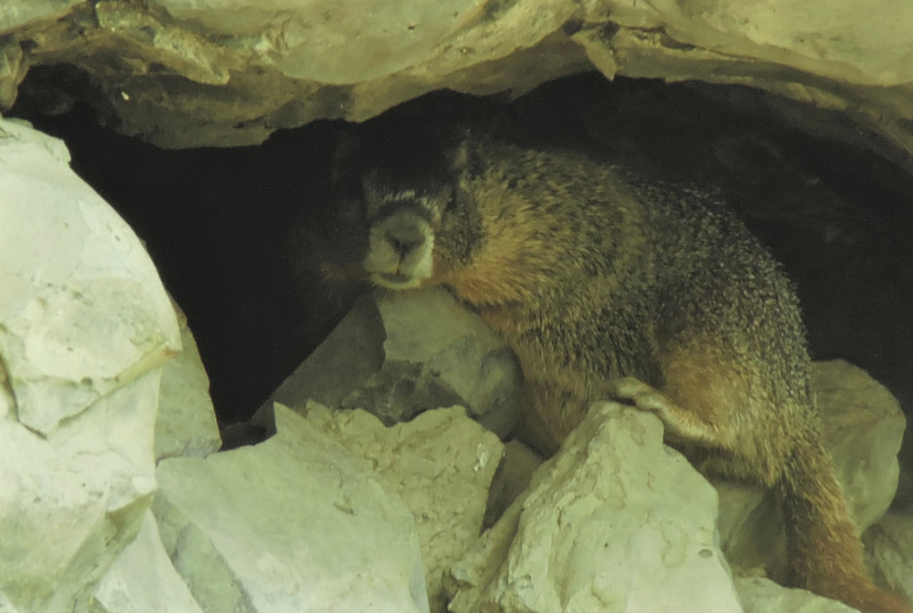{: data-src="assets/images/b07bb846-07d7-4b28-b629-54f5f9a85b77-1-201-a_orig.jpeg" data-title="A MARMOT AT PALOUSE FALLS, WA." }

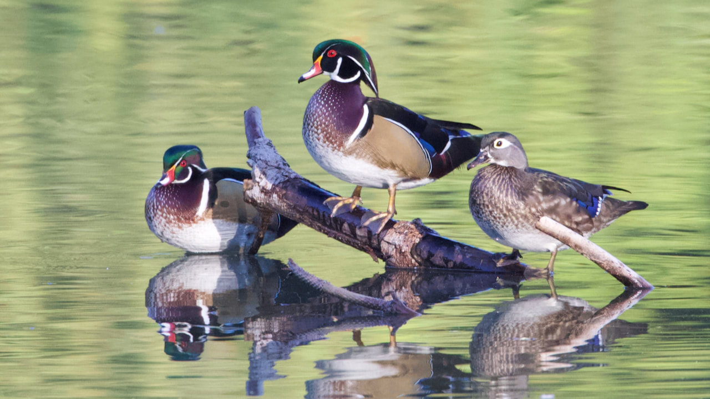"

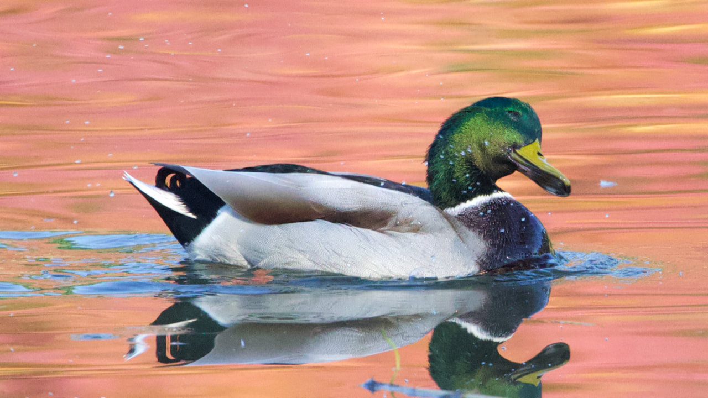{: data-src=" data-title="MALLARD DUCK" }
