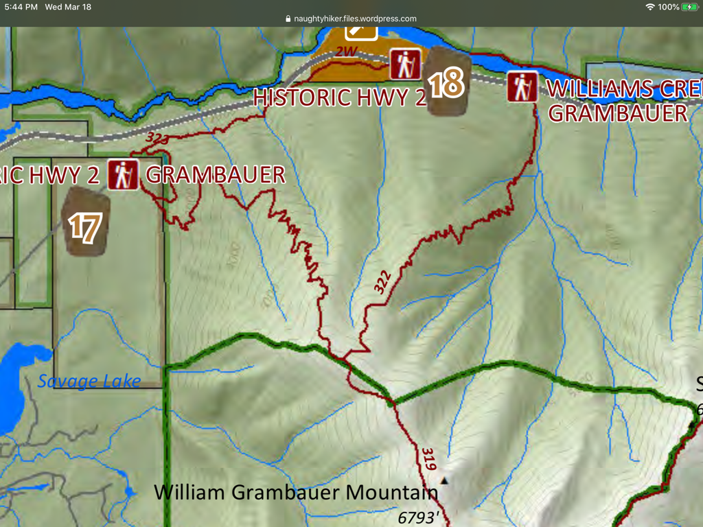

---
tags:
- Trails & Scrambles
- Very Strenuous
- Day Hiking
- Backpacking
stats:
- label: Event Type
  icon: hiking
  value: Day hiking, backpacking
- label: Distance
  icon: map-marker-distance
  value: 14 miles RT
- label: Elevation
  icon: terrain
  value: 4900 verts
- label: Difficulty
  icon: speedometer
  value: Very strenuous
- label: Maps
  icon: map
  value: K.N.F., Kootenai Falls topo
- label: GPS
  icon: crosshairs-gps
  value: 48°12’11" n 115°44’66" w
- label: Lincoln County Sheriff
  icon: shield-account
  value: CALL 911 FIRST or 406.293.4112
notes:
- Three Rivers Ranger District 406.295.4693
- Kootenai national forest/alerts<https://www.fs.usda.gov/alerts/kootenai/alerts-notices>
---

# William Grambauer

*William grambauer mt. 6793’ trail #319*

## Description

The William Brambauer Mountain sits on the northern edge of the wilderness, and towers over 5300’ above the Kootenai River.
Although the trailhead is on private property, the USFS has an easement so the trail can cross private land.
At about a mile up the trail, there are rock ledges that offer views all around. The trail switchbacks dozens of times on its relentless climb of 3000’ to a ridge that levels out for almost two miles, until the summit comes into view to the south. From here, the trail edges along side a forest burn that occurred in 1994.
Once on top, the views are spectacular all around. One of the advantages to summiting this mountain is the view south down the 35 miles of the Cabinet Mountain Wilderness.

## Directions

About 4 miles southeast of Troy near milepost 35 is a turnoff northeast on a gravel road marked "Old Highway 2". Drive about 1.5 miles to the trailhead.

## Hazards

No water source up high.
Did you read that this hike is 4900 vertical feet to the top?
That means its 4900’ down.
Seemingly endless switchbacks on very steep terrain.

## Cool things close by

Cedar Lakes, Kootenai Falls, Ross Creek Cedars, and Scenery Mountain.

## R & p

Henry’s, Rosauers, & Pizza Hut in Libby. Squeeze Inn, Clark Fork Pantry in Clark Fork. Eicharts, Mr. Sub & Jalapeño in Sandpoint

## Plan your trip

Click for Current NOAA Weather Conditions

## Photo gallery

## No images available. to contribute contact chic

---

---

---

---

---

---

---
