# Winter

---

## Winter

## Click on the image to enlarge

---

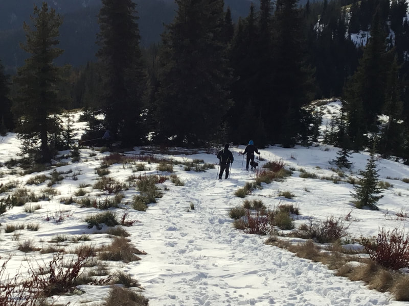{: data-src="https://www.inlandnwroutes.com/uploads/7/9/2/5/79257998/12262021759p_orig.jpg" data-title="HIKING THE TRAIL TO GOLD HILL VIA MOON PASS" }

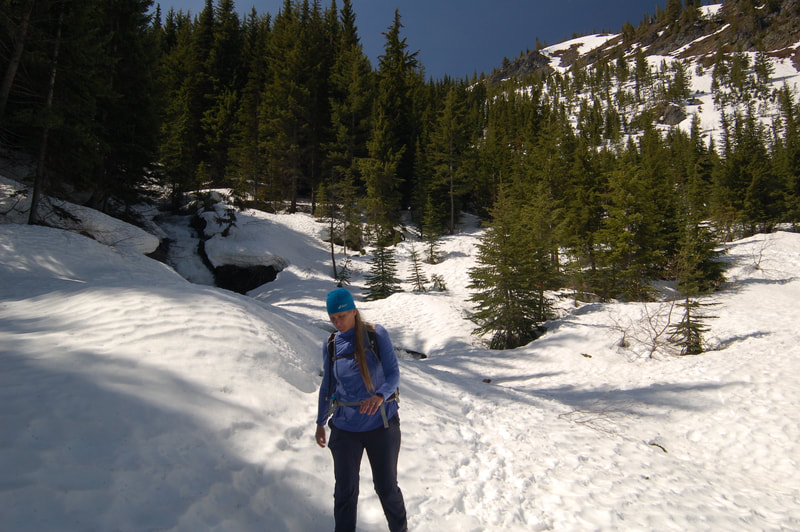{: data-src="https://www.inlandnwroutes.com/uploads/7/9/2/5/79257998/12262021801p_orig.jpg" data-title="AMY SSHOEING UP TO STEVENS LAKE" }

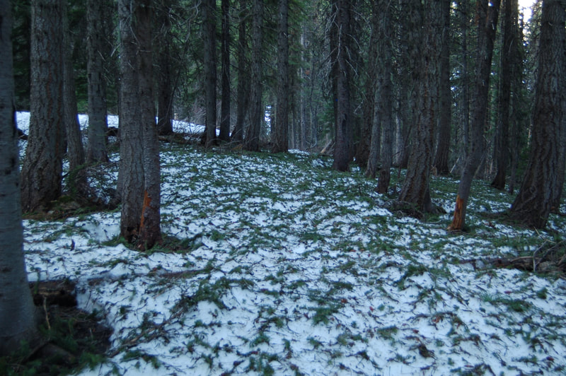{: data-src="https://www.inlandnwroutes.com/uploads/7/9/2/5/79257998/12262021802p_orig.jpg" data-title="TRAIL #168 TO STEVENS LAKE AFTER THE WIND STORM IN FEBRUARY 2021" }

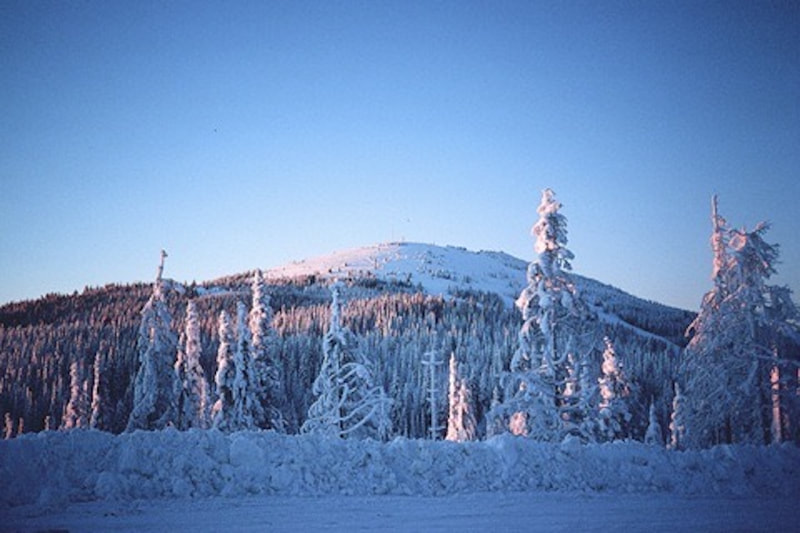{: data-src="https://www.inlandnwroutes.com/uploads/7/9/2/5/79257998/12262021803p_orig.jpg" data-title="MOUNT SPOKANE FROM THE SELKIRK LODGE" }

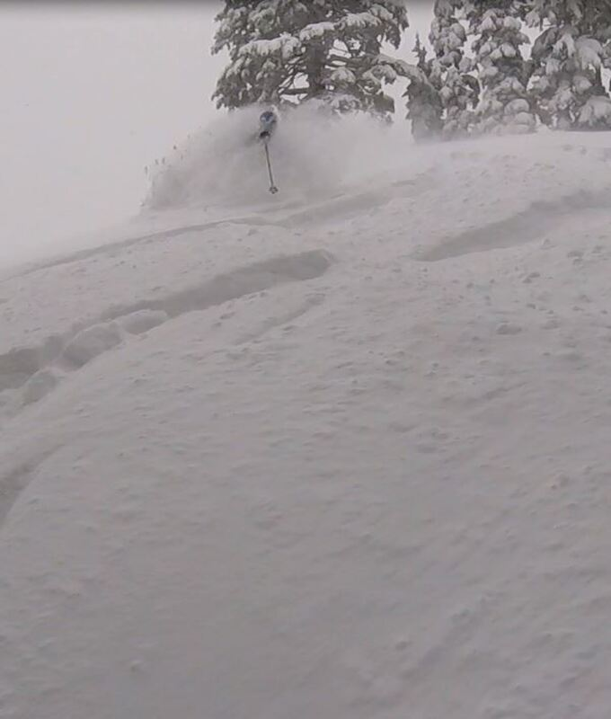{: data-src="https://www.inlandnwroutes.com/uploads/7/9/2/5/79257998/12262021804p_orig.jpg" data-title="FACE SHOTS AT SILVER MT" }

{: data-src="assets/images/28140007.jpg" data-title="MYRTLE CREEK AT KOOTENAI NATIONAL WILDLIFE REFUGE" }

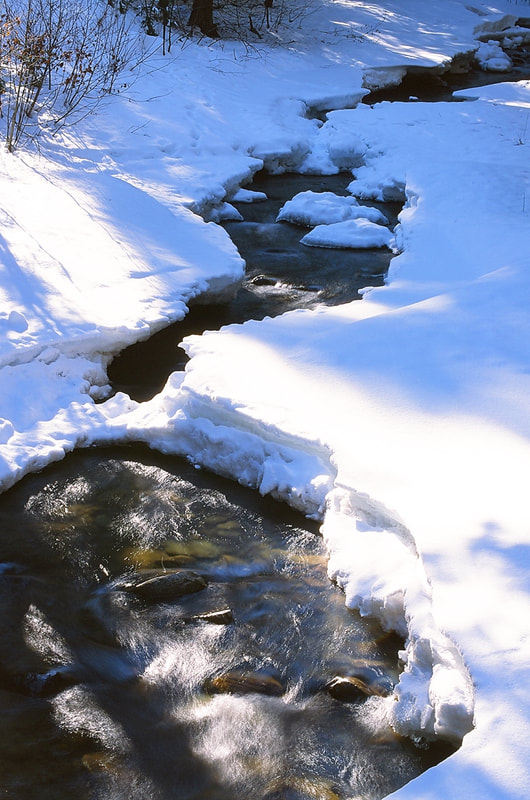{: data-src="https://www.inlandnwroutes.com/uploads/7/9/2/5/79257998/12262021806p_orig.jpg" data-title="MYRTLE CREEK, KOOTENAI NATIONAL WILDLIFE REFUGE" }

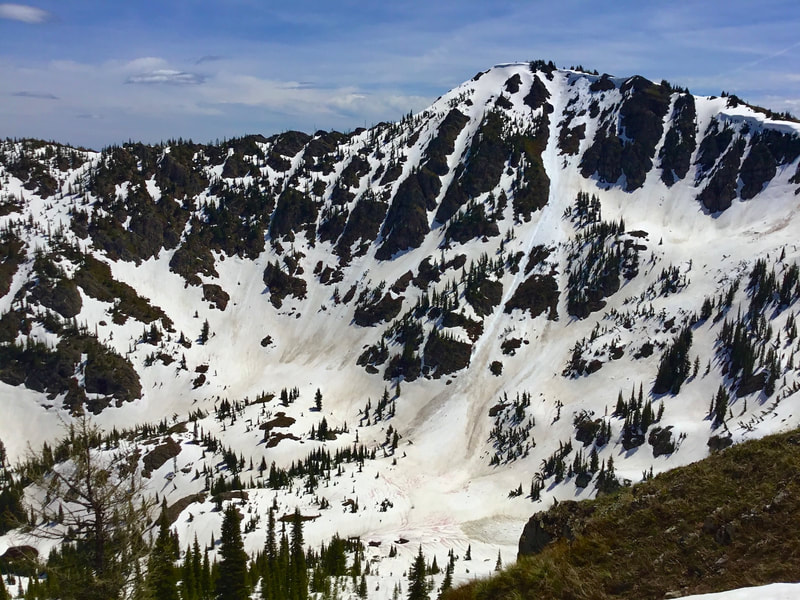{: data-src="https://www.inlandnwroutes.com/uploads/7/9/2/5/79257998/12262021807p_orig.jpg" data-title="STEVENS PEAK FROM THE IDAHO CENTENNIAL TRAIL, WITH THE UPPER SANCTUARY AT LONE LAKE" }

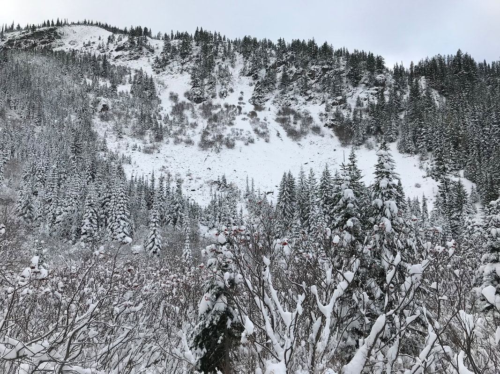{: data-src="assets/images/12262021810p_orig.jpeg" data-title="THE TRAIL TO STEVENS LAKE SWITCHBACKS ACROSS THIS RIDGE" }

[*(Image missing)*](https://www.inlandnwroutes.com/uploads/7/9/2/5/79257998/12262021811p_orig.jpeg "THE SHAFT OF THE \"ARROW\" ON THE STATE LINE RIDGE ROUTE")

{: data-src="https://www.inlandnwroutes.com/uploads/7/9/2/5/79257998/12262021812p_orig.jpg" }

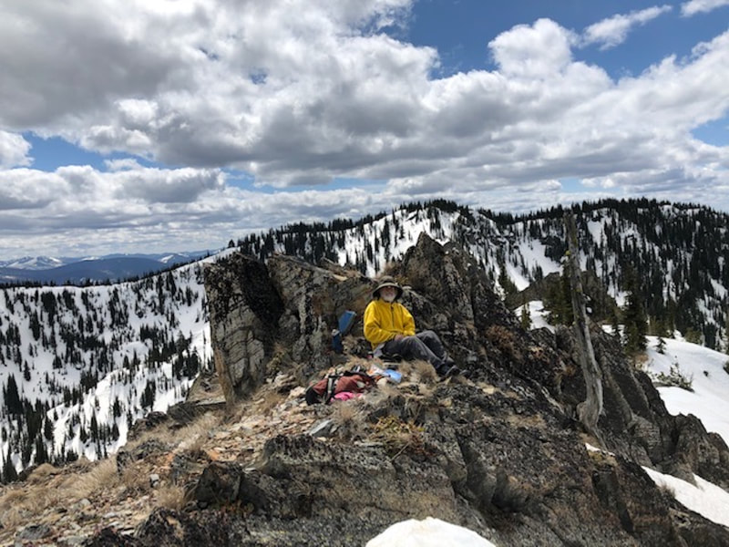{: data-src="https://www.inlandnwroutes.com/uploads/7/9/2/5/79257998/12262021813p_orig.jpg" data-title="CHIC ENJOYING LUNCH ON THE STATE LINE RIDGE" }

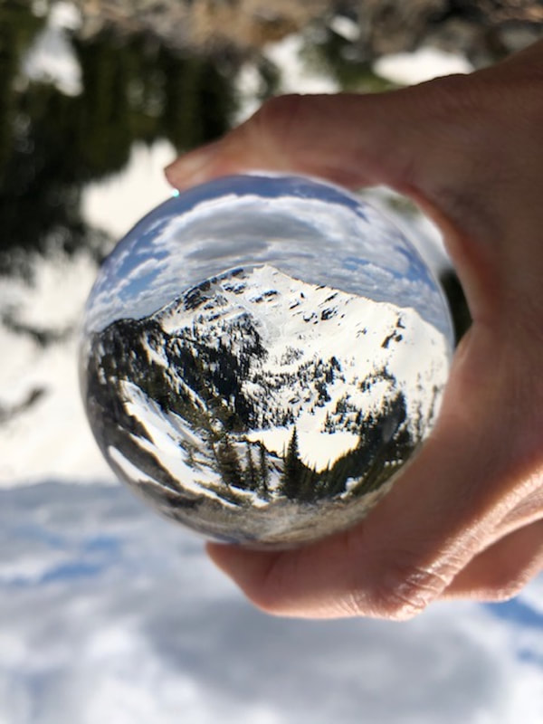{: data-src="https://www.inlandnwroutes.com/uploads/7/9/2/5/79257998/12262021814p_orig.jpg" data-title="AMY CARRIES THIS SPHERE TO PHOTOGRAPH THRU EVERYWHERE WE HIKE OR SSHOE" }

{: data-src="https://www.inlandnwroutes.com/uploads/7/9/2/5/79257998/12262021815_orig.jpg" }

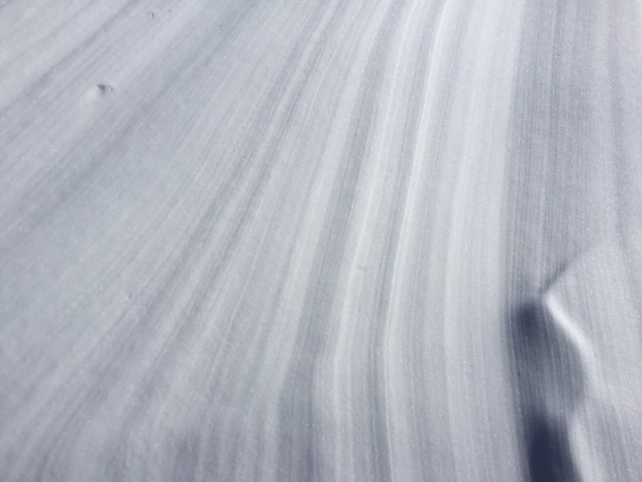{: data-src="https://www.inlandnwroutes.com/uploads/7/9/2/5/79257998/12262021815p_orig.jpg" data-title="HIGH WINDS CREATE AN UNUSUAL PATTERN IN THE SNOW" }

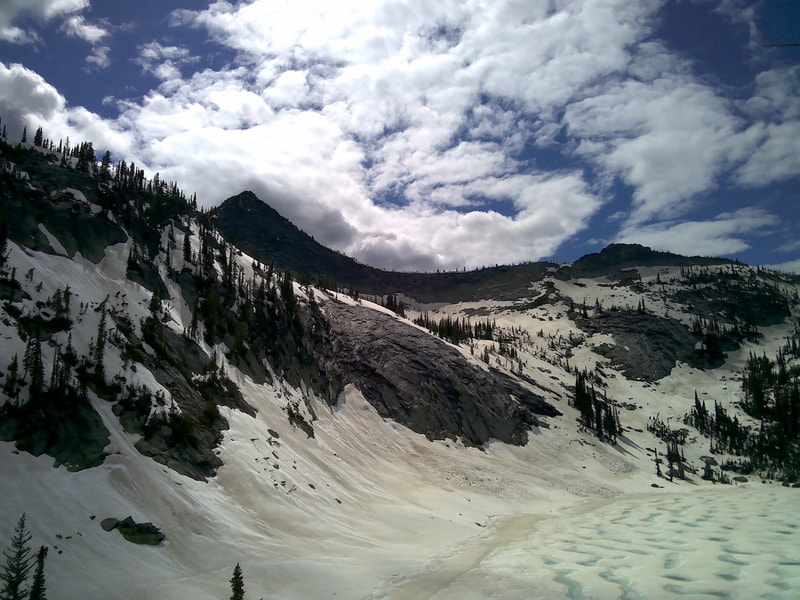{: data-src="https://www.inlandnwroutes.com/uploads/7/9/2/5/79257998/122672021820p_orig.jpg" data-title="PEAK 7171' & HARRISON LAKE. SELKIRKS" }

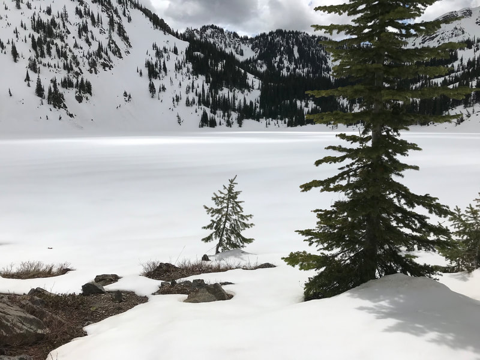{: data-src="https://www.inlandnwroutes.com/uploads/7/9/2/5/79257998/12262021821p_orig.jpeg" data-title="UPPER STEVENS LAKE WITH THE STATE LINE RIDGE" }

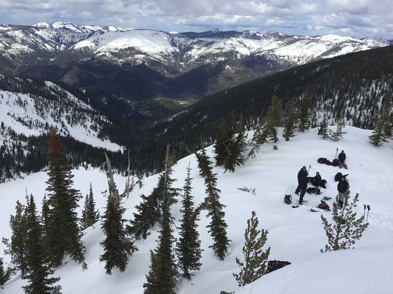{: data-src="https://www.inlandnwroutes.com/uploads/7/9/2/5/79257998/122620021822p_orig.jpg" data-title="LUNCH AFTER SSHOEING TO THE STATE LINE RIDGE" }

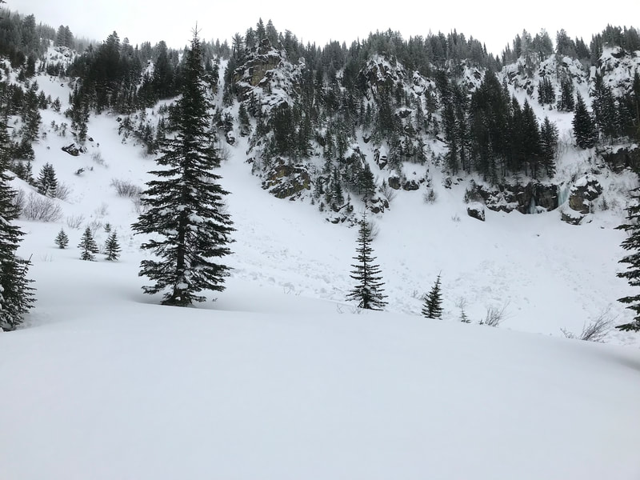{: data-src="https://www.inlandnwroutes.com/uploads/7/9/2/5/79257998/12262021823p_orig.jpeg" data-title="ENTERING THE MEADOWS BELOW WEST WILLOW CREEK FALLS ON THE WAY TO STEVENS PEAK" }

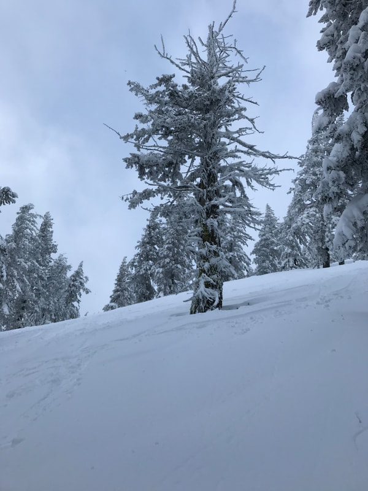{: data-src="https://www.inlandnwroutes.com/uploads/7/9/2/5/79257998/12262021824p_orig.jpeg" data-title="SOUTH OF THE BOARDER, SILVER MT." }

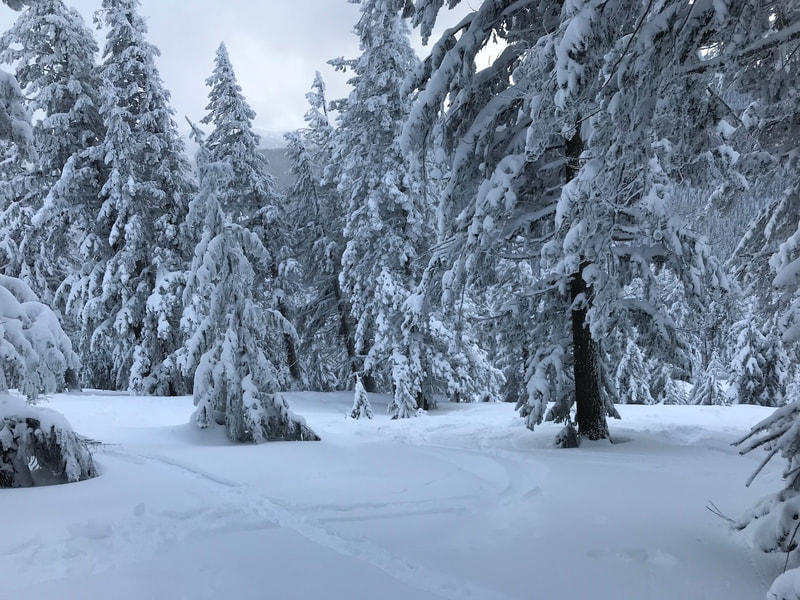{: data-src="https://www.inlandnwroutes.com/uploads/7/9/2/5/79257998/12262021825p_orig.jpeg" data-title="SOUTH OF THE BOARDER" }

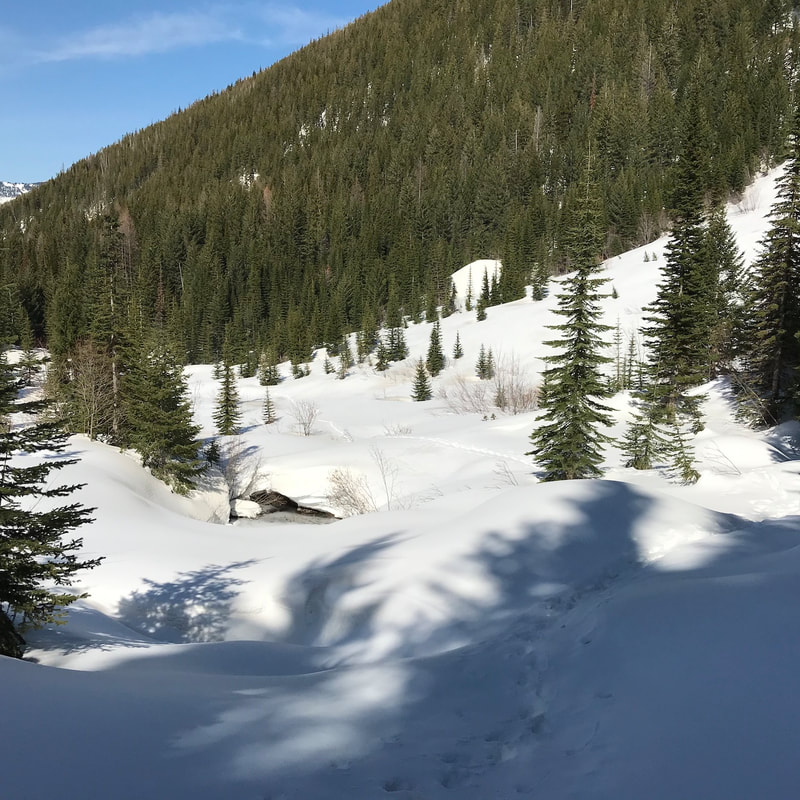{: data-src="assets/images/12262021826p_orig.jpeg" data-title="THE MEADOWS FROM ABOVE THE UPPER EAST WILLOW CREEK FALLS" }

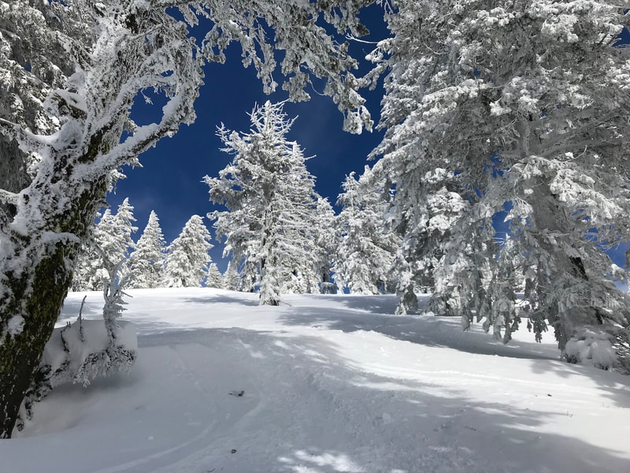{: data-src="https://www.inlandnwroutes.com/uploads/7/9/2/5/79257998/12262021827p_orig.jpeg" data-title="SOUTH OF THE BOARDER" }

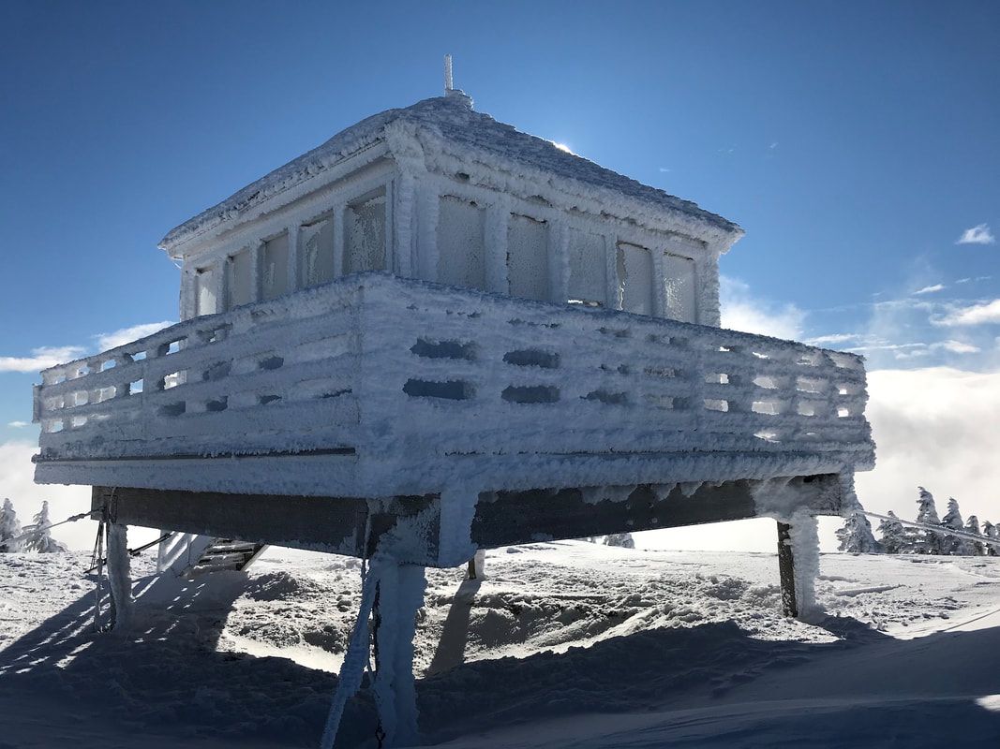{: data-src="assets/images/12262021828p_orig.jpeg" data-title="THE FIRE LOOKOUT REPLICA ON TOP OF KELLOGG PEAK 6300'
SILVER MOUNTAIN" }

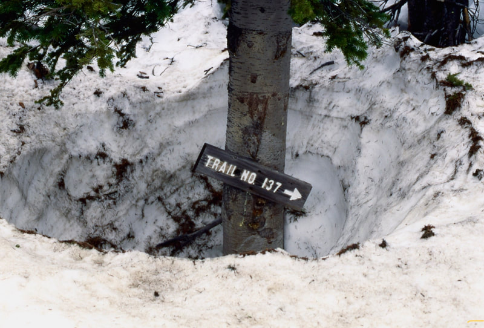{: data-src="https://www.inlandnwroutes.com/uploads/7/9/2/5/79257998/12262021829p_orig.jpg" data-title="TRAIL #137 DOWN TO PEAR & BLOSSOM LAKES" }

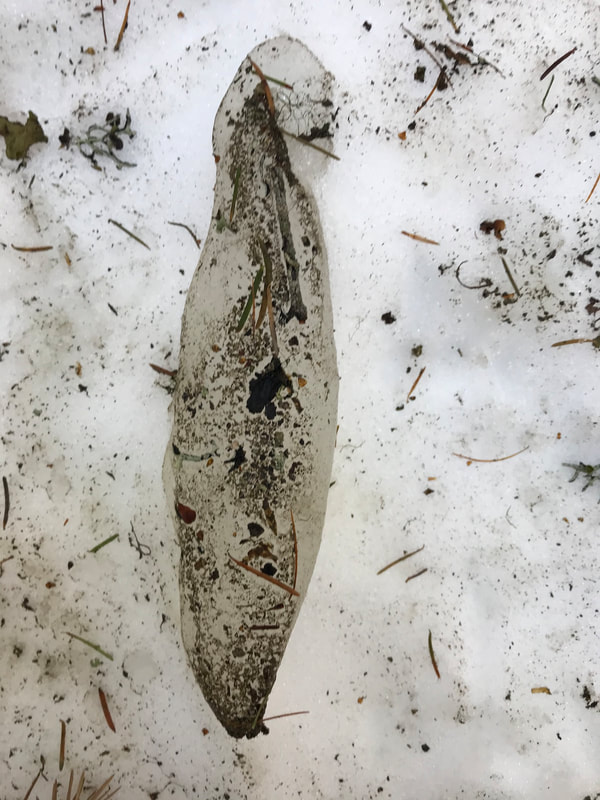{: data-src="https://www.inlandnwroutes.com/uploads/7/9/2/5/79257998/img-0817_orig.jpeg" data-title="AS I WAS SSHOEING ONE DAY, I NOTICED THIS SHOE PRINT SNOW MELT. CAN YOU SPOT THE SURFER?" }

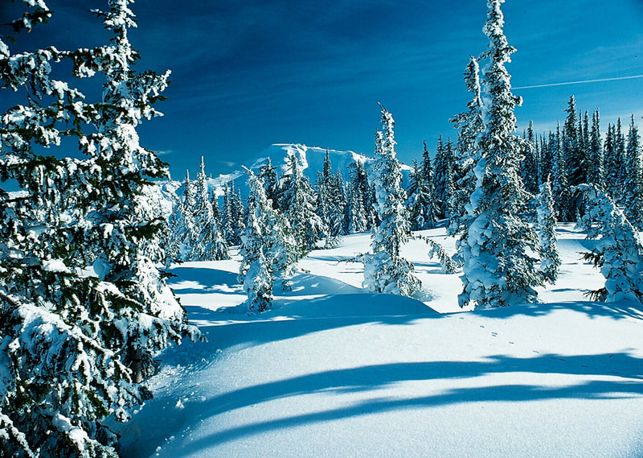{: data-src="https://www.inlandnwroutes.com/uploads/7/9/2/5/79257998/3312022845p_orig.jpg" data-title="STEVENS PEAK FROM THE IDAHO CENTENNIAL TRAIL RIDGE" }

{: data-src="https://www.inlandnwroutes.com/uploads/7/9/2/5/79257998/3312022851p_orig.jpg" data-title="STEVENS PEAK 6838' ABOVE UPPER  STEVENS LAKE" }
